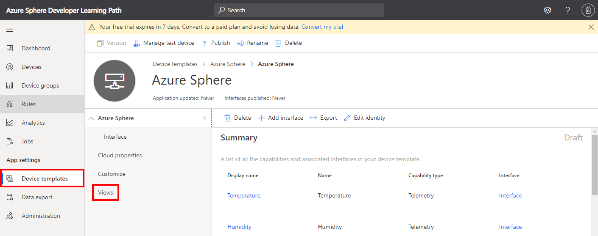
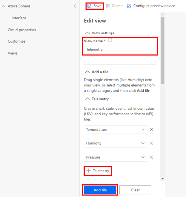

In this exercise, we'll build a high-level Azure Sphere application that connects and sends environment telemetry to Azure IoT Central.

------

## Step 1: Create a new Azure IoT Central application

1. Open this link in a new window: [Azure IoT Central](https://azure.microsoft.com/services/iot-central?azure-portal=true).

2. Click **Build a solution**.

3. You'll need to sign with your Microsoft personal, work, or school account. If you do not have a Microsoft account, then you can create one for free by using the **Create one!** link.

4. Expand the sidebar menu by clicking on the **Menu** icon.

   

5. Navigate to **Build** and click **+ New application** to create a new Azure IoT Central application.

6. Select **Custom app**.

   

### Create a new application

1. Specify the **Application name**, specify the **URL**, select the **Free** pricing plan, and complete the registration form.

   

2. Click **Create**.

### Create a new device template

A device template is a blueprint that defines the characteristics and behaviors of a type of device that connects to an Azure IoT Central application.

1. Navigate to **Device templates**, then **+ New**.

2. Click the **IoT device** template type.

   

3. Create an **IoT device** template.

   1. Select **IoT device**.
   2. Click **Next:Customize**.
   3. Name your template **Azure Sphere**.
   4. Click **Next: Review**.
   5. Click **Create**.

### Import a capability model

1. Click **Import capability model**.
2. Navigate to the folder that you cloned the Azure Sphere Developer Learning Path into.
3. Navigate to the **iot_central** folder.
4. Select **Azure_Sphere_Developer_Learning_Path.json** and open it.

### Create a device visualization view

1. Navigate to **Device templates** and click **Views**.

   

2. Select **Visualizing the device**.

   

3. Select **Humidity**, **Pressure**, and **Temperature** telemetry items.

   

4. Click **Add tile**.

5. Click **Save** to save the view.

### Create a properties form

1. Navigate to **Device templates** and click **Views**.

2. Click the **Editing device and cloud data** option.

   

3. Expand the **Properties** section.

4. Select all properties. 

   

5. Click **Add section**.

6. Click **Save** to save the form.

### Publish the device template

1. Click **Publish** to publish the template. Publishing the template makes it available for devices. 

   

2. Confirm and click **Publish**.

------

