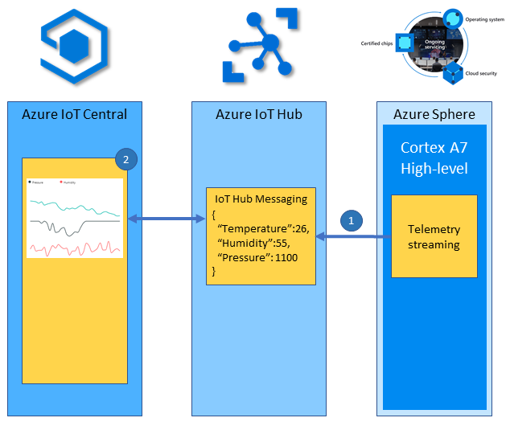

In this unit you will learn how to deploy a High-level application to your Azure Sphere and stream telemetry to IoT Central.


## Solution architecture

The following outlines how the Azure Sphere stream telemetry to IoT Central.



1. The High-level application running on the Cortex-A7 reads the environment sensors every 6 seconds, serializes the data as JSON, and sends the telemetry message to IoT Hub.
2. Azure IoT Central subscribes to telemetry messages sent to IoT Hub by the device and displays the data to the user.


## Understanding the Azure Sphere application

The application declares **measureSensorTimer**. When initialized, this timer will trigger every 6 seconds calling the **MeasureSensorHandler** handler function.

```c
static LP_TIMER measureSensorTimer = {
    .period = { 6, 0 },
    .name = "measureSensorTimer",
    .handler = MeasureSensorHandler };
```

The **MeasureSensorHandler** function is called when the **measureSensorTimer** timer triggers.

The MeasureSensorHandler function will read the environment sensor, format the data into a JSON string, display the JSON data on the **Output** tab, and then send the telemetry to Azure IoT Central.

```c
/// <summary>
/// Read sensor and send to Azure IoT
/// </summary>
static void MeasureSensorHandler(EventLoopTimer* eventLoopTimer)
{
    static int msgId = 0;
    static LP_ENVIRONMENT environment;

    if (ConsumeEventLoopTimerEvent(eventLoopTimer) != 0)
    {
        lp_terminate(ExitCode_ConsumeEventLoopTimeEvent);
    }
    else {
        if (lp_readTelemetry(&environment) &&
            snprintf(msgBuffer, JSON_MESSAGE_BYTES, msgTemplate,
                environment.temperature, environment.humidity, environment.pressure, msgId++) > 0)
        {
            Log_Debug(msgBuffer);
            lp_azureMsgSendWithProperties(msgBuffer, telemetryMessageProperties, NELEMS(telemetryMessageProperties));
        }
    }
}
```
