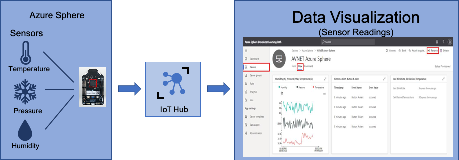

Building and running an application on microcontroller IoT devices can be challenging. These challenges could range from ease of development to securely capturing and transferring the data to the server with underlying security. Using Azure Sphere, we can build an end-to-end connected platform from the IoT device to the Cloud. The application can be built and deployed remotely with security at its core. This could provide a means to capture and transmit data from the IoT application running on the Azure Sphere to the Cloud. We can display the captured data in a dashboard. We can define rules and implement actions depending on the status.

Suppose you're a scientist in a microbiology laboratory who is responsible for storing samples from tests. You want to build a system that monitors the environment around the laboratory equipment in real time. This system will monitor pressure, light, temperature, and humidity. Previously these were recorded manually by the lab assistants using sensors at regular intervals. Manual recording of ambient conditions is a tedious job - prone to human error. And any issues with the sensors would invalidate the tests performed in the Lab environment.
Maintaining the room conditions accurately (temperature, air pressure, humidity, and light)  is critical for managing the laboratory. The lab needs to maintain the right conditions to help you get more accurate results. Any variation in the conditions can affect the equipment temperature during the storage and manipulation of the samples, specimens, and lab equipment. This could impact the ability to produce right and stable results and can also have an economic impact on the organization.

The proposed new system would have the sensors within the lab at multiple points. These sensors will automate the reading of air pressure, temperature, humidity inside the lab, and light conditions at the defined intervals. The sensor data from the devices will be transmitted securely for the analysis of data trends. This solution will thus provide a platform to create secure IoT solutions without worrying about the underlying security vulnerabilities. Additionally, the system can trigger an alarm or alert message to concerned authority when any of the defined variables drops below a specific threshold range.

## Learning objectives

In this module, you will:

- Create an Azure IoT Hub and Device Provisioning Services
- Configure your Azure Sphere application to Azure IoT Hub
- Build and deploy the Azure Sphere application
- View the environment telemetry from the Azure Cloud Shell
- Control an Azure Sphere application using Azure IoT Hub Direct Method.

## Prerequisites

- Azure Sphere kit
- Visual Studio Code installed in your computer
- Ability to use Visual Studio Code
- Git installed in your computer
- Ability to use Git/Github
- Basic knowledge of Azure Sphere
- Basic knowledge of Azure IoT
