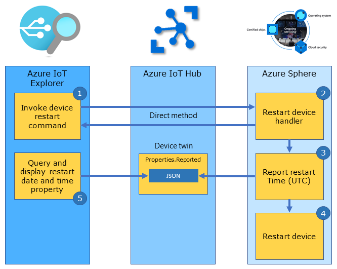

In this unit, you will learn how to remote restart an Azure Sphere from Azure IoT Explorer.

## Understanding IoT Hub direct method commands

Azure IoT Hub uses direct method commands to invoke an action on a device. Commands are often used for interactive control of devices, such as turning on a fan, a light, or in the case of this unit, to restart the Azure Sphere.

IoT Hub direct methods represent a request-reply interaction with a device similar to an HTTP call in that they succeed or fail immediately (after a user-specified timeout). This approach is useful for scenarios where the course of immediate action is different depending on whether the device was able to respond.

> [!NOTE]
> There are a number of reasons why you might need to remote restart a Azure Sphere. Device certificates, OS updates, and application updates are done on a 24 hour cycle or after the device has been restarted. You may have an operational reason why you need to restart the device to force an update.

## Remote restarting an Azure Sphere

From the IoT Explorer device commands tab, you can invoke the command to restart the device. You need to set the number of seconds the device will wait before restarting. Azure IoT Hub sends a direct method message with an optional payload to the device. The device responds with a status code and optionally a message indicating if the command succeeded or failed.



### Steps to restarting an Azure Sphere IoT Explorer

The following steps outline how Azure IoT Explorer and Azure IoT Hub direct methods are used for cloud-to-device control.

1. From Azure IoT Explorer, you can invoke the **Restart Device** IoT Hub direct method command.
1. On the Azure Sphere, the **RestartDeviceHandler** function is called.
1. Next the device sends a device twin **ReportedRestartUTC** message to Azure IoT to record the time the device was restarted.
1. The direct method responds with an HTTP status code and a response message.
1. The Azure Sphere is then restarted.
1. Azure IoT Explorer queries and displays the device **ReportedRestartUTC** property.

## Getting started with Direct method bindings

A direct method binding maps an IoT Hub direct method command name with a handler function that will be called to implement the action.

The following example declares a Direct Method Binding to restart the Azure Sphere. This declaration maps the Azure IoT Hub `RestartDevice` direct method command with a handler function named `RestartDeviceHandler`.

```c
static LP_DIRECT_METHOD_BINDING dm_restartDevice = {
    .methodName = "RestartDevice",
    .handler = RestartDeviceHandler };
```

### Remote restarting the Azure Sphere

The following is the implementation of the handler function `RestartDeviceHandler`. The handler function is called when the device receives a direct method message named `RestartDevice` from Azure IoT Hub.

```c
/// <summary>
/// Start Device Power Restart Direct Method 'ResetMethod' integer seconds eg 5
/// </summary>
static LP_DIRECT_METHOD_RESPONSE_CODE RestartDeviceHandler(JSON_Value* json, LP_DIRECT_METHOD_BINDING* directMethodBinding, char** responseMsg)
{
    const size_t responseLen = 60; // Allocate and initialize a response message buffer. The calling function is responsible for the freeing memory
    static struct timespec period;

    *responseMsg = (char*)malloc(responseLen);
    memset(*responseMsg, 0, responseLen);

    if (json_value_get_type(json) != JSONNumber) { return LP_METHOD_FAILED; }

    int seconds = (int)json_value_get_number(json);

    // leave enough time for the device twin dt_reportedRestartUtc to update before restarting the device
    if (seconds > 2 && seconds < 10)
    {
        // Report Device Restart UTC
        lp_deviceTwinReportState(&dt_reportedRestartUtc, lp_getCurrentUtc(msgBuffer, sizeof(msgBuffer))); // LP_TYPE_STRING

        // Create Direct Method Response
        snprintf(*responseMsg, responseLen, "%s called. Restart in %d seconds", directMethodBinding->methodName, seconds);

        // Set One Shot LP_TIMER
        period = (struct timespec){ .tv_sec = seconds, .tv_nsec = 0 };
        lp_timerOneShotSet(&restartDeviceOneShotTimer, &period);

        return LP_METHOD_SUCCEEDED;
    }
    else
    {
        snprintf(*responseMsg, responseLen, "%s called. Restart Failed. Seconds out of range: %d", directMethodBinding->methodName, seconds);
        return LP_METHOD_FAILED;
    }
}
```

## Azure Sphere PowerControls Capability

The RestartDeviceHandler function sets up a one-shot timer that invokes the **DelayRestartDeviceTimerHandler** function after the specified restart period measured in seconds. In the DelayRestartDeviceTimerHandler function a call is made to the **PowerManagement_ForceSystemReboot** API. The PowerManagement_ForceSystemReboot API requires the **PowerControls** capability to be declared in the app_manifest.json file.

```json
"PowerControls": [
    "ForceReboot"
]
```

## How direct methods are mapped to handlers

All declared direct method bindings must be added by reference to the directMethodBindingSet array. When a direct method message is received by the device from Azure IoT Hub, it is checked for a matching *methodName* name in the directMethodBindingSet array. When a match is found, the corresponding handler function is called.

```c
LP_DIRECT_METHOD_BINDING* directMethodBindingSet[] = { &dm_restartDevice };
```

### Opening the device twin binding set

Direct method binding sets are initialized in the **InitPeripheralsAndHandlers** function in **main.c**.

```c
lp_directMethodSetOpen(directMethodBindingSet, NELEMS(directMethodBindingSet));
```

### Closing the device twin binding set

Device twin bindings sets are closed in the **ClosePeripheralsAndHandlers** function in **main.c**.

```c
lp_directMethodSetClose();
```
