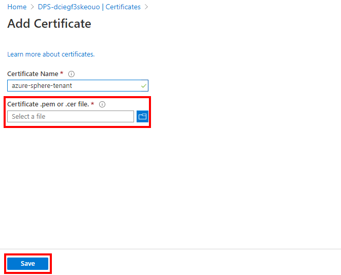
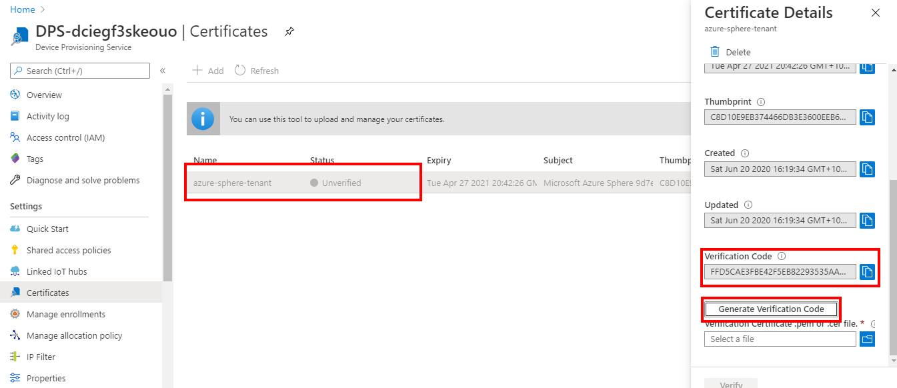
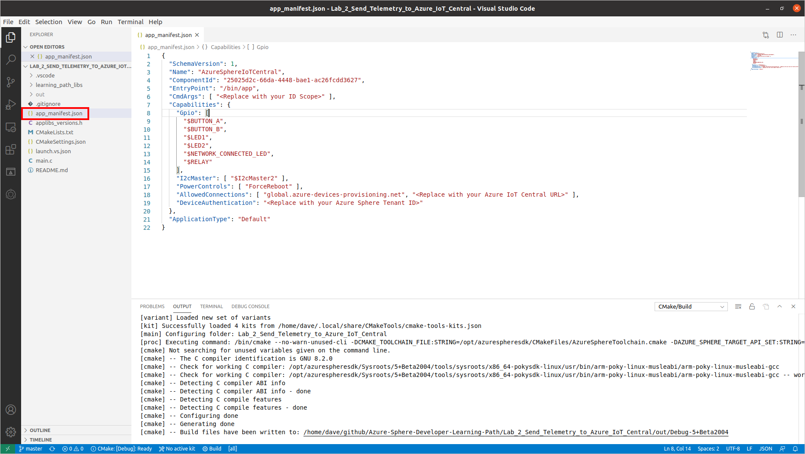

## Step 1: Prepare Azure resources

You can prepare Azure cloud resources with the Azure CLI, the Azure portal (Web interface), or deployment templates. For this module, we will be using an Azure deployment template. Click the **Deploy to Azure** button to deploy a Device Provisioning Service and a linked IoT Hub.

[](https://azuredeploy.net/?repository=https://github.com/MicrosoftDocs/Azure-Sphere-Developer-Learning-Path/blob/master/zdocs-vs-code-iot-hub/Lab_2_Send_Telemetry_to_Azure_IoT_Central/setup)

1. Select or create a new resource group

2. Choose the site located closest to you.

3. Select the IoT Hub Tier. The default IoT Hub tier is the free **F1** tier. You can only have one free IoT Hub per subscription. If you already have a free IoT Hub then either select S1 ([pricing](https://azure.microsoft.com/pricing/details/iot-hub/)) or delete your existing free IoT Hub before proceeding.

4. Click **Next**.

5. Click **Deploy**. The deployment will take three to four minutes to complete.

6. When the deployment has completed, click on **Manage your resources**. You will see two services listed in the Azure Web Portal. The Device Provisioning Service (DPS) and the IoT Hub. Appended to the resource names is a random string to ensure the names are globally unique.

   

7. **DON'T** close the Azure Web Portal and you will be needing it shortly.

------

## Step 2: Link your Azure Sphere Tenant to the Device Provisioning Service

You need to set up a trust relationship between your Azure Sphere tenant and your IoT Device Provisioning Service.

Devices claimed by your Azure Sphere tenant will automatically be enrolled with the linked IoT Hub by the Device Provisioning Service when the device first connects.

### Download the Azure Sphere Tenant authentication CA certificate

1. Open an **Azure Sphere Developer Command Prompt**.

2. Be sure to make a note of the current directory, or change to the Azure Sphere Learning path directory. You will need the name of this directory in the next step.

3. Download the Certificate Authority (CA) certificate for your Azure Sphere tenant:

   ```
   azsphere tenant download-CA-certificate --output CAcertificate.cer
   ```

### Upload the Azure Sphere Tenant certificate to Azure Device Provisioning Service

1. Switch back to the Azure web portal.
2. Click on the Device Provisioning Service (**DPS**) resource link.
3. Click **Certificates** from the Device Provisioning Service sidebar menu.
4. Click **+ Add**.

    

5. Name your certificate, and then select the **CAcertificate.cer** file you downloaded in the previous step to upload into the device provisioning service.
6. Click **Save**.

    

### Verify the uploaded certificate

1. Click on the certificate you just uploaded to display the certificate details.

2. From the certificate details panel, scroll down and click **Generate Verification Code**.

3. Copy the verification code to the clipboard.

   

### Generate the verification certificate

1. Return to the Azure Sphere Developer Command Prompt.

2. Run the following command, replacing <code> with the **Verification Code** you just copied to the clipboard. This will generate a verification certificate that you need to upload to the Device Provisioning Service.

   ```
   azsphere tenant download-validation-certificate --output ValidationCertification.cer --verificationcode <code>
   ```

### Upload the verification certificate

1. Return to the Azure web portal.

2. Click the **Verification Certificate** file selector icon.

3. From the file manager, select the **ValidationCertification.cer** certificate you generated in the previous step.

4. Click the **Verify** button.

   

------

## Step 3: Create a Device Provisioning Service Enrollment Group

From the Azure Web portal.

1. Select **Manage Enrollments** from the Device Provisioning Service sidebar menu.

2. Click **+ Add enrollment group**.

3. Name the enrollment group.

4. Select the primary certificate you just uploaded.

5. Click Save.

   

------

## Step 4: Explicitly allow connections to Azure IoT Endpoints

Remember, applications on Azure Sphere are locked down by default, including hardware and network endpoints. You must explicitly allow connections to the network endpoints of your Azure IoT Hub **and** your Device Provisioning Service otherwise your Azure Sphere application will not be able to connect.

You must allow communications to the following **three** Azure IoT network endpoints:

- The Device Provisioning Service **Global device endpoint**.
- The Device Provisioning Service **Service endpoint**.
- The IoT Hub **Hostname** endpoint.

Follow these steps:

1. Return to the Azure Web Portal.

2. Select **Overview** from the Device Provisioning Service sidebar menu.

3. Copy the Device Provisioning Service **Global device endpoint** URI to *Notepad*.

4. Copy the Device Provisioning Service **Service endpoint** URI to *Notepad*.

5. Copy the **ID Scope** to *Notepad*.

6. Click on the **Resource group URL** to return to the resource group. 

   

7. Select the **IoT Hub** resource.

8. Copy the IoT Hub **Hostname** URL to *Notepad*.

    

------

## Step 5: Get the Azure Sphere Tenant ID

We need the ID of the Azure Sphere Tenant that is now trusted by the Device Provisioning Service.

1. From the Azure Sphere Developer Command Prompt, run

   `azsphere tenant show-selected`

   - The output of this command will look similar to the following.

     ```
     Default Azure Sphere tenant ID is 'yourSphereTenant' (99999999-e021-43ce-9999-fa9999499994).
     ```

   - The **Tenant ID** is the numeric value inside the parentheses.

2. Copy the **Tenant ID** to *Notepad* as you will need it soon.

------

## Step 6: Open the project

1. Start Visual Studio Code.
2. Click **Open folder**.
3. Open the Azure-Sphere lab folder.
4. Open the **Lab_2_Send_Telemetry_to_Azure_IoT** folder.
5. Click **Select Folder** button to open the project.

------

## Step 7: Set your developer board configuration

These labs support developer boards from AVNET and Seeed Studio. You need to set the configuration that matches your developer board.

The default developer board configuration is for the AVENT Azure Sphere Starter Kit. If you have this board, there is no additional configuration required.

1. Open CMakeList.txt.

2. Add a # at the beginning of the set AVNET line to disable it.

3. Uncomment the **set** command that corresponds to your Azure Sphere developer board.

   ```
   set(AVNET TRUE "AVNET Azure Sphere Starter Kit")
   # set(SEEED_STUDIO_RDB TRUE "Seeed Studio Azure Sphere MT3620 Development Kit (aka Reference Design Board or rdb)")
   # set(SEEED_STUDIO_MINI TRUE "Seeed Studio Azure Sphere MT3620 Mini Dev Board")
   ```

4. Save the file. This will auto-generate the CMake cache. 

------

## Step 8: Understanding Azure Sphere Security

Applications on Azure Sphere are locked down by default. You must grant capabilities to the application. Granting capabilities is key to Azure Sphere security and is also known as the [Principle of least privilege](https://en.wikipedia.org/wiki/Principle_of_least_privilege). You should only grant the capabilities the Azure Sphere application needs to run correctly, and no more.

Application capabilities include what hardware can be accessed, what internet services can be called (including Azure IoT Central and the Azure Device Provisioning Service), and what inter-core communications are allowed.

### Open the Application Manifest File

From Visual Studio Code, open the **app_manifest.json** file. The resources this application can access are limited to those listed in the **Capabilities** section.

> [!NOTE]
> The following example is for the Avnet Azure Sphere device. The resource names and capabilities will differ depending on which Azure Sphere device you are using.

```
{
  "SchemaVersion": 1,
  "Name": "AzureSphereIoTCentral",
  "ComponentId": "25025d2c-66da-4448-bae1-ac26fcdd3627",
  "EntryPoint": "/bin/app",
  "CmdArgs": [ ],
  "Capabilities": {
    "Gpio": [
      "$BUTTON_A",
      "$BUTTON_B",
      "$LED1",
      "$LED2",
      "$NETWORK_CONNECTED_LED",
      "$RELAY"
    ],
    "I2cMaster": [ "$I2cMaster2" ],
    "PowerControls": [ "ForceReboot" ]
  },
  "ApplicationType": "Default"
}
```

### Understanding pin mappings

Each Azure Sphere manufacturer maps pins differently. Follow these steps to understand how the pins are mapped for your developer board.

1. Ensure you have the **main.c** file open. Place the cursor on the line that reads **#include "hw/azure_sphere_learning_path.h"**, then press F12 to open the header file.

2. Review the pin mappings set up for the Azure Sphere Learning Path using the Avnet Starter Kit.

    > [!NOTE]
    > Azure Sphere hardware is available from multiple vendors, and each vendor may expose features of the underlying chip in different ways. Azure Sphere applications manage hardware dependencies by using hardware definition files. For further information, review the [Managing target hardware dependencies](https://docs.microsoft.com/azure-sphere/app-development/manage-hardware-dependencies) article.

    ```
    /* Copyright (c) Microsoft Corporation. All rights reserved.
    Licensed under the MIT License. */
      
    // This file defines the mapping from the MT3620 reference development board (RDB) to the
    // 'sample hardware' abstraction used by the samples at https://github.com/Azure/azure-sphere-samples.
    // Some peripherals are on-board on the RDB, while other peripherals must be attached externally if needed.
    // https://docs.microsoft.com/azure-sphere/app-development/manage-hardware-dependencies
    // to enable apps to work across multiple hardware variants.
      
    // This file is autogenerated from ../../azure_sphere_learning_path.json.  Do not edit it directly.
      
    #pragma once
    #include "avnet_mt3620_sk.h"
      
    // Button A
    #define BUTTON_A AVNET_MT3620_SK_USER_BUTTON_A
      
    // Button B
    #define BUTTON_B AVNET_MT3620_SK_USER_BUTTON_B
      
    // LED 1
    #define LED1 AVNET_MT3620_SK_USER_LED_BLUE
      
    // LED 2
    #define LED2 AVNET_MT3620_SK_APP_STATUS_LED_YELLOW
      
    // AVNET: Network Connected
    #define NETWORK_CONNECTED_LED AVNET_MT3620_SK_WLAN_STATUS_LED_YELLOW
      
    // Click Relay
    #define RELAY AVNET_MT3620_SK_GPIO0
    ```

3. Next, from Visual Studio Code, open the main.c file to bring back into focus.

------

## Step 9: Configure the Azure Sphere Application

1. Open the **app_manifest.json** file

   

2. Update the Azure IoT Application connection properties.

   - Update **CmdArgs** with your Device Provisioning Service **ID Scope** you copied to Notepad.
   - Update **DeviceAuthentication** with your **Azure Sphere Tenant ID**. Remember, this was the numeric value output from the `azsphere tenant show-selected` command that you copied to Notepad.

3. Update the network endpoints **AllowedConnections** with your Azure IoT Hub and Device Provisioning endpoint URLs you copied to Notepad.

4. **Review** your updated manifest_app.json file. It should look similar to the following.

   ```
   {
       "SchemaVersion": 1,
       "Name": "AzureSphereIoTCentral",
       "ComponentId": "25025d2c-66da-4448-bae1-ac26fcdd3627",
       "EntryPoint": "/bin/app",
       "CmdArgs": [ "0ne0099999D" ],
       "Capabilities": {
           "Gpio": [
               "$BUTTON_A",
               "$BUTTON_B",
               "$LED2",
               "$NETWORK_CONNECTED_LED",
               "$LED_RED",
               "$LED_GREEN",
               "$LED_BLUE"
           ],
           "I2cMaster": [ "$I2cMaster2" ],
           "PowerControls": [ "ForceReboot" ],
           "AllowedConnections": [
               "global.azure-devices-provisioning.net",
               "<Your Device Provisioning Service Endpoint>",
               "<Your Azure IoT Hub Endpoint>"
           ],
           "DeviceAuthentication": "9d7e79eb-9999-43ce-9999-fa8888888894"
       },
       "ApplicationType": "Default"
   }
   ```

5. Copy the contents of your **app_manifest.json** file to **Notepad** as you will need this configuration information for the next labs.

------

## Step 10: Understanding the Azure Sphere Application

### Sending telemetry to Azure IoT Hub

Open **main.c**, and scroll down to the **MeasureSensorHandler** function.

In the **MeasureSensorHandler** function there is a call to **SendMsgLedOn(msgBuffer);**.

```
/// <summary>
/// Read sensor and send to Azure IoT
/// </summary>
static void MeasureSensorHandler(EventLoopTimer* eventLoopTimer)
{
	static int msgId = 0;
	static LP_ENVIRONMENT environment;
	static const char* MsgTemplate = "{ \"Temperature\": \"%3.2f\", \"Humidity\": \"%3.1f\", \"Pressure\":\"%3.1f\", \"Light\":%d, \"MsgId\":%d }";

	if (ConsumeEventLoopTimerEvent(eventLoopTimer) != 0)
	{
		lp_terminate(ExitCode_ConsumeEventLoopTimeEvent);
		return;
	}

	if (lp_readTelemetry(&environment))
	{
		if (snprintf(msgBuffer, JSON_MESSAGE_BYTES, MsgTemplate, environment.temperature, environment.humidity, environment.pressure, environment.light, msgId++) > 0)
		{
			SendMsgLedOn(msgBuffer);
		}
	}
}
```

Function **SendMsgLedOn** will turn on the send message LED, then **SendMsg(message)** is called to send a JSON formatted message to Azure IoT Hub.

```
/// <summary>
/// Turn on LED2, send message to Azure IoT and set a one shot timer to turn LED2 off
/// </summary>
static void SendMsgLedOn(char* message)
{
	lp_gpioOn(&sendMsgLed);
	Log_Debug("%s\n", message);
	lp_sendMsg(message);
	lp_setOneShotTimer(&sendMsgLedOffOneShotTimer, &sendMsgLedBlinkPeriod);
}
```

------

## Step 11: Deploying the Application to Azure Sphere

### Start the app build deploy process

1. Ensure main.c is open.

2. Select **CMake: [Debug]: Ready** from the Visual Studio Code Status Bar.

   

3. From Visual Studio Code, press F5 to build, deploy, start, and attached the remote debugger to the application now running the Azure Sphere device.

### View debugger output

1. Open the Visual Studio Code **Output** tab to view the output from **Log_Debug** statements in the code.

    > [!NOTE]
    > You can open the output window by using the Visual Studio Code Ctrl+K Ctrl+H shortcut or click the **Output** tab.

2. You will see the device negotiating security, and then it will start sending telemetry to Azure IoT Hub.

    > [!NOTE]
    > You may see a couple of *ERROR: failure to create IoTHub Handle* messages displayed. These messages occur while the connection to Azure IoT is being negotiated.

------

## Step 12: Expected Device Behavior

### Avnet Azure Sphere MT3620 Starter Kit


1. The blue LED will start to blink.
2. LED3 will turn yellow when connected to Azure.
3. Press **Button A** on the device to change the blink rate.

### Seeed Studio Azure Sphere MT3620 Development Kit


1. The green LED will start to blink.
2. The network LED will turn red when connected to Azure.
3. Press **Button A** on the device to change the blink rate.

### Seeed Studio MT3620 Mini Dev Board


- The green LED closest to the USB connector will start to blink.

------

## Step 13: View the device telemetry from the Azure Cloud Shell

1. You will need to know the name of the Azure IoT Hub you created. You can get the name from the Azure web portal.  

2. Open the Azure Cloud shell at [https://shell.azure.com](https://shell.azure.com/).

3. In the Cloud Shell, run the following command to add the Microsoft Azure IoT Extension to your CLI shell. The IoT Extension adds IoT Hub, IoT Edge, and IoT Device Provisioning Service (DPS) specific commands to Azure CLI.

   ```
   az extension add --name azure-iot
   ```

4. Start the IoT Hub Events Monitor with the following command. Be sure to use your IoT Hub name.

   ```
   az iot hub monitor-events --hub-name {your IoT Hub name}
   ```

5. Observe telemetry in the cloud. The output will be similar to the following screen. 

6. Use ctrl+c to stop the event monitor.

## Close Visual Studio

Now close **Close Visual Studio**.
