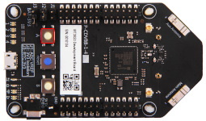

In this exercise, we'll deploy a high-level application to your Azure Sphere.

## Step 1: Open the lab project

1. Start Visual Studio Code.

2. Click **Open folder**.

3. Open the **Azure-Sphere lab** folder.

4. Open the **Lab_2_Send_Telemetry_to_Azure_IoT** folder.

5. Click **Select Folder** or the **OK** button to open the project.

## Step 2: Configure the Azure Sphere application

1. From Visual Studio Code, open the **app_manifest.json** file. The resources this application requires must be declared in the **Capabilities** section.

1. Update the connection properties for the Azure IoT Hub.

    - Update **CmdArgs** with your Azure IoT DPS ID scope.
    - Update **DeviceAuthentication** with your Azure Sphere Tenant ID. Remember, this was the numeric value returned from running the **azsphere tenant show-selected** command.

1. Update the **AllowedConnections** with the **global device provisioning service endpoint**, your **DPS endpoint**, and your **Azure IoT Hub endpoint**. See the example below to understand the correct format for these endpoints.

1. You can format the app_manifest.json document by right mouse clicking on the document and selecting **Format Document** from the context menu.

1. Review your updated **app_manifest.json** file. It should look similar to the following.

    ```json
    {
        "SchemaVersion": 1,
        "Name": "AzureSphereIoTCentral",
        "ComponentId": "25025d2c-66da-4448-bae1-ac26fcdd3627",
        "EntryPoint": "/bin/app",
        "CmdArgs": [ "--ConnectionType", "DPS", "--ScopeID", "0ne0099999D" ],
        "Capabilities": {
            "Gpio": [
                "$NETWORK_CONNECTED_LED",
                "$LED_RED",
                "$LED_GREEN",
                "$LED_BLUE"
            ],
            "I2cMaster": [
                "$I2cMaster2"
            ],
            "PowerControls": [
                "ForceReboot"
            ],
            "AllowedConnections": [
                "global.azure-devices-provisioning.net",
                "<Your device provisioning service endpoint>",
                "<Your Azure IoT hub endpoint>"
            ],
            "DeviceAuthentication": "9d7e79eb-9999-43ce-9999-fa8888888894"
        },
        "ApplicationType": "Default"
    }
    ```

1. Save the updated app_manifest.json file.

1. **IMPORTANT**. Copy the contents of your **app_manifest.json** file to Notepad or your text editor of choice, as you'll need this configuration information for the next labs.

## Step 3: Select your developer board configuration

These labs support developer boards from Avnet and Seeed Studio. You need to set the configuration that matches your developer board. The default developer board configuration is for the Avnet Azure Sphere Starter Kit Revision 1. If you have this board, there is no additional configuration required.

1. Open **CMakeLists.txt**.

2. Add **#** at the beginning of the **set AVNET** line to disable it.

3. Uncomment the **set** command that corresponds to your Azure Sphere developer board.

    ```text
    set(AVNET TRUE "AVNET Azure Sphere Starter Kit Revision 1 ")
    # set(AVNET_REV_2 TRUE "AVNET Azure Sphere Starter Kit Revision 2 ")
    # set(SEEED_STUDIO_RDB TRUE "Seeed Studio Azure Sphere MT3620 Development Kit (aka Reference Design Board or rdb)")
    # set(SEEED_STUDIO_MINI TRUE "Seeed Studio Azure Sphere MT3620 Mini Dev Board")
    ```

4. Save the file. This will autogenerate the CMake cache.

## Step 4: Deploy the application to Azure Sphere

### Start the app build and deployment process

1. Open **main.c**.

1. Select **CMake: [Debug]: Ready** from the Visual Studio Code status bar.

   :::image type="content" source="../media/visual-studio-code-start-application.png" alt-text="The illustration shows CMake status." lightbox="../media/visual-studio-code-start-application.png":::

1. From Visual Studio Code, press F5 to build, deploy, start, and attach the remote debugger to the application now running the Azure Sphere device.

1. Try setting a breakpoint in the **MeasureSensorHandler** function. The function will be called every 5 seconds.

    > [!NOTE]
    > You can learn how to set breakpoints from this [Visual Studio Code Debugging](https://code.visualstudio.com/docs/editor/debugging#_debug-actions?azure-portal=true) article.

### View debugger output

1. Select the Visual Studio Code **Output** tab to view the output from **Log_Debug** statements in the code.

   > [!TIP]
   > You can open the output tab by using the Visual Studio Code **Ctrl+Shift+U** shortcut or clicking the **Output** tab.

2. You'll see the device negotiating security, and then it will start sending telemetry to Azure IoT Hub.

    > [!NOTE]
    > You may see a couple of *ERROR: failure to create IoTHub Handle* messages displayed. These messages occur while the connection to Azure IoT Hub is being negotiated.

## Step 5: Expected device behavior

### Azure Sphere MT3620 Starter Kit Revision 1 and 2


- The WLAN LED will blink every 5 seconds when connected to Azure.

### Seeed Studio Azure Sphere MT3620 Development Kit



- The WLAN LED will blink every 5 seconds when connected to Azure.

### Seeed Studio MT3620 Mini Dev Board


- The User LED will blink every 5 seconds when connected to Azure.

## Step 6: Display the device telemetry using Azure IoT Explorer

1. Start **Azure IoT Explorer**.

1. Click **View devices in this hub**.

    :::image type="content" source="../media/iot-explorer-view-devices-in-this-hub.png" alt-text="The illustration shows how to select devices in this hub." lightbox="../media/iot-explorer-view-devices-in-this-hub.png":::

1. Click on your **device**.

    The device name is your Azure Sphere Device ID. You can display your Device ID by running the following command from the Windows **PowerShell command line** or Linux **Terminal**.

    ```
    azsphere device show-attached
    ```

1. Click **IoT Plug and Play components** from the side menu.

    :::image type="content" source="../media/iot-explorer-iot-pnp.png" alt-text="The illustration shows how to select IoT Plug and Play components." lightbox="../media/iot-explorer-iot-pnp.png":::

1. Click **Default component**.
    
    :::image type="content" source="../media/iot-explorer-pnp-default-component.png" alt-text="The illustration shows how to select the default component." lightbox="../media/iot-explorer-pnp-default-component.png":::

1. Select **Telemetry** from the menu.

    :::image type="content" source="../media/iot-explorer-pnp-telemetry.png" alt-text="The illustration shows how to select telemetry." lightbox="../media/iot-explorer-pnp-telemetry.png":::

1. Click the **Start** button.

1. Click the **Show modeled events** to map the IoT Plug and Play model to the telemetry.

## Close Visual Studio Code

Now close Visual Studio Code.
