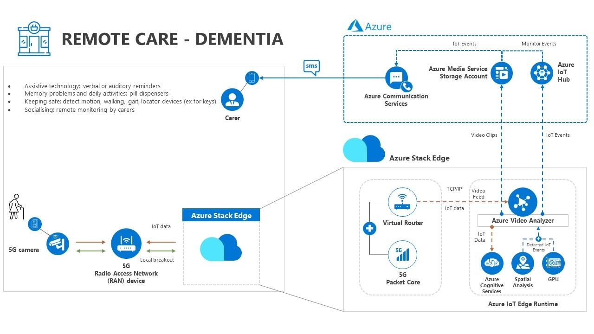

5G technology is disruptive and holds many promise to transform enterprise applications. While 5G represents a fundamental change in architecture, it isn't easy for developers to rapidly adopt the new components of 5G.  Using Azure private MEC, Azure developers can take advantage of the new features of 5G to create compelling enterprise applications using their existing knowledge.  Azure private MEC coupled with 5G enables developers to combine the technical components for 5G to create applications like low latency IoT services and live video analytics.  Solutions will be typically created in partnership with the mobile network operators and will use 5G related modules from the Azure Marketplace to enhance the solution.

Suppose you work as a carer responsible for caring for patients with dementia and Alzheimer’s disease. Patients with degenerative mental conditions like Alzheimer’s disease and dementia present some unique challenges – for example, they're often prone to walking away and endangering themselves. In such cases, rapid response is essential. 

Four situations were identified. In all cases, you should be able to respond rapidly to the risks.

- Assistive technology: providing verbal or auditory reminders
- Memory problems and daily activities: for example, managing pill dispensers
- Keeping safe: detecting motion, walking, gait; using locator devices (ex: for keys)
- Socializing: remote monitoring by carers 

Your healthcare facility has decided to invest in new technology to cope with dynamic and unpredictable challenges that coupled with the need for rapid response.

Video analytics is especially beneficial for monitoring and tracking. Also, video analytics can be used as a diagnostic and preventative tool for proactive intervention. You want to use 5G and Azure private MEC to address the challenges of caring for patients with dementia and Alzheimer’s. You aspire to use 5G-enabled internet protocol (IP) cameras to capture real-time video of the patients in care homes. Then, the on-premises IoT Edge devices will analyze the video data in real-time to detect the conditions listed above, such as walking, gait, socialization, and medication routines. Based on the analytics running on edge devices, the system sends an alert to the carer. If an anomaly (such as a deviation from a regular pattern or an emergency) is detected, the carer undertakes an action. Also, over time, the video clips collected are analyzed for trend data in the cloud. 

