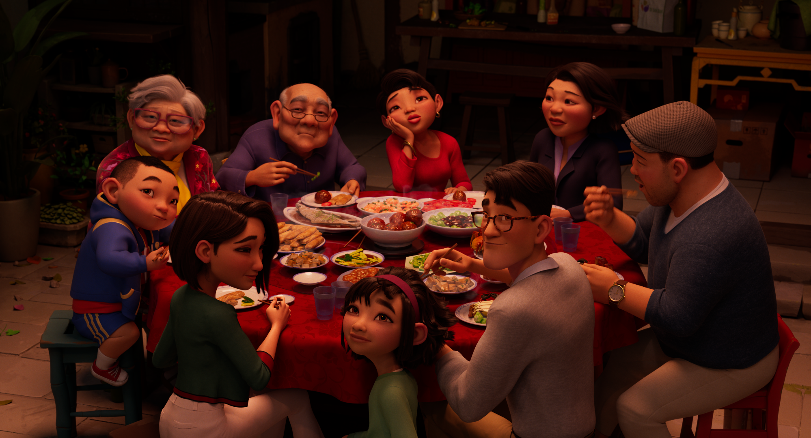

Now comes a tricky part, it's tricky because it requires us humans to do some thinking. We need to choose the right set of pictures that represent our object. As mentioned in the last unit, the pictures should all include the object, but should be diverse in:
- camera angle
- lighting
- background
- visual style
- individual/grouped subject(s)
- size
- type (if that applies to your object)

For this module, the example will be using images of Bungee from the Over the Moon film. You will be choosing your own images. If you want to make this really personal, you can even take your own pictures. Find your favorite pet or stuffed animal and take ~30 pictures of it keeping in mind everything listed above. 

Other things to keep in mind when you are taking or finding these images:
- They should be in one of these formats: .jpg, .png, .bmp, or .gif
- They should be no greater than 6MB in size
- They should have no less than 256 pixels on the shortest edge

You will also need to find/take a set of images that you want to use to test your AI. These prediction images should *not* be used to train the Custom Vision service. They should adhere to the same guidelines above, except you want prediction images to be no greater than 4MB in size. 

Spend some time finding or taking images, be creative! Do some with transparent backgrounds, some with only the object at every angle, some where the object is really small. This is your chance to really have the serivce learn what you want it to be able to identify. 

## An Ethics Aside on Image Recognition

This is the part of the module where it makes sense to jump into a quick aside about ethics. As with any technology, ethics should *always* be at the forefront of what solutions you are building. Even if you are "just" doing an experiment, or trying something out, you should be thinking of the implications of what you're doing and how it could impact others. 

Remember, Fei Fei built a rocket and flew to the moon to try to bring her family closer together.

When you are choosing images, make sure they are representative of what the object is. Avoid bias and be inclusive. Being ethical and inclusive in computing practices is not about needing to solve every possible version of a problem, but rather about appropriately representing what problem you are actually solving. 

An example of this could be the following:  
Imagine you were choosing to train your Custom Vision service to identify building entrances so that you could add that information on a map created by a camera taking pictures of street-facing businesses. Images that you included had stairs, ramps, and were flat on the ground. If you were to then create predictions using this trained AI on a new part of the city and automatically include those in your map as viable entraces, it simply wouldn't be true for everyone. You could be providing information to your users that a business can be entered via the street and when a user who requires a ramp arrives they could be met with a stairs-only entrance. 

You could still build this exact same model, but ensure that it is marked appropriately in your maps app as not guaranteeing a ramp when sairs are present. Or, even better, since you already had ramps as part of your training data set, you could include a tag for ramps and allow folks to opt-in to the types of entrances they are comfortable and capable of using. 

Before continuing on in this module, take a few minutes to think of the images you want to capture and have a non-human, non-empathetic AI make decisions on your behalf. Think of your worst case scenarios and decide how you want to account for them. Even if this is a "simple experiment", always being mindful and considering these ethical practices will only lead to you naturally engaging them when you *are* making something that could greatly impact the lives of your fellow human.