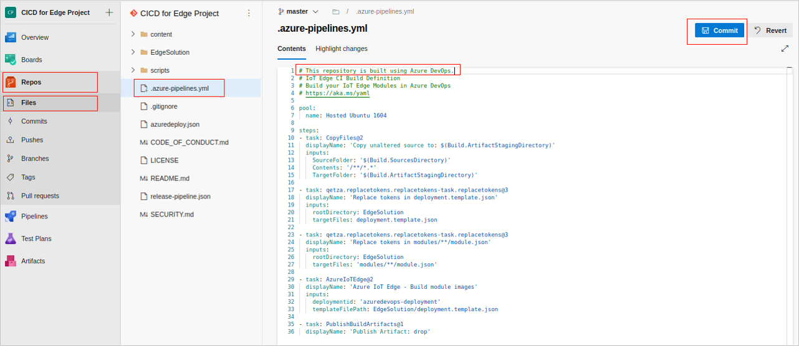
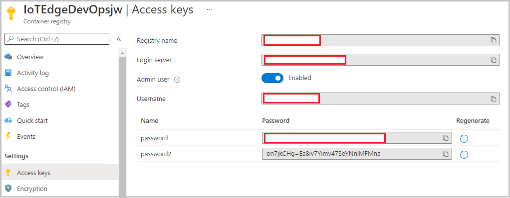

## Create Azure resources

Azure DevOps Projects creates a CI/CD pipeline in Azure DevOps. You firstly will need to create cloud services that will be used for the module.

1. Sign in to the [Microsoft Azure portal](https://portal.azure.com/).

2. Click on the **Deploy to Azure** button below.

   [](https://azuredeploy.net/)

3. On the web page, provide required information.

   1. Select **directory**.
   2. Select your **subscription**.
   3. Select **Create New** for **resource group**.
   4. Create a **resource group name** or keep it as default.
   5. Provide a globally unique value for the **Resource Name Suffix** parameter.

4. Review and deploy your resources to Azure.

   > [!NOTE]
   > If you encounter any issues in the deployment, it is advised to delete the created resource group (if any) and retry with a new value for the **Resource Name Suffix** parameter.

5. Go to the Azure portal to review your resources.

## Create an Azure DevOps project

1. If you don't have an Azure DevOps organization, you should follow the steps to create one for free.

   1. Open [Azure Pipelines](https://azure.microsoft.com/services/devops/pipelines) and choose **Start free**.
   1. Sign in/up with Microsoft.
   1. Give a name to your organization and create it.

2. Create a new project in your organization. Give it a descriptive name, and you can choose private or public. Then it will take you to the **Overview** page of your project.

3. Navigate to **Repos**, and then click the **Import** button underneath **Import a repository** and provide this URL:

   ```
   https://github.com/MicrosoftDocs/mslearn-oxford-implement-cicd-iot-edge.git
   ```

4. Begin the import process of the repository into your Azure DevOps project.

## Create a CI pipeline

This repository contains an Azure DevOps build definition, which is preconfigured to build the included EdgeSolution in [azure-pipelines.yml](https://github.com/MicrosoftDocs/mslearn-oxford-implement-cicd-iot-edge/blob/master/.azure-pipelines.yml). This build definition relies on an external plugin called [Replace Tokens](https://marketplace.visualstudio.com/items?itemName=qetza.replacetokens).

1. Begin by installing the **Replace Tokens** task from the Visual Studio Marketplace by visiting [this link](https://marketplace.visualstudio.com/items?itemName=qetza.replacetoken&wt.mc_id=iotedgedevops-github-pdecarlo) and clicking the **Get it free** button. Then install into the organization that contains your newly created Azure DevOps project.

2. Once this task is successfully installed, return to the Azure DevOps project and select **Repos** > **Files**. Then edit the `.azure-pipelines.yml` file.

3. Add the following comment to the top of the file, as shown below.

   ```
   # This repository is built using Azure DevOps.
   ```

   

4. Commit your change and go back to **Files**.

5. Set up the build. You should see that a build has kicked off upon editing the build definition.

6. Go to **Pipelines**. You will see the build will fail. This is to be expected, as Azure DevOps will create the build definition with a name that contains spaces, which cause a conflict in the "Azure IoT Edge - Build module images" task. To fix this, select **Pipelines** > **Builds** > **Rename**, and then rename the newly created build definition so that it does not contain spaces.

   

### Create build definition variables

1. Now you need to add build variables in order to run the build successfully. You'll need to obtain:

   - Azure Container Registry host name as `acr.host`
   - Azure Container Registry username as `acr.user`
   - Azure Container Registry password as `acr.password`

2. Go to the Azure portal and navigate to the resource group you created for this module.

3. Select a Container Registry resource and go to **Access keys** under **Settings**.

4. Copy the name of the login server, username, and password.

   

5. Obtain the Application Insights instrumentation key, which will be represented by `appinsights.instrumentationkey`.

6. Go to the Azure portal and navigate to the resource group you created for this module.

7. Select **Application Insights** and copy the **Instrumentation Key** information in the **Overview** page.

   

8. Go back to Azure DevOps project and navigate to **Pipelines**.

9. Select the pipeline you ran earlier and edit the pipeline. Click **Variables** and start adding new variables.

    

10. When you add four variables above with values, save and run the pipeline.

11. You review the status of the pipeline by going back to **Pipelines**. The build should finish successfully as shown below.

    

### Apply a branch policy

1. With a successful build definition in place, we can now enforce continuous integration by applying a branch policy to the master branch. Start with selecting **Repos** > **Branches**. Then click **...** on the row for the master branch and select **Branch policies**.

2. Navigate to the build validation, click **Add build policy**, and select the newly created build pipeline. Keep everything as default and then click the **Save** button.

   

   While this policy is enabled, all commits to feature branches will kick off an execution of the newly created build pipeline. It must succeed in order for a pull request of those changes to be made to the master branch.
