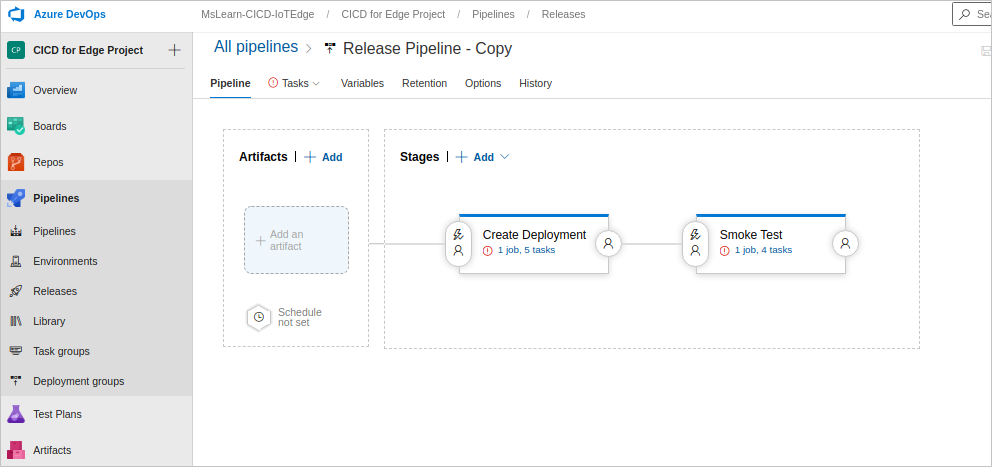
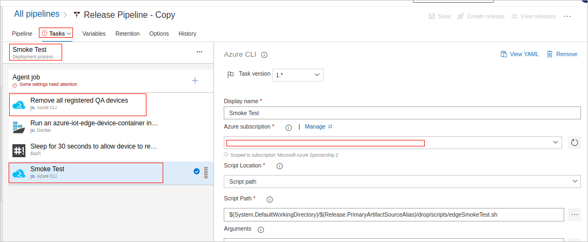

Deployments to devices need to be done under tight control in production environments. To achieve this, you'll create a release pipeline which deploys to QA devices and smoke tests the edge runtime in a containerized device. This is accomplished by running an instance of the [azure-iot-edge-device-container](https://github.com/toolboc/azure-iot-edge-device-container) which is configured as a QA device then probing the IoT Hub to ensure that QA device receives the desired deployment configuration and is able to successfully run all configured modules. This test is contained in [edgeSmokeTest.sh](https://github.com/aysemutlu/mslearn-oxford-implement-cicd-iot-edge/blob/master/scripts/edgeSmokeTest.sh)

1. To begin creating a release pipeline, navigate to **Pipelines** > **Releases** then create a new pipeline with an **empty job** and save it.

2. Now head back to **Releases** > New and select "Import a pipeline". Download the [release-pipeline.json](https://github.com/MicrosoftDocs/mslearn-oxford-implement-cicd-iot-edge/blob/master/release-pipeline.json) file located in the root of this repository and import it. The import should complete successfully as shown below.

   

3. You'll need to fix a few things before you can successfully run the Release Pipeline, specifically Azure Subscription endpoints, Agent Pools, and variable settings, and artifact source.

   To fix the Azure Subscription Endpoints, select **Tasks** > **Create Deployment** and provide the appropriate Azure subscription and Azure Container Registry for the "Azure IoT Edge - Push module images".

   

   

   Provide the appropriate Azure subscription and Azure Container Registry for Azure IoT Edge - Deploy to IoT Edge devices" task.

4. Next select **Tasks** > Smoke Test and provide the appropriate Azure subscription and Azure Container Registry for the "Remove all registered QA devices" and "Smoke Test" tasks.

   

5. To fix the Agent Pools, select **Tasks** > Create Deployment > Agent Job and change the Agent Pool. Repeat the same step by selecting  **Tasks** > Smoke Test > Agent Job and change Agent Pool.

6. Now you should be able to save the Release pipeline. It's highly recommended to save at this point if Azure DevOps allows.

7. Navigate to **Variables** tab. You'll need to modify all variables in brackets (<>).

   

8. You can use the same values for `acr.host`, `acr.user`, `acr.password`, and `appinsights.instrumentationkey` that were used in the CI build definition earlier.

9. `iothub_name` is the name of the IoT Hub you created. Navigate to Azure portal, go to resource group you created and make a copy of the IoT hub name.

10. For the additional variables, you need to create a service principal by performing the following the steps.

    1. Go to Azure portal

    2. Open Azure Cloud Shell.

    3. Run `az account list` to see available subscriptions, and set the appropriate subscription with:

       ```
       az account set --subscription <subscriptionid>
       ```

    4. Create a Service Principal for your subscription with the Azure CLI:

       ```
       az ad sp create-for-rbac --name <name>
       ```

    5. You should see output similar as below.

       ```
       {
       "appId": "12345678-1234-1234-1234-1234567890ab",
       "displayName": "azure-iot-edge-device-container-sp",
       "name": "http://azure-iot-edge-device-container-sp",
       "password": "MyPassword",
       "tenant": "abcdefgh-abcd-abcd-abcd-abcdefghijkl"
       }
       ```

    6. Make note of the `name`, `password`, and `tenant` as these values will be used for `spAppURl`, `spPassword`, and `tenant` respectively.

    7. Provide all parameters as required in Variables.

11. Now go back to **Pipeline** and add an artifact.

    

12. Next, select your CI build pipeline as source type and configure to obtain the latest version.

13. Once you have configured everything appropriately, select **Save**.

14. Navigate to **Pipelines** > Releases then select the newly created Release pipeline and Select **Create a release**.

    

15. The new release pipeline should begin running.
