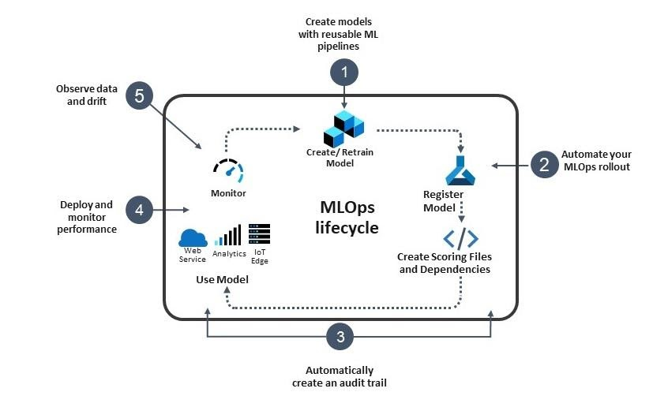

MLOps (DevOps for machine learning) enables data science, and IT teams to collaborate and increase the pace of model development and deployment via monitoring, validation, and governance of machine learning models. MLOps brings the philosophy of DevOps to Machine Learning by automating the end-to-end workflows. MLOps is a part of Azure Machine Learning and can be deployed to IoT Edge devices. 

The end-to-end ML life cycle is as below:

1. Create models with reusable ML pipelines using the Azure Machine Learning extension for Azure DevOps. Store your code in GitHub, so it automatically integrates into your MLOps pipeline

2. Automate your MLOps rollout using Azure DevOps + Azure Machine Learning for version models with rich metadata and event management.

3. Automatically create an audit trail for all artifacts in your MLOPs pipeline ensure asset integrity and meet regulatory requirements.

4. Deploy and monitor performance so you can release models with confidence and know when to retrain.

5. Observe data drift and feedback model information to improve future training.

The deployment of machine learning models in production presents one of the most significant pain points in the workflow. The deployment process presents additional challenges when the target platform is IoT Edge. These include: 

- IoT machine learning models are rapidly changing, and hence they degrade faster (with respect to data drift of the current data). Therefore, they need more frequent and automatic retraining.

- IoT machine learning models need to be deployed on different kind of target platforms, and you need to leverage the capabilities of these platforms in terms of performance, security, so on.

- IoT Edge solutions may need to run offline – hence you need to allow for offline working with the frequency of refresh for the models.

## Scenario

Suppose you work in the Oil and Gas industry, and you're responsible for maintaining thousands of oil and gas pumps operating in remote/offshore locations. Even if these locations are remote, your team must rapidly identify and fix faults in the field. Hence, you want to build and deploy a predictive maintenance system for the pumps. Before you create a predictive maintenance model, you must first implement a system for remote monitoring of connected devices to ingest sensor data in a stream, process that data, and store it in a database. Currently, your team has managed to achieve this goal with IoT Edge. You can capture data from multiple sensors in the field connected to the pumps. Currently, anomalies are detected visually from a dashboard. Hence, your engineers want to deploy a new predictive maintenance system that can detect anomalies from up-to-date machine learning models. The models generated by the new predictive maintenance system should reflect the current state of the data dynamically by accounting for data drift. Hence, the system should allow for frequent and automatic retraining of models to indicate the status. You also need to deploy the trained models on a variety of pumps from a range of manufacturers. The system should use the unique characteristics of the software on the pumps: ex for performance and security. Finally, the models so deployed should be able to run offline on the Edge device if needed. The company can avail substantial savings on maintenance and production costs and increase workplace safety and their environmental impact by achieving these objectives. 

This module covers **source control, reproducible training pipeline, model storage, and versioning**, **model packaging**, **model validation**, **deployment,** **monitoring models in production, and retraining of models** in context for IoT Edge devices. 

In this module, you'll examine the significance of MLOps for IoT Edge in the context of the above scenario for the development and deployment of machine learning models.