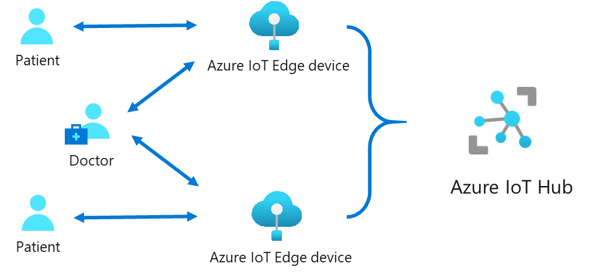

The cloud has made storage and compute costs affordable for IoT developers. In the simplest case, IoT devices connect to the cloud and persist IoT data in the cloud. However, it isn't possible to always manage all the IoT data in the cloud. You often need rapid response times, especially for mission-critical applications. If you store all data in the cloud, then the round trip to the cloud and back would cause high latency, leading to increased response times.

Azure IoT Edge brings compute capability closer to the source of the data, that is, to edge devices. IoT Edge provides the ability to move workloads from the cloud to the edge. In doing so, IoT Edge overcomes the problems of latency and response times.

The ability to move computing workloads to edge devices provides other advantages such as deploying artificial intelligence applications on edge devices. Machine learning models can be trained in the cloud and then deployed on edge devices. IoT Edge also provides the ability to run in offline mode and provides the underlying security for reliable operations in such cases.

Suppose you're a doctor who specializes in diabetic treatment. You want to monitor the patient's blood glucose level and warn the patient when the glucose level changes are of concern to their health. In this case, the IoT Edge device monitors the glucose level of the patient and stores the data on the device itself. The device pushes summarized data from the edge to the cloud. Algorithms, which run on the device help to monitor the changes in the glucose levels, which could cause concern. If the glucose levels are of concern, the doctor receives an alert from the algorithm running on the IoT Edge device. The alarm can be generated rapidly in response to the changing glucose levels because the algorithm is running on the edge device. Hence, it doesn't need to connect to the cloud – by doing that saving data round trip to the cloud, i.e. latency time. This notification enables the doctor to respond to the patient immediately. The device also caters for situations where connectivity is poor. The data is stored securely on the device.

## Learning objectives

In this module, you will:  

- Evaluate situations where IoT Edge can help in deploying IoT applications to the cloud
- Describe the components of IoT Edge  
- List the capabilities of the IoT Edge for the IoT solutions in the cloud  

## Prerequisites

- Basic programming knowledge in languages such as C, Python, Node.js  
- Basic knowledge of running Azure CLI
- Basic knowledge of IoT applications and IoT Hub

