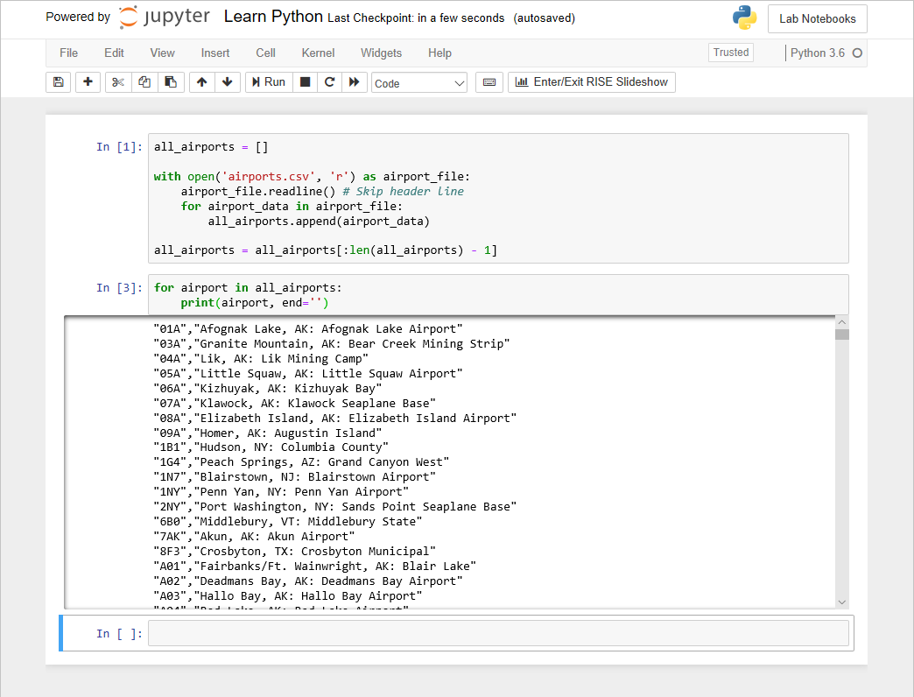

Python is one of the most popular programming languages in the world. Created in the early 1990s, it enjoys a wide range of uses from automating repetitive tasks and writing Web applications to building machine learning models and implementing neural networks. Researchers, mathematicians, and data scientists in particular like Python because of its rich and easy-to-understand syntax and the wide range of open-source packages available. Packages are commonly used, shared code libraries which are freely available for anyone to use.

Applications coded in Python can run on almost all computer systems, including those running Windows, macOS, and popular distributions of Linux. Furthermore, the ecosystem contains a rich set of development tools for writing, debugging, and publishing Python applications. And Python is supported by an active user community that is eager to help new programmers learn the [Pythonic way](https://docs.python-guide.org/writing/style/).

## Your mission, should you choose to accept it

Imagine that you've been tasked with collecting information about U.S. airports and answering some basic questions using the data. For example, you need to know how many airports are present in each state and which city or state has the most airports. Perhaps you are experienced with programming languages such as Java and C++, but have no experience with Python. Or perhaps you aren't a programmer at all. Nonetheless, a little time invested in learning Python can make short work of the task at hand.

In this module, you will learn the basics of Python by creating a Jupyter notebook that loads airport data downloaded from a U.S. Government Web site and manipulates the data. Jupyter notebooks provide an interactive platform for writing and testing Python code, and they're easily built in [Azure Notebooks](https://notebooks.azure.com/), which offer Jupyter-as-a-service for free.

## Learning objectives

In this module, you will learn:

- How to create a Jupyter notebook in Azure
- How to build Python applications in Jupyter notebooks
- How to deal with variables and data types in Python
- How to perform input and output in Python
- How to read text files in Python
- How to perform looping in Python
- How to work with strings in Python, and how to parse text
- How to use conditional statements to perform branching in Python
- How to use functions in Python and how (and when) to write your own functions
- How to perform practical problem solving with Python and Jupyter notebooks

Let's get started!