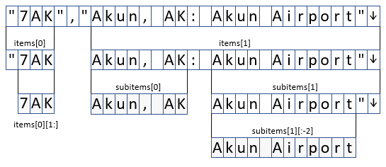
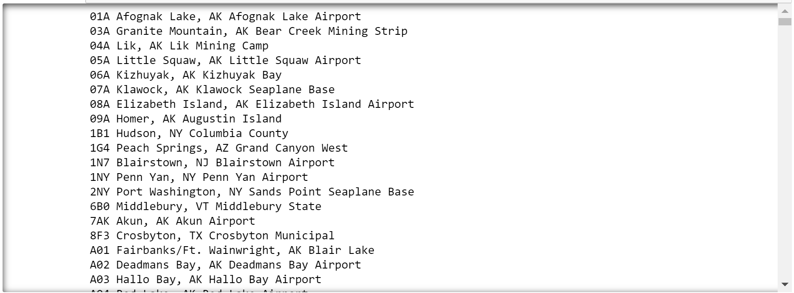
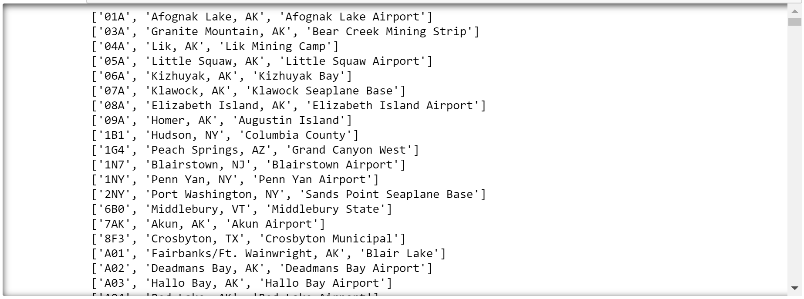

Strings are among the most commonly used data types in Python and in other programming languages. Strings contain text — text output to the screen, retrieved from user input, or read from a CSV file. Knowing how to parse and manipulate strings is an essential skill for any programmer, because virtually every program uses strings in some way. Many of today's most commonly used data formats, including [CSV](https://en.wikipedia.org/wiki/Comma-separated_values), [JSON](https://www.json.org/), and [XML](https://www.w3.org/XML/), use strings to store data.

In the previous lesson, you downloaded a CSV file containing a list of airports all over the world inside Azure Noteboks and wrote some Python code to read the file and create a list of strings from the file's content. In this lesson, you will parse the content that you read and convert the data into a more useful format.

## Working with strings

A string is a collection of zero or more characters. A string with no characters is called an *empty string*. Any text contained within single or double quotation marks is a string value:

```python
message = 'This is a string'
print(message) # outputs: This is a string
```

Strings can be added to other strings (an operation known as "concatenation") with the `+` operator:

```python
message = 'Hello' + ' ' + 'World!'
print(message) # outputs: Hello World!
```

You may use single or double quotation marks to quote strings. There is no difference in the results, or in how the strings are stored internally. You can embed a double quotation mark in a string by enclosing the string itself in single quotes, and you can embed a single quotation mark in a string by enclosing the string in double quotes. If the string contains the same quotation mark as the one used to quote the string, you can escape the embedded quotation mark with a backslash:

```python
message = 'Tim said, \'Hello World!\''
print(message) # outputs: Tim said, 'Hello World!'
```

Strings support slicing using the same syntax used for slicing lists. (Lists and strings are both examples of *sequences* in Python, and slicing can be performed on any sequence.) The following examples demonstrate how slicing is performed and substrings are extracted from other strings:

```python
message = 'This is fun!'
print(message[0]) # outputs T
print(message[0:4]) # outputs This
print(message[:4]) # outputs This
print(message[8:]) # outputs fun!
print(message[8:-1]) # outputs fun
print(message[-4:-1]) # outputs fun
```

Specifying a negative number for a starting or ending index represents an offset from the end of the string. In Python, [:-1] is a clever way to remove the final character from a string. Not surprisingly, [:-2] removes the final two characters, [:-3] removes the final three, and so on.

String slicing will play a large role in parsing the airport data that you loaded in the previous lesson. So will string functions, which can be called to manipulate strings in various ways.

### Using string functions

Strings come with an extensive API (Application Programming Interface) for manipulating them. For example, the `upper` function can be called on any string. It changes a string's characters to all uppercase:

```python
message = 'Hello'
message.upper()
print(message) # outputs: HELLO
```

Similarly, the `lower` function changes the string to all lowercase:

```python
message = 'Hello'
message.lower()
print(message) # outputs: hello
```

The `replace` function replaces a specified sequence of characters in a string with another sequence of characters:

```python
message = 'This is fun!'
message.replace('is', 'was')
print(message) #outputs: This was fun!
```

A common requirement is to split a string containing a collection of strings separated by commas, spaces, or other characters into a list of strings. Here's an example that splits a string containing a list of strings separated by commas into a list of strings using the `split` function:

```python
colors_data = 'red,green,blue'
colors = colors_data.split(',')
print(colors) # outputs: ['red','blue','green']
```

Another example involves combining a list of strings into a single string using the `join` function:

```python
colors = ['red','blue','green']
colors_data = ','.join(colors)
print(colors_data) # outputs: 'red,green,blue'
```

`upper`, `lower`, `replace`, `split`, and `join` are but a few of the more than 40 functions that you can call on a string in Python. For a complete list, see <https://www.w3schools.com/python/python_ref_string.asp>.

## Parse airport data

In this exercise, you will use string slicing and string splitting to parse the strings read from the data file in the previous lesson into a list of lists, with the inner lists containing data regarding individual airports. Lists of lists are very common in Python and are useful for storing tabular data — that is, data that is organized into rows and columns.

1. Return to the Azure notebook that you created in the first lesson. Add the following statements to the empty cell at the end of the notebook:

    ```python
    for airport in all_airports:
        items = airport.split('","')
        airport_code = items[0][1:]
        print(airport_code)
    ```

    Based on the discussion of string splitting and slicing in the previous section, can you predict what the output will be?

1. Run the cell and confirm that it produces a lst of airport codes parsed from the strings in the file:

    

    _Printing airport codes_

1. The previous code parsed an airport code from each line read from the data file. The next challenge is to get each airport's name and location. Modify the code above as follows:

    ```python
    for airport in all_airports:
        # Split the airport code from the airport location and name and
        # remove the quotation mark from the beginning of the airport code
        items = airport.split('","')
        airport_code = items[0][1:]

        # Split the airport location and airport name, and remove the quotation
        # mark and newline character from the end of the airport name
        subitems = items[1].split(': ')
        airport_location = subitems[0]
        airport_name = subitems[1][:-2]

        # Print the resulting strings
        print(airport_code, airport_location, airport_name)
    ```

    The purpose of the code in the `for-in` loop is to divide a string containing an airport code, an airport location, and an airport name into three strings, as diagrammed below. First the string is split at "," to produce `items[0]` and `items[1]` at the top of the diagram. Then the quotation mark is removed from the beginning of `items[0]`, producing an airport code. Next, `items[1]` is split to produce `subitems[0]` and `subitems[1]`. The former is the airport location, and the quotation mark and embedded newline character are removed from the end of `subitems[1]` to get the airport name.

    

    _Splitting and trimming strings_

    The final line in the `for-in` loop prints the resulting pieces of data on one line. Based on this, can you predict what the output will be?

1. Now run the modified cell. Confirm that the output resembles the output below.

    

    _Printing airport data_

1. The next step is to add the airport codes, locations, and names to a list rather than simply print them out. To that end, add the following code to the empty cell at the bottom of the notebook:

    ```python
    airports = []

    for airport in all_airports:
        items = airport.split('","')
        airport_code = items[0][1:]
        subitems = items[1].split(': ')
        airport_location = subitems[0]
        airport_name = subitems[1][:-2]
        airports.append([airport_code, airport_location, airport_name])

    for airport in airports:
        print(airport)
    ```

    This code defines a new list named `airports` and adds to it a list containing the airport code, location, and name for each line in the input. Then it prints each list in the list of lists.

1. Run the cell and confirm that the output resembles the output below.

    

    _Printing final transfomed airport data_

1. Use the **File** -> **Save and Checkpoint** command to save the notebook.

Now that you have separated airport codes, airport locations, and airport names into explicit entities, you are prepared to take the next step, which involves filtering the data so the list includes only U.S. airports.
