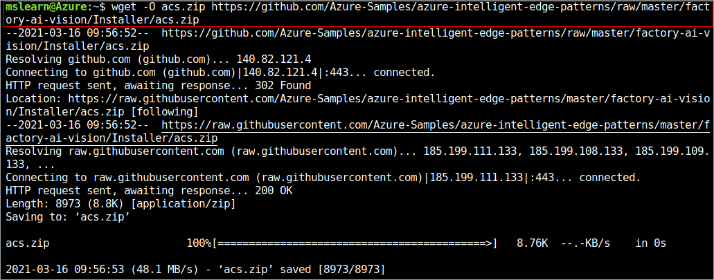
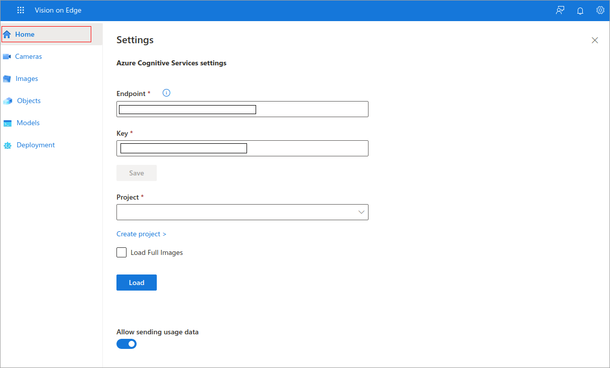

Perform the following steps in the Azure Cloud Shell environment.

## Install the Vision on Edge Solution Accelerator

1. Run the following command to download installer (acs.zip) from GitHub.

   ```
   wget -O acs.zip https://github.com/Azure-Samples/azure-intelligent-edge-patterns/raw/master/factory-ai-vision/Installer/acs.zip
   ```

   [](../media/download-installer.png#lightbox)

2. Unzip the installer.

   ```
   unzip -o acs.zip
   ```

   [](../media/unzip-installer.png#lightbox)

3. Execute the installer. It will check the az command and check if it requires any installing/updating the IoT extension.

   ```
   bash factory-ai-vision-install.sh
   ```

   [](../media/execute-installer.png#lightbox)

4. You would be asked if you would like to use an existing Custom Vision Service. Choose **no** and go ahead to create a new one with the instruction.

   [](../media/create-custom-vision-service.png#lightbox)

5. Once you create custom vision service information, make a note of **API key** and **Endpoint**.

   [](../media/copy-api-key-endpoint.png#lightbox)

6. Next you will be asked if you want to use Azure Live Video Analytics. Choose **yes** and it will create Azure Media Service.

   [](../media/create-azure-media-service.png#lightbox)

7. Copy the "SERVICE-PRINCIPLE-SECRET" information. You will need the secret information for later use.         

   [](../media/service-principal-secret.png#lightbox)

8. There will be a list of IoT hubs, choose the IoT Hub that you created in this module.  

   [](../media/list-iot-hubs.png#lightbox)

9. It will show a list of devices in your account, and choose the device to install VisionEdge. 

   [](../media/device-list.png#lightbox)

10. Choose the platform you are going to deploy.

   [](../media/choose-platform.png#lightbox)

11. You will be asked if your device has a GPU or not. Choose CPU as your Edge device doesn't have it.

   [](../media/choose-device.png#lightbox)

12. The installation will be started after. You'll wait for couple minutes to complete the installation. You can check the deployment status on the [Azure portal](https://portal.azure.com/#home)

   [](../media/create-deployment.png#lightbox)

13. Open your browser, connect to **http://YOUR_IP:8181**. You'll connect to the VisiononEdge solution.

14. To find your Public IP address, go to the overview page of your virtual machine and copy it.

   [](../media/vm-overview.png#lightbox)

15. When you connect to the Vision on Edge solution, click on the Home page.

   [](../media/vision-on-edge.png#lightbox)