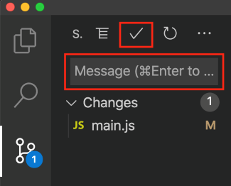
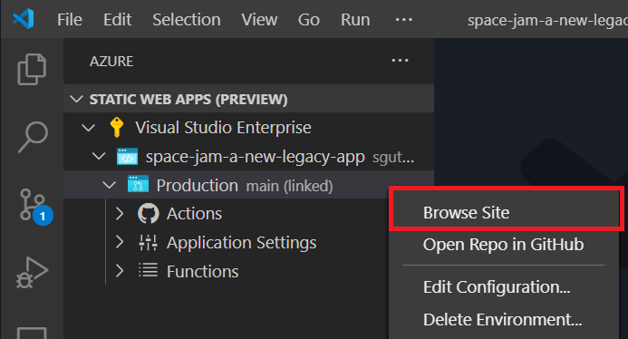

The final function is the one that will simulate the game actually running. In this case, instead of waiting 12 minutes we will pretend that a quarter is only 12 seconds. 

The `startNextQuarter()` function will be called from the button that is defined in `index.html`. Locate the div with the id "start" to see the onclick declaration. 

```javascript
// This function is called when the Game button is clicked. Each time the button is clicked
// it will run through a 12-second timer (simulating 12 minutes) and then update the game
// to the next quarter
function startNextQuarter() {
    // If there aren't exactly 5 players on the court, alert the coach that the game can't start
    if(playersOnCourt != maxPlayersOnCourt){
        alert("Choose exactly " + maxPlayersOnCourt + " players to be on the court.");
        return;
    }

    document.getElementById("start").innerHTML = "Q" + (currentQuarter+1) + " is in progress";

    // Define the interval period for the quarter, in this case, 12 seconds
    var interval = secondsInQuarter;

    // Set the quarterInplay variable to true so that the coach can't move players during
    // gameplay
    quarterInPlay = true;

    // Update the count down every 1 second, as indicated by the `1000` as the second parameter
    // to the setInterval function
    var x = setInterval(function() {        
        // Display the current time on the court board
        document.getElementById("timer").innerHTML = "Q "+ (currentQuarter+1) + " Timer: " + ((secondsInQuarter - interval)+1);

        // Decrement the interval counter for this quarter
        interval--;

        // If the quarter has ended, reset the interval timer, and get ready for the next quarter
        if (interval < 0) {
            clearInterval(x);
            if(currentQuarter < 3) {
                endQuarter();
            }
            else {
                endGame();
            }
        }
    }, 1000);
}
```

While the interval functionality is beyond the scope of this module, one critical piece (especially for when you're testing new functionality) is that you can modify the interval timing, which is the the second parameter in the `setInterval()` function, in this case set to 1000. You can set this to 100 if you want the quarters to go by quicker to reduce the amount of time it takes to test new changes.

## Test your new app

It's finally time! The app is complete! We can now test our app. Remmeber, you will want to test all of the functionality (including trying to add too many players to the court, or starting the game when there are too few players on the court).

1. Choose 5 characters
2. Press the "Start the Game!" button
3. When the timer stops, adjust (or not) the players on the court vs taking a break
4. Press the "Start Q2" button when your lineup is locked in

:::image type="content" source="../media/final-test-1.png" alt-text="Screenshot showing the test of the final web app.":::

Repeat steps 3 and 4 this for all 4 quarters and you should get to the end of the game!

:::image type="content" source="../media/final-test-2.png" alt-text="Screenshot showing completing the first game in the web app.":::

Congratulations! You completed the web app!

## Deploy your final web app

Now that you have completed your web app and you were able to test it locally, you can deploy it to the web! Remember, this is actually fairly easy because all you have to do is push your changes to your main branch! 

To commit and push your changes, go to the source control extension, add a commit mesage, and click on the check mark at the top. 



Next, push your changes by clicking on the up and down arrows at the bottom of the Visual Studio Code window (ensure you're on the main branch).


Once you commit and push your changes (and wait a little while for the GitHub Action to be triggered and completed), you can go back to the Azure extension, right-click the production app, and choose Browse Site.



For example, the one built during creation of this module can be found at [https://aka.ms/LearnWithDrG/SpaceJamANewLegacyWebApp](https://aka.ms/LearnWithDrG/SpaceJamANewLegacyWebApp?azure-portal=true).

© 2020 Warner Bros. Ent. All Rights Reserved