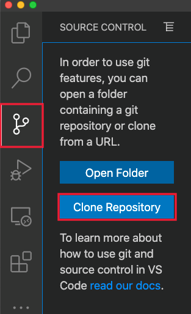
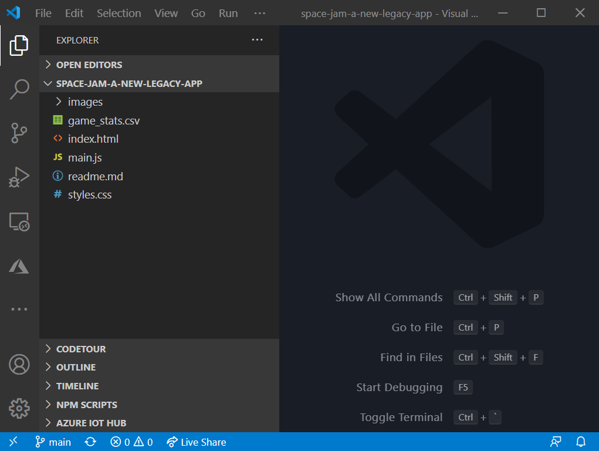
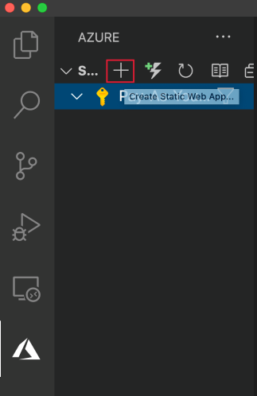

To create our Azure Static Web App, you will use a GitHub template repository to get started. GitHub template repositories are basically repos that have everything setup to be able to accomplish a specific task, while giving you felxibility to make it your own. 

In this case, we will leverage the Static Web Vanilla Basic repo template. Before continuing, make sure you have your GitHub account and you are signed in on the browser of your choice. 

>[!NOTE] 
>You can also create a basic web app without deploying it to Azure, which you can setup by following [this Learn module](https://docs.microsoft.com/learn/modules/build-simple-website?azure-portal=true). 

## Create the Azure Static Web App repo

There are many ways to create an Azure Static Web App, and in later units we will introduce some others. For the puposes of this module, we will build a *very* simple web app and deploy it using GitHub Actions.

To get started, you will need to create a repo based on this app. Go to [https://aka.ms/space-jam-template-app](https://github.com/microsoft/space-jam-template/generate?azure-portal=true) and fill out the form, naming your repo `space-jam-app`. You can make this repo public or private, but be sure to include all branches

:::image type="content" source="../media/web-app-repo-setup.png" alt-text="Screenshot showing how to set up the new web app repo on GitHub.com.":::

## Clone your repo using Visual Studio Code

>[!NOTE] 
> You may be prompted to sign in to Azure or GitHub throughout the remaining steps in this unit. If so, follow the instructions to authorize Visual Studio Code to access this specific repository and your Azure subscription if you feel comfortable doing so. This is necessary to complete the module.

One your repo is created, you can clone it (make a copy onto your local computer) using Visual Studio Code. First, open a new Visual Studio Code window by clicking "File -> New Window".

Click on the Source Control menu on the left-hand side and choose "Clone Repository":

Then, back on GitHub.com in your space-jam-app repo, click the Clone button and copy the HTTPS URL:

:::image type="content" source="../media/github-clone-url.png" alt-text="Screenshot showing how to get the HTTPS URL of the repo from GitHub.com.":::

>[!NOTE] 
> The `complete-code` branch is there in case you need it, but you should ignore it for now as you create this web app on your own. Don't worry, there is lots of start code!

Back in Visual Studio Code, paste the URL you just copied into the command prompt and press Enter. If prompted, choose a location for your code to be downloaded.

If prompted, choose to open the code in your current window. Once the files download, Visual Studio Code should look like this:

## Create an Azure Static Web App in Visual Studio Code

Before we start modifying the web app, let's make sure it can deploy successfully with Azure. In Visual Studio Code, click on the Azure extension, and click on the plus sign of the Static Web App area to create a new Static Web App.

Follow the prompts. All will be default except the name and the deployment branch:
- *Static web app a name: `space-jam-app`
- *Deployment branch: `main`
- Web App Location: `/`
- Azure Functions Location: `/`
- Buid path: `build`
- Location: `WESTUS2` (or whatever is closest to you geographically!)

You will then be prompted to view the GitHub Action associated with this Static Web App. 

Clicking on "Show Actions" will take you to the Actions page of your space-jam-web-app GitHub repo that you created at the beginning of this unit.

:::image type="content" source="../media/action-on-github.png" alt-text="Screenshot showing GitHub Action for this web app.":::

If you want, you can click on the Action and then click on "Workflow file" to see the workflow that was generated. This Action will take all pushed to the main branch and deploy them to the Azure Static Web App that is saved in the secret GitHub token that was setup when you connected the repo to Azure in Visual Studio Code. GitHub Actions is beyond the scope of this module, but if you want to learn more you can check out the [GitHub Actions Learn module](https://docs.microsoft.com/learn/modules/github-actions-ci?azure-portal=true).

For the purposes of this module, all you have to know is that if you push changes to your main branch, they will get rendered on the static web app.

## View the web app live in the browser

The final setup step is to make sure your web app is actually live. Back in Visual Studio Code in the Azure extension, right click on the production site for the space-jam-web-app and click "Browse Site".

You may have to authorize Visual Studio Code to open a new brower window or tab. After you've done this, your live web app will open in a browser tab and you should see the beginnings of a Looney Tunes basketball web app. 

:::image type="content" source="../media/web-app-browser.png" alt-text="Screenshot showing the basketball web app with no functionality.":::

Congratulations! You just deployed an Azure Static Web App! Now it's time to make this usable with our data.