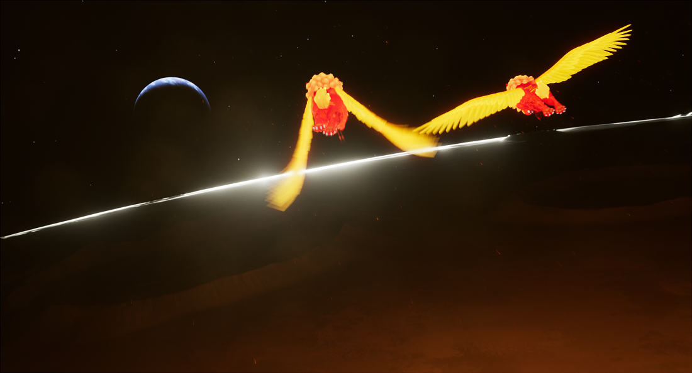

Between watching Fei Fei design, prototype, test, and ultimate succeed at creating a rocket that launched her to the Moon, and experiencing a little taste of what NASA scientists and Engineers might analyze to determine how to account for every ounce of weight on a rocket, it's clear why data science skills and practices are so critical to space exploration. 

NASA may have a lot more information and clearer standards than what we could decipher online to do this analysis, but the exploration and understanding of data from multiple sources is prolific through so many industries, making the journey you just completed one that is transferrable to solving many more problems. 

Throughout this module, you:
- Gathered information about samples brought back from the Moon via the Apollo missions, and information about the types of space crafts and rockets used for Apollo and Artemis missions
- Compiled dataframes (tables) of that data that told stories and provided insights
- Created a prediction of how much samples could be returned from the Artemis missions
- Made a recommendation for the amount and types of rocks astronauts should focus their efforts on based on the rocks that are being used for research here on Earth

The data journey can take many turns, and with your new data wrangling skills, you should feel empowered to find other data sets or cut the data used here in new ways to discover and uncover new information about Space exploration and Moon Sample Recovery...or...any problem you might be interested in!

Remember, this module is a part of a multi-modal approach to learning, meaning you can also follow along with a video tutorial on the [Learn with Dr G Learn TV video series](https://aka.ms/LearnWithDrG).

And with that, Fei Fei ends her journey to the Moon.

