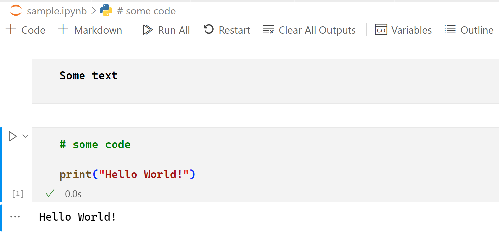

To create documentation for a system, you often consider several different things like a textual description, flowcharts for the architecture and even code for important parts. To properly describe a system, you therefore conclude you need more than one file and stored in different formats. Because you’re looking to maintain many different files, that can be a bit cumbersome. You're therefore looking for a way to reduce this complexity.

## What is a notebook?
Notebooks are interactive files that allow the mixing of executable code, visualizations, equations, and narrative text. Notebooks are composed of code cells that make it easy to quickly iterate on code. This capability makes it ideal to use when performing data science, machine learning, documentation, or any type of prototyping. A notebook uses the concept of cells to represent different types of content. Here’s what a Notebook can look like:  

In this image is a rendered Notebook with a markdown cell on top displaying 'Some text' and under it a code cell for Python. Additionally, the code cell was executed and displayed the text 'Hello world' because of running the code - print("Hello world").

## What is Polyglot Programming?
Polyglot programming is the practice of using multiple programming languages, using the strength of each language for different tasks. When polyglot programming meets notebooks, you get Polyglot Notebooks! 

As opposed to traditional notebooks that are typically used with Python, the Polyglot Notebooks extension allows you to use multiple programming languages natively all in the same notebook in Visual Studio Code! No more needing wrapper libraries or magic commands to work with your favorite languages in the same notebook!

## Why use Polyglot Notebooks
There are many reasons why Polyglot Notebook is a great tool to use for your everyday workflows.
- **Supports many languages**. Polyglot Notebooks supports various different languages. Current supported languages are C#, F#, PowerShell, JavaScript, HTML, Mermaid, SQL, KQL (Kusto Query Language).
- **Powerful features**. Polyglot Notebook has a set of features that makes it a compelling choice. Noteworthy features are, for example,  the ability to share variable between cells regardless of chosen language. You can for example fetch data using C# and, in another cell, read, and work with the same data in JavaScript. There are also magic commands can extend the capabilities of Polyglot Notebook. 
- **Prototyping is easy**. With all Notebook solutions prototyping, an app is made easy as you don’t need a full-fledged IDE to get started with writing and running code. 

## Polyglot Notebook vs Jupyter Notebook
If you’re used to working with Notebooks already, the first thing that comes to mind might be Jupyter Notebooks. While that’s a great solution, we believe that Polyglot Notebook offers extra value. The significant differences are in the number of languages supported by Polyglot Notebooks. Polyglot Notebook also offers features like variable sharing, magic commands, and ability to render flowcharts via Mermaid, just to mention a few.

The differences enable you to, for example, build full stack solutions. With Polyglot the following example is made possible: Imagine querying a data source, exposing that as a Web API, and then calling said API from another cell and render it as HTML, all possible thanks to Polyglot Notebooks. Additionally, you're able to document the above example with state and flow diagrams.