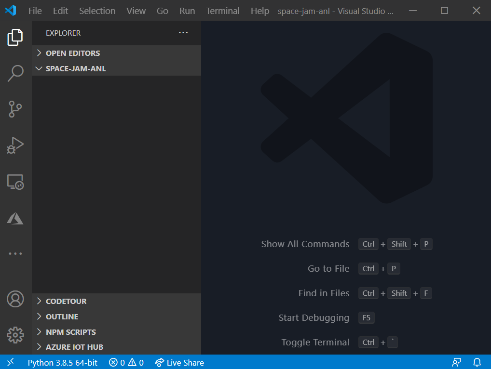
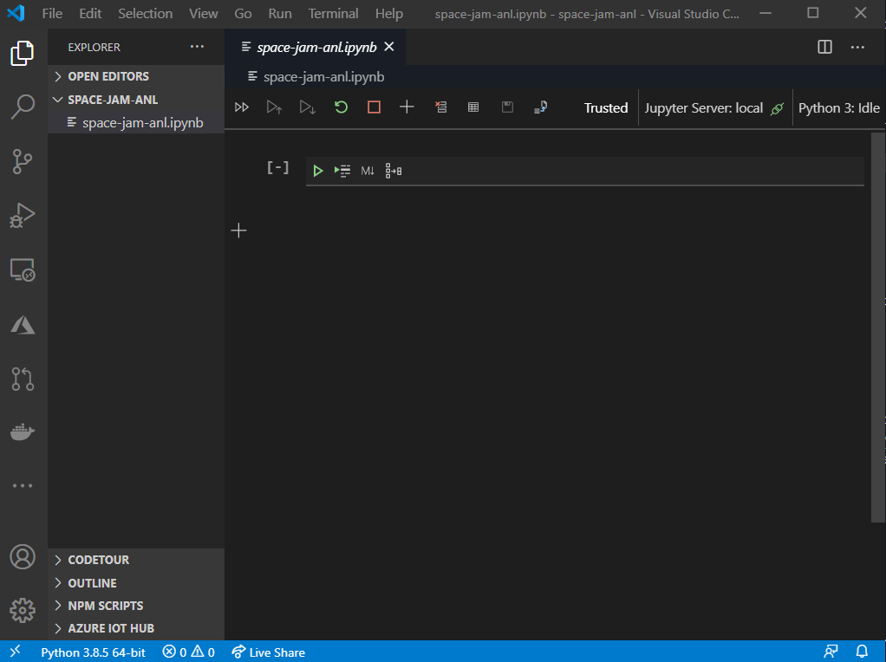
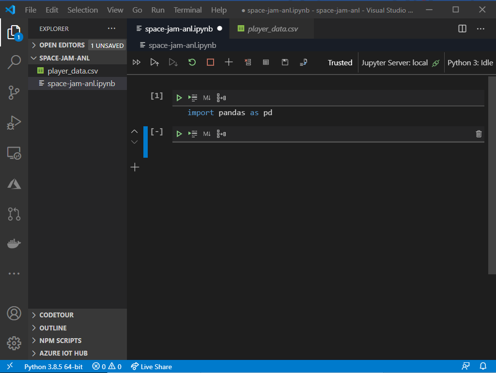
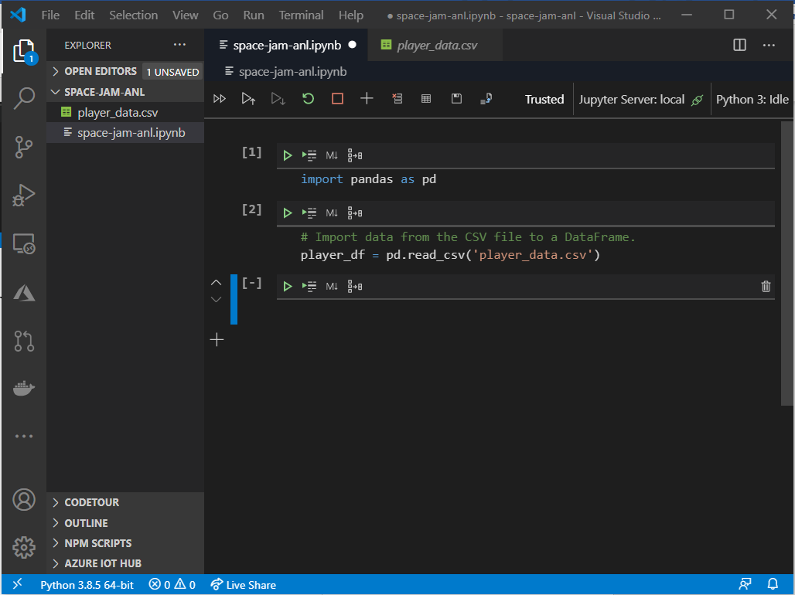

In [Space Jam: A New Legacy](https://spacejam.com) we see Dom passionate about coding and his dad, LeBron James, passionate about basketball. Inspired by this set of passions that are seemingly so different, we're going to dive into how coding can play a role in basketball, particularly in understanding players based on their stats.

Before jumping into the module, be sure to make sure your environment is setup and ready to go. For this module, you will need a coding editor (we use Visual Studio Code), Python, and Jupyter notebooks (we use the Python extension for Visual Studio Code).

If you haven't yet installed Visual Studio Code, you can find guides on the [Visual Studio Code Learn to Code site](https://aka.ms/LearnOnVSCode). Here, you can also find a Coding Pack for Python for Windows that will install everything you need for this module. If you're not on Windows, you can find a guide for seeting up your environment on the [Data Science in Visual Studio Code docs page](https://code.visualstudio.com/docs/python/data-science-tutorial).

## Set up Visual Studio Code with a new Jupyter file

Once you have your environment setup, you should create a folder called space-jam wherever you store code on your computer. This can be anywhere, for example, on your Desktop. 


Open Visual Studio Code, and from the Welcome tab, click "Open Folder". You can also do this by clicking File -> Open... and navigating to the folder you just created.



Create a new file in the space-jam folder called space-jam.ipynb by clicking on the new file icon next to the folder name in the Explorer.


Make sure the file opens into a notebook and that the Jupyter server is connected and the kernel is pointing to the desired Python version.



## Download data with basketball stats

Next, you will need some data. While you can gather data on your own, we have gathered data from 47 anonymous basketball players to use throughout this module. You can download the data by heading to the [player_data.csv on GitHub](https://aka.ms/LearnWithDrG/SpaceJam/Data1) and downloading the CSV file. Make sure you save the data in a file called player_data.csv and save it in the space-jam folder you just created.

Visual Studio Code should show you this data if you click on the CSV file.


## Check local setup with Python libraries

Now that you have your local environment and data ready to go, you should check to make sure everything is setup properly. 

In the top cell of the space-jam.ipynb file, import the Pandas library as pd. This will allow you to call Pandas functions using `pd.`.

```python
import pandas as pd
```

If that completes, successfully, you should see a [1] next to the cell and no output.



Next, you will make sure you can import the data into your coding environment by using the Pandas function `read_csv`. 

```python
# Import data from the CSV file to a DataFrame.
player_df = pd.read_csv('player_data.csv')
```

If that us successful, you should see a [2] next to the cell and no output.



Now you're ready to start exploring and cleansing your data!
