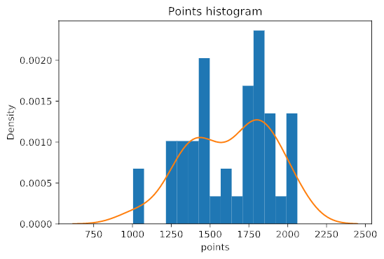
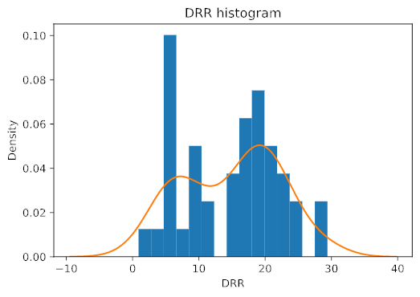

Recognizing that data comes from different populations can be essential in business data analysis. Imagine that you were analyzing occupancy data for a lodging-rental business. Vacation renters and business renters (such as individuals renting for a temporary business trip) could distribute themselves very differently for length of stay, time of year, or types of amenities required. However, being able to separate out the different populations could be useful, such as for generating different marketing promotions for each population.

In our case, we know that have a mixture of human basketball players and Looney Tunes players in our dataset. We can take a few of our more distinguished bimodal graphs, for example `points`, `DRR`, and `PER` and try to see if we can differentiate the two populations. First, let's look at each of these distributions on their own:

```python
# Plot the KDE for 'points' over the probability-density histogram.
plt.hist(player_df['points'], density=True, bins=15)
plt.title('Points histogram')
sns.kdeplot(player_df['points']);
```



We can see that at around 1,600 is when the split across the two populations occurs. We can use that to explore the data further. One hypothesis is that Looney Tunes players might score more points because they often have additional skills that humans just don't have. We can start to see the rows where players have scored more than 1,600 points: 

```python
player_df.loc[player_df['points'] >= 1600].info()
```

```output
<class 'pandas.core.frame.DataFrame'>
Int64Index: 24 entries, 0 to 41
Data columns (total 14 columns):
 #   Column       Non-Null Count  Dtype  
---  ------       --------------  -----  
 0   ID           24 non-null     int64  
 1   points       24 non-null     float64
 2   possessions  24 non-null     float64
 3   team_pace    24 non-null     float64
 4   GP           21 non-null     float64
 5   MPG          21 non-null     float64
 6   TS%          24 non-null     float64
 7   AST          24 non-null     float64
 8   TO           24 non-null     float64
 9   USG          24 non-null     float64
 10  ORR          24 non-null     float64
 11  DRR          24 non-null     float64
 12  REBR         24 non-null     float64
 13  PER          21 non-null     float64
dtypes: float64(13), int64(1)
memory usage: 2.8 KB
```

There are 24 rows that have players that have scored at least 1,600 points. Let's continue narrowing down the players that are more likely to be Looney Tunes. 

```python
# Plot the KDE for 'DRR' over the probability-density histogram.
plt.hist(player_df['DRR'], density=True, bins=15)
plt.title('DRR histogram')
sns.kdeplot(player_df['DRR']);
```



At around 15 defensive rebounds is where we see the distribution split. So we can see if that helps narrow down our population that we think might be Looney Tunes. Again, we could hypothesis that Looney Tunes are going to be more likely to try to get the ball in a defensive rebound because of their special skills, so we can count how many rows/players have scored more than 1,600 points and have a DRR of more than 15:

```python
player_df.loc[(player_df['points'] >= 1600) & (player_df['DRR'] >= 15)].info()
```

```output
<class 'pandas.core.frame.DataFrame'>
Int64Index: 19 entries, 0 to 41
Data columns (total 14 columns):
 #   Column       Non-Null Count  Dtype  
---  ------       --------------  -----  
 0   ID           19 non-null     int64  
 1   points       19 non-null     float64
 2   possessions  19 non-null     float64
 3   team_pace    19 non-null     float64
 4   GP           16 non-null     float64
 5   MPG          17 non-null     float64
 6   TS%          19 non-null     float64
 7   AST          19 non-null     float64
 8   TO           19 non-null     float64
 9   USG          19 non-null     float64
 10  ORR          19 non-null     float64
 11  DRR          19 non-null     float64
 12  REBR         19 non-null     float64
 13  PER          17 non-null     float64
dtypes: float64(13), int64(1)
memory usage: 2.2 KB
```

Finally, we can take a look at PER. If our hypothesis is correct so far, then Looney Tunes probably have a higher PER.

```python
# Plot the KDE for 'PER' over the probability-density histogram.
plt.hist(player_df['PER'], density=True, bins=15)
plt.title('PER histogram')
sns.kdeplot(player_df['PER']);
```


At around 17 is when the PER distributions get split, we can take a look at those rows now that are at least 17 PER:

```python
player_df.loc[(player_df['points'] >= 1600) & (player_df['DRR'] >= 15) & (player_df['PER'] >= 17)]
```

**Output**
|  | ID | points | possessions | team_pace | GP | MPG | TS% | AST | TO | USG | ORR | DRR | REBR | PER |
|---|---|---|---|---|---|---|---|---|---|---|---|---|---|---|
| 26 | 31 | 2049.0 | 1434.0 | 110.0 | 64.0 | 38.8 | 0.619 | 31.5 | 14.9 | 35.5 | 8.3 | 17.6 | 12.8 | 28.44 |
| 27 | 32 | 1795.0 | 1481.8 | 112.1 | 62.0 | 35.4 | 0.608 | 31.9 | 14.5 | 32.0 | 6.5 | 22.5 | 12.9 | 23.34 |
| 28 | 33 | 1805.0 | 1509.9 | 108.6 | 64.0 | 35.4 | 0.622 | 27.9 | 13.9 | 36.0 | 5.9 | 27.7 | 12.2 | 22.41 |
| 30 | 35 | 1963.0 | 1539.1 | 117.4 | NaN | NaN | 0.633 | 32.3 | 16.2 | 34.0 | 5.9 | 19.8 | 13.1 | 27.16 |
| 31 | 36 | 2062.0 | 1505.7 | 111.5 | NaN | 37.0 | 0.620 | 29.8 | 15.6 | 36.2 | 4.9 | 23.9 | 14.7 | 27.86 |
| 32 | 37 | 1845.0 | 1435.7 | 113.1 | 69.0 | 36.9 | 0.634 | 33.2 | 14.0 | 36.5 | 4.1 | 21.5 | 16.4 | 34.26 |
| 33 | 38 | 1778.0 | 1526.4 | 109.3 | 66.0 | 34.9 | 0.612 | 30.6 | 15.9 | 35.9 | 5.5 | 18.8 | 13.7 | 28.65 |
| 34 | 39 | 1901.0 | 1444.1 | 109.7 | 67.0 | 36.5 | 0.609 | 27.2 | 14.8 | 35.5 | 5.0 | 21.8 | 8.9 | 20.12 |
| 35 | 41 | 2030.0 | 1431.0 | 112.3 | 68.0 | 37.0 | 0.618 | 32.5 | 15.3 | 34.5 | 5.7 | 15.7 | 13.2 | 30.07 |
| 36 | 42 | 1631.0 | 1465.7 | 110.1 | 66.0 | 37.5 | 0.613 | 28.4 | 14.4 | 35.7 | 6.5 | 20.7 | 14.0 | 28.40 |
| 38 | 44 | 1821.0 | 1443.7 | 118.8 | 66.0 | 36.6 | 0.609 | 27.3 | 13.5 | 35.8 | 7.0 | 23.8 | 11.5 | 22.96 |
| 39 | 45 | 1604.0 | 1526.5 | 114.5 | 67.0 | 37.6 | 0.633 | 28.2 | 13.0 | 34.2 | 6.1 | 19.0 | 16.3 | 33.89 |
| 40 | 46 | 1740.0 | 1443.9 | 114.1 | 68.0 | 37.1 | 0.611 | 26.6 | 15.2 | 29.3 | 8.3 | 17.7 | 11.1 | 21.22 |
| 41 | 47 | 1993.0 | 1459.0 | 112.5 | NaN | 36.9 | 0.627 | 30.4 | 15.0 | 33.7 | 6.3 | 19.3 | 14.1 | 28.76 |

We could reasonably expect these to represent the Looney Tunes players, and as part of this module I can tell you that the 16 Looney Tunes that we added to this data set were in fact added at the very end. If you didn't know that, though, you could reasonable assume that the data was compiled from two different datasets, where the second dataset was simply added to the end of the first. 

We can see that the rows for Player ID 34 and 40 are not a part of this set. We removed 40 because that was the row where the points were only 183, and looking at player ID 34:

```python
player_df.loc[player_df['ID'] == 34]
```

**Output**
| | ID | points | possessions | team_pace | GP | MPG | TS% | AST | TO | USG | ORR | DRR | REBR | PER |
|---|---|---|---|---|---|---|---|---|---|---|---|---|---|---|
| 29 | 34 | 1743.0 | 1422.4 | 112.9 | 64.0 | 36.3 | 0.619 | 30.9 | 15.6 | 34.5 | 5.9 | 18.9 | 14.8 | NaN |

The PER for Player 34 is `NaN`, since we haven't had a chance to impute data yet, so that makes sense.
