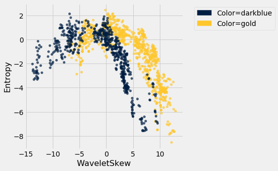
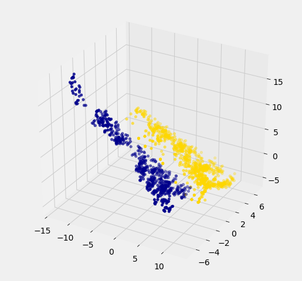
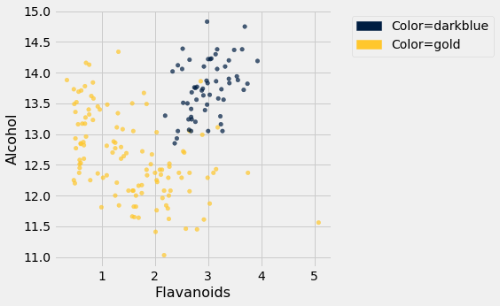
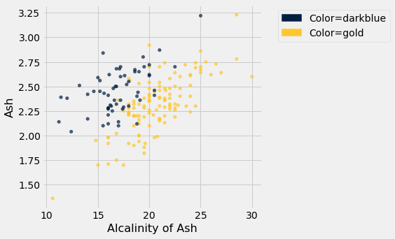
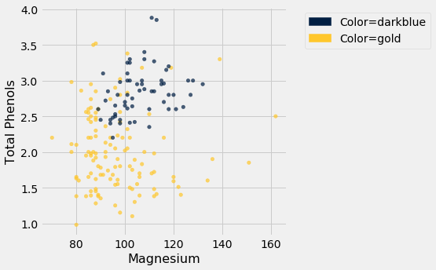

> [!NOTE]
> You can find an interactive version of this unit named **implementing-the-classifier.ipynb** in your virtual environment

If you haven't set up your online Visual Studio Codespaces environment for the Learning Path "Foundations of Data Science", please refer to the first unit **Setup.**

Open [Visual Studio Codespaces](https://online.visualstudio.com/environments)

We are now ready to implement a $k$-nearest neighbor classifier based on
multiple attributes. We have used only two attributes so far, for ease
of visualization. But usually predictions will be based on many
attributes. Here is an example that shows how multiple attributes can be
better than pairs.

### Banknote authentication

This time we'll look at predicting whether a banknote (for example, a \$20
bill) is counterfeit or legitimate. Researchers have put together a data
set for us, based on photographs of many individual banknotes: some
counterfeit, some legitimate. They computed a few numbers from each
image, using techniques that we won't worry about for this course. So,
for each banknote, we know a few numbers that were computed from a
photograph of it as well as its class (whether it is counterfeit or
not). Let's load it into a table and take a look.

``` python
banknotes = Table.read_table(path_data + 'banknote.csv')
banknotes
```

``` output
| WaveletVar | WaveletSkew | WaveletCurt | Entropy  | Class |
|------------|-------------|-------------|----------|-------|
| 3.6216     | 8.6661      | -2.8073     | -0.44699 | 0     |
| 4.5459     | 8.1674      | -2.4586     | -1.4621  | 0     |
| 3.866      | -2.6383     | 1.9242      | 0.10645  | 0     |
| 3.4566     | 9.5228      | -4.0112     | -3.5944  | 0     |
| 0.32924    | -4.4552     | 4.5718      | -0.9888  | 0     |
| 4.3684     | 9.6718      | -3.9606     | -3.1625  | 0     |
| 3.5912     | 3.0129      | 0.72888     | 0.56421  | 0     |
| 2.0922     | -6.81       | 8.4636      | -0.60216 | 0     |
| 3.2032     | 5.7588      | -0.75345    | -0.61251 | 0     |
| 1.5356     | 9.1772      | -2.2718     | -0.73535 | 0     |  

... (1362 rows omitted)
```

Let's look at whether the first two numbers tell us anything about
whether the banknote is counterfeit or not. Here's a scatterplot:


``` python
banknotes = banknotes.join('Class', color_table)
```

``` python
banknotes.scatter('WaveletVar', 'WaveletCurt', group='Color')
```


Interesting! Those two measurements do seem helpful for
predicting whether the banknote is counterfeit or not. However, in this
example you can now see that there is some overlap between the blue
cluster and the gold cluster. This indicates that there will be some
images where it's hard to tell whether the banknote is legitimate based
on just these two numbers. Still, you could use a $k$-nearest neighbor
classifier to predict the legitimacy of a banknote.

Take a minute and think it through: Suppose we used $k=11$ (say). What
parts of the plot would the classifier get right, and what parts would
it make errors on? What would the decision boundary look like?

The patterns that show up in the data can get wild. For instance,
here's what we'd get if used a different pair of measurements from the
images:

``` python
banknotes.scatter('WaveletSkew', 'Entropy', group='Color')
```



There does seem to be a pattern, but it's a complex one.
Nonetheless, the $k$-nearest neighbors classifier can still be used and
will effectively "discover" patterns out of this. This illustrates how
powerful machine learning can be: it can effectively take advantage of
even patterns that we would not have anticipated, or that we would have
thought to "program into" the computer.

### Multiple attributes

So far I've been assuming that we have exactly two attributes that we can
use to help us make our prediction. What if we have more than two? For
instance, what if we have three attributes?

Here's the cool part: you can use the same ideas for this case, too. All
you have to do is make a three-dimensional scatterplot, instead of a
two-dimensional plot. You can still use the $k$-nearest neighbors
classifier, but now computing distances in three dimensions instead of just
two. It just works. Cool!

In fact, there's nothing special about two or three. If you have four attributes,
you can use the $k$-nearest neighbors classifier in four dimensions. five
attributes? Work in five-dimensional space. And no need to stop there! This
all works for arbitrarily many attributes; you just work in a high
dimensional space. It gets wicked-impossible to visualize, but that's
OK. The computer algorithm generalizes nicely: all you need is the
ability to compute the distance, and that's not hard. Mind-blowing
stuff!

For instance, let's see what happens if we try to predict whether a
banknote is counterfeit or not using three of the measurements, instead of
just two. Here's what you get:

``` python
ax = plt.figure(figsize=(8,8)).add_subplot(111, projection='3d')
ax.scatter(banknotes.column('WaveletSkew'),
           banknotes.column('WaveletVar'),
           banknotes.column('WaveletCurt'),
           c=banknotes.column('Color'));
```



Awesome! With just two attributes, there was some overlap between the two
clusters (which means that the classifier was bound to make some
mistakes for pointers in the overlap). But when we use these 3
attributes, the two clusters have almost no overlap. In other words, a
classifier that uses these three attributes will be more accurate than one
that only uses the 2 attributes.

This is a general phenomenom in classification. Each attribute can
potentially give you new information, so more attributes sometimes helps
you build a better classifier. The cost is that now we have
to gather more information to measure the value of each attribute, but
this cost may be well worth it if it significantly improves the accuracy
of our classifier.

To sum up: you now know how to use $k$-nearest neighbor classification
to predict the answer to a yes/no question, based on the values of some
attributes, assuming you have a training set with examples where the
correct prediction is known. The general roadmap is this:

1.  identify some attributes that you think might help you predict the
    answer to the question.
2.  Gather a training set of examples where you know the values of the
    attributes as well as the correct prediction.
3.  To make predictions in the future, measure the value of the
    attributes and then use $k$-nearest neighbor classification to
    predict the answer to the question.

### Distance in multiple dimensions

We know how to compute distance in 2-dimensional space. If we have a
point at coordinates $(x_0,y_0)$ and another at $(x_1,y_1)$, the
distance between them is

$$D = \sqrt{(x_0-x_1)^2 + (y_0-y_1)^2}.$$

In 3-dimensional space, the points are $(x_0, y_0, z_0)$ and
$(x_1, y_1, z_1)$, and the formula for the distance between them is

$$
D = \sqrt{(x_0-x_1)^2 + (y_0-y_1)^2 + (z_0-z_1)^2}
$$

In $n$-dimensional space, things are a bit harder to visualize, but I
think you can see how the formula generalized: we sum up the squares of
the differences between each individual coordinate, and then take the
square root of that.

In the last section, we defined the function `distance` that returned
the distance between two points. We used it in two-dimensions, but the
great news is that the function doesn't care how many dimensions there
are! It just subtracts the two arrays of coordinates (no matter how long
the arrays are), squares the differences and adds up, and then takes the
square root. To work in multiple dimensions, we don't have to change the
code at all.

``` python
def distance(point1, point2):
    """Returns the distance between point1 and point2
    where each argument is an array
    consisting of the coordinates of the point"""
    return np.sqrt(np.sum((point1 - point2)**2))
```

Let's use this on a [new
dataset](https://archive.ics.uci.edu/ml/datasets/Wine). The table `wine`
contains the chemical composition of 178 different Italian wines. The
classes are the grape species, called cultivars. There are three classes
but let's just see whether we can tell Class 1 apart from the other two.

``` python
wine = Table.read_table(path_data + 'wine.csv')

# For converting Class to binary

def is_one(x):
    if x == 1:
        return 1
    else:
        return 0

wine = wine.with_column('Class', wine.apply(is_one, 0))
```

``` python
wine
```

``` output
| Class | Alcohol | Malic Acid | Ash  | Alcalinity of Ash | Magnesium | Total Phenols | Flavanoids | Nonflavanoid phenols | Proanthocyanins | Color Intensity | Hue  | OD280/OD315 of diluted wines | Proline |
|-------|---------|------------|------|-------------------|-----------|---------------|------------|----------------------|-----------------|-----------------|------|------------------------------|---------|
| 1     | 14.23   | 1.71       | 2.43 | 15.6              | 127       | 2.8           | 3.06       | 0.28                 | 2.29            | 5.64            | 1.04 | 3.92                         | 1065    |
| 1     | 13.2    | 1.78       | 2.14 | 11.2              | 100       | 2.65          | 2.76       | 0.26                 | 1.28            | 4.38            | 1.05 | 3.4                          | 1050    |
| 1     | 13.16   | 2.36       | 2.67 | 18.6              | 101       | 2.8           | 3.24       | 0.3                  | 2.81            | 5.68            | 1.03 | 3.17                         | 1185    |
| 1     | 14.37   | 1.95       | 2.5  | 16.8              | 113       | 3.85          | 3.49       | 0.24                 | 2.18            | 7.8             | 0.86 | 3.45                         | 1480    |
| 1     | 13.24   | 2.59       | 2.87 | 21                | 118       | 2.8           | 2.69       | 0.39                 | 1.82            | 4.32            | 1.04 | 2.93                         | 735     |
| 1     | 14.2    | 1.76       | 2.45 | 15.2              | 112       | 3.27          | 3.39       | 0.34                 | 1.97            | 6.75            | 1.05 | 2.85                         | 1450    |
| 1     | 14.39   | 1.87       | 2.45 | 14.6              | 96        | 2.5           | 2.52       | 0.3                  | 1.98            | 5.25            | 1.02 | 3.58                         | 1290    |
| 1     | 14.06   | 2.15       | 2.61 | 17.6              | 121       | 2.6           | 2.51       | 0.31                 | 1.25            | 5.05            | 1.06 | 3.58                         | 1295    |
| 1     | 14.83   | 1.64       | 2.17 | 14                | 97        | 2.8           | 2.98       | 0.29                 | 1.98            | 5.2             | 1.08 | 2.85                         | 1045    |
| 1     | 13.86   | 1.35       | 2.27 | 16                | 98        | 2.98          | 3.15       | 0.22                 | 1.85            | 7.22            | 1.01 | 3.55                         | 1045    |  

... (168 rows omitted)
```

The first two wines are both in Class 1. To find the distance between
them, we first need a table of just the attributes:

``` python
wine_attributes = wine.drop('Class')
```

``` python
distance(np.array(wine_attributes.row(0)), np.array(wine_attributes.row(1)))
```

``` output
31.265012394048398
```

The last wine in the table is of Class 0. Its distance from the first
wine is:

``` python
distance(np.array(wine_attributes.row(0)), np.array(wine_attributes.row(177)))
```

``` output
506.05936766351834
```

That's quite a bit bigger! Let's do some visualization to see if Class 1
really looks different from Class 0.

``` python
wine_with_colors = wine.join('Class', color_table)
```

``` python
wine_with_colors.scatter('Flavanoids', 'Alcohol', group='Color')
```



The blue points (Class 1) are almost entirely separate from the gold
ones. That is one indication of why the distance between two Class 1
wines would be smaller than the distance between wines of two different
classes. We can see a similar phenomenon with a different pair of
attributes too:

``` python
wine_with_colors.scatter('Alcalinity of Ash', 'Ash', group='Color')
```



But for some pairs the picture is more murky.

``` python
wine_with_colors.scatter('Magnesium', 'Total Phenols', group='Color')
```



Let's see if we can implement a classifier based on all of the
attributes. After that, we'll see how accurate it is.

### A Plan for the implementation

It's time to write some code to implement the classifier. The input is a
`point` that we want to classify. The classifier works by finding the
$k$ nearest neighbors of `point` from the training set. So, our approach
will go like this:

1.  Find the closest $k$ neighbors of `point`, i.e., the $k$ wines from
    the training set that are most similar to `point`.

2.  Look at the classes of those $k$ neighbors, and take the majority
    vote to find the most-common class of wine. Use that as our
    predicted class for `point`.

So that will guide the structure of our Python code.

``` python
def closest(training, p, k):
    ...

def majority(topkclasses):
    ...

def classify(training, p, k):
    kclosest = closest(training, p, k)
    kclosest.classes = kclosest.select('Class')
    return majority(kclosest)
```

### Implementation step 1

To implement the first step for the kidney disease data, we had to
compute the distance from each patient in the training set to `point`,
sort them by distance, and take the $k$ closest patients in the training
set.

That's what we did in the previous section with the point corresponding
to Alice. Let's generalize that code. We'll redefine `distance` here,
just for convenience.

``` python
def distance(point1, point2):
    """Returns the distance between point1 and point2
    where each argument is an array
    consisting of the coordinates of the point"""
    return np.sqrt(np.sum((point1 - point2)**2))

def all_distances(training, new_point):
    """Returns an array of distances
    between each point in the training set
    and the new point (which is a row of attributes)"""
    attributes = training.drop('Class')
    def distance_from_point(row):
        return distance(np.array(new_point), np.array(row))
    return attributes.apply(distance_from_point)

def table_with_distances(training, new_point):
    """Augments the training table
    with a column of distances from new_point"""
    return training.with_column('Distance', all_distances(training, new_point))

def closest(training, new_point, k):
    """Returns a table of the k rows of the augmented table
    corresponding to the k smallest distances"""
    with_dists = table_with_distances(training, new_point)
    sorted_by_distance = with_dists.sort('Distance')
    topk = sorted_by_distance.take(np.arange(k))
    return topk
```

Let's see how this works on our `wine` data. We'll just take the first
wine and find its five nearest neighbors among all the wines. Remember
that since this wine is part of the dataset, it is its own nearest
neighbor. So we should expect to see it at the top of the list, followed
by four others.

First let's extract its attributes:

``` python
special_wine = wine.drop('Class').row(0)
```

And now let's find its five nearest neighbors.

``` python
closest(wine, special_wine, 5)
```

``` output
| Class | Alcohol | Malic Acid | Ash  | Alcalinity of Ash | Magnesium | Total Phenols | Flavanoids | Nonflavanoid phenols | Proanthocyanins | Color Intensity | Hue  | OD280/OD315 of diulted wines | Proline | Distance |
|-------|---------|------------|------|-------------------|-----------|---------------|------------|----------------------|-----------------|-----------------|------|------------------------------|---------|----------|
| 1     | 14.23   | 1.71       | 2.43 | 15.6              | 127       | 2.8           | 3.06       | 0.28                 | 2.29            | 5.64            | 1.04 | 3.92                         | 1065    | 0        |
| 1     | 13.74   | 1.67       | 2.25 | 16.4              | 118       | 2.6           | 2.9        | 0.21                 | 1.62            | 5.85            | 0.92 | 3.2                          | 1060    | 10.3928  |
| 1     | 14.21   | 4.04       | 2.44 | 18.9              | 111       | 2.85          | 2.65       | 0.3                  | 1.25            | 5.24            | 0.87 | 3.33                         | 1080    | 22.3407  |
| 1     | 14.1    | 2.02       | 2.4  | 18.8              | 103       | 2.75          | 2.92       | 0.32                 | 2.38            | 6.2             | 1.07 | 2.75                         | 1060    | 24.7602  |
| 1     | 14.38   | 3.59       | 2.28 | 16                | 102       | 3.25          | 3.17       | 0.27                 | 2.19            | 4.9             | 1.04 | 3.44                         | 1065    | 25.0947  |  

```

Bingo! The first row is the nearest neighbor, which is itself--there's
a 0 in the `Distance` column as expected. All five nearest neighbors are
of Class 1, which is consistent with our earlier observation that Class
1 wines appear to be clumped together in some dimensions.

### Implementation steps 2 and 3

Next we need to take a "majority vote" of the nearest neighbors and
assign our point the same class as the majority.

``` python
def majority(topkclasses):
    ones = topkclasses.where('Class', are.equal_to(1)).num_rows
    zeros = topkclasses.where('Class', are.equal_to(0)).num_rows
    if ones > zeros:
        return 1
    else:
        return 0

def classify(training, new_point, k):
    closestk = closest(training, new_point, k)
    topkclasses = closestk.select('Class')
    return majority(topkclasses)
```

``` python
classify(wine, special_wine, 5)
```

``` output
1
```

If we change `special_wine` to be the last one in the dataset, is our
classifier able to tell that it's in Class 0?

``` python
special_wine = wine.drop('Class').row(177)
classify(wine, special_wine, 5)
```

``` output
0
```

Yes! The classifier gets this one right too.

But we don't yet know how it does with all the other wines, and in any
case we know that testing on wines that are already part of the training
set might be over-optimistic. In the final section of this chapter, we
will separate the wines into a training and test set and then measure
the accuracy of our classifier on the test set.
