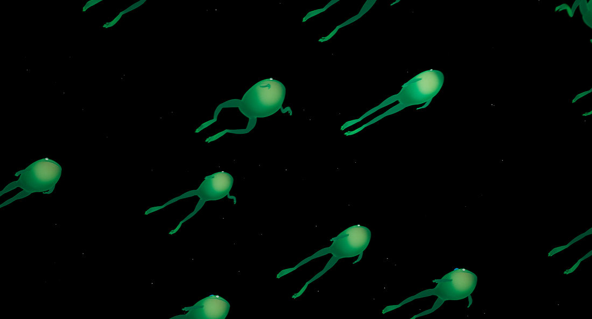

In *Over the Moon*, Fei Fei's mother tells the story of Chang'e. Chang'e is the moon goddess who tried to escape with the love of her life but ended up living eternally alone on the moon. Fei Fei and her mother gaze into the clear night sky as her mother tells Fei Fei that Chang'e's tears turn to star dust. That dust is what we see flying across our skies at night. 

This touching moment inspired this module. When Fei Fei and her parents are looking into the night sky, they're likely watching meteoroids fly through Earth's atmosphere. Although Fei Fei might need to know the mood of Chang'e to predict a major meteor shower, we can rely on measurable events to predict when we can see a meteor shower. At the end of the module, we'll add to our data predictions what we know about Chang'e.

Before we start, you need to understand what meteor showers are. This understanding will help you choose which data to gather to write an algorithm to predict the best date to view a meteor shower. 

## What are meteor showers?

*Meteoroids* are objects in space that are typically made of dust, rocks, or metal. They can range from small grains of dust to small asteroids. They're essentially space rocks floating out in space. 

When meteoroids get near Earth, gravity pulls them into our atmosphere, where they begin to burn. That burning is the light we see in our skies. In this state, meteoroids are called *meteors*. If a meteor passes through the atmosphere without completely burning, it lands somewhere on Earth and is then called a *meteorite*. 

NASA estimates that 48.5 tons of meteoric material fall to Earth each day. Most meteors are completely burned in our atmosphere. The best place to find the ones that reach Earth's surface is the desert or an icy place like Antarctica. They're easier to find in these places because by the time they land on Earth, meteorites look similar to any rock you'd find in your yard. It's difficult to distinguish them from rocks that naturally occur on Earth. 

Meteoroids can originate from comets, asteroids, moons, or planets. The most common source of meteor showers is comets. This module focuses on comets. 

You can learn more about meteors and meteor showers on the [NASA Solar System Exploration website](https://solarsystem.nasa.gov/asteroids-comets-and-meteors/meteors-and-meteorites/overview?azure-portal=true).

. . . Or meteor showers could be flying frogs. Who's to say?

### Meteors from comets 

Comets are made mostly of ice. They're embedded with some dust, rock, and metals. Comets have cylindrical orbits around our sun. So sometimes they are nearer to the sun than other times. When a comet is near the sun, it often begins to melt. As it melts, some of the dust, rock, and metal dislodge from the comet and remain in space at that location. 

When Earth nears a location where a comet has shed debris, that debris can enter our atmosphere and cause meteor showers. Because some locations in Earth's orbit are more likely to have a lot of comet debris, meteor showers are more common in those locations. 

**Fun fact**: Earth's oceans were likely caused by comets that struck our planet during its formation and melted into water!