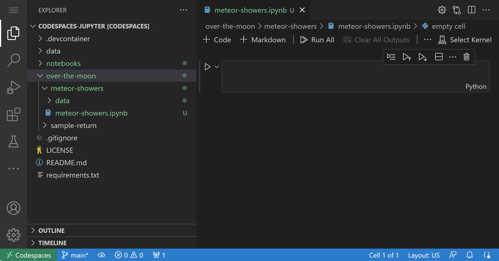

We now know that meteors can be visible from Earth every night. But the best chances of seeing one is to wait for a meteor shower from one of the comets that orbits around our sun. Beyond knowing about the comets, it is important that we also are on the right side of the Earth, where the meteors are entering our atmosphere, and that we are looking into a dark night sky - to optimize the viewing of the meteor tails. 

## Review the data science lifecyle

Before jumping into the code, it's important to review the [data science lifecyle](https://docs.microsoft.com/azure/machine-learning/team-data-science-process/overview?azure-portal=true). Data science is a field that supports the discovery of new ways to view and understand our world using data. A typical data science project will iterate through four main steps:
- Business Understanding
- Data Acquisition and Understanding
- Modeling
- Deployment

A project will *iterate* through these, meaning at every step, you could revisit one of the others to see if there is something that has changed or if what you *now* know might provide insights to change one of the other steps.

While we are not space exploration experts, we can use what we can learn from experts to help guide this module. In a scenario where what you are building and discovering is going to impact something real, you should always consult an expert in the field. 

This module will focus on the "data acquisiton and understanding" node of the data science lifecyle. 

## Set up your local environment

This module will guide you through creating a model to predict the best date to view a meteor shower. To do this, you will need to have some kind of Python notebook development environment setup. If you haven't done this before, we recommend the following steps to setup your local environment. The easiest way to do this is to follow the [Visual Studio Code data science setup docs](https://code.visualstudio.com/docs/python/data-science-tutorial?azure-portal=true). The three things you will need are:
- Visual Studio Code
- Python
- Miniconda

> [!NOTE]
> If you have already completed one of the Over the Moon Learn modules, you can open your "over-the-moon" folder in Visual Studio Code and skip to step 3. 

Once you have everything installed, follow these steps to get your environment ready:
1. Create a folder called "over-the-moon". 
2. Open the folder in Visual Studio Code
3. Create a folder inside that folder called "meteor-showers"
4. Create a folder inside that folder called "data"  in the "meteor-showers" folder
5. Create a file called "meteor-showers.ipynb"
6. Open the meteor-showers.ipynb file in Visual Studio Code
7. Make sure you are using the conda environment that you setup above

Your environment should look like this:

