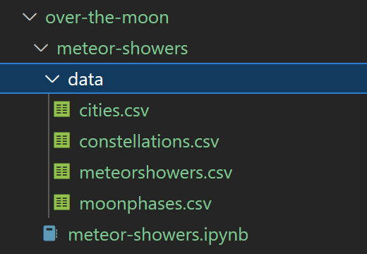

Now it's time to get data ready to create your prediction model. Remember, ideally a meteor expert would guide this step. But even without an expert, we can make a best guess at what data would help us identify the best date to see a meteor shower. 

Before we gather data, it's important to identify the kind of data that we want to find. We know a few things:
- Meteor showers are typically caused by meteoroids that melt off of comets. 
- Comets have an orbit around the sun that's observable and predictable.
- A bright Moon makes a meteor shower harder to see.
- The orbit and spin of Earth affects where a meteor shower can be seen from Earth.

We also know that Chang'e from *Over the Moon* can cause meteor showers, but we'll add that data in a later unit.

## Select comets to focus on

Although meteoroids can come from comets, asteroids, moons, and planets, this module focuses on meteoroids that come from popular comets. We often use four comets to predict when and where meteor showers will be visible. The following sections describe these comets.

### Comet Thatcher

[Comet Thatcher](https://solarsystem.nasa.gov/asteroids-comets-and-meteors/comets/c-1861-g1-thatcher/in-depth/?azure-portal=true) was first discovered in 1861. It takes 415.5 years for comet Thatcher to orbit the sun. 

The debris from this comet creates the [Lyrids meteor shower](https://solarsystem.nasa.gov/asteroids-comets-and-meteors/meteors-and-meteorites/lyrids/in-depth/?azure-portal=true) each April. The first recorded sighting of the Lyrids meteor shower goes back to 687 BC. 

The Lyrids meteor shower appears to come from the direction of the constellation Lyra. But the comet and meteor shower don't actually originate from this constellation. 

### Comet Halley

[Comet Halley](https://solarsystem.nasa.gov/asteroids-comets-and-meteors/comets/1p-halley/in-depth/?azure-portal=true) was first discovered in 1531. However, only in 1705 was it discovered that the comet sighted in 1531, 1607, and 1682 was the same comet. 

Comet Halley takes 76 years to orbit the sun. The debris from this comet creates the [Eta Aquarids meteor shower](https://solarsystem.nasa.gov/asteroids-comets-and-meteors/meteors-and-meteorites/eta-aquarids/in-depth/?azure-portal=true) each May and the [Orionids meteor shower](https://solarsystem.nasa.gov/asteroids-comets-and-meteors/meteors-and-meteorites/orionids/in-depth/?azure-portal=true) each October. 

The Eta Aquarids meteor shower appears to come from the direction of the constellation Aquarius. The Orionids meteor shower appears to come from the direction of the constellation Orion.

### Comet Swift-Tuttle

[Comet Swift-Tuttle](https://solarsystem.nasa.gov/asteroids-comets-and-meteors/comets/109p-swift-tuttle/in-depth/?azure-portal=true) was first discovered in 1862. This comet takes 133 years to orbit the sun. Debris from this comet creates the [Perseids meteor shower](https://solarsystem.nasa.gov/asteroids-comets-and-meteors/meteors-and-meteorites/perseids/in-depth/?azure-portal=true) each August. 

It wasn't until 1865 that it was understood that this meteor shower originated from Comet Swift-Tuttle. The Perseids meteor shower appears to come from the direction of the constellation Perseus.

### Comet Tempel-Tuttle

[Comet Tempel-Tuttle](https://solarsystem.nasa.gov/asteroids-comets-and-meteors/comets/55p-tempel-tuttle/in-depth/?azure-portal=true) was independently discovered *twice*, in 1865 and 1866. This comet takes 33 years to orbit the sun. Debris from this comet creates the Leonids meteor shower each November. 

Every 33 years, the [Leonids meteor shower](https://solarsystem.nasa.gov/asteroids-comets-and-meteors/meteors-and-meteorites/leonids/in-depth/?azure-portal=true) becomes a *meteor storm*. A meteor storm is when there are at least 1,000 meteors per hour. The Leonids meteor shower appears to come from the direction of the constellation Leo.

## Moon phases

As [the Moon](https://solarsystem.nasa.gov/moons/earths-moon/overview/?azure-portal=true) orbits Earth, and Earth orbits the sun, different amounts of sunlight are reflected off the Moon to Earth. Each month, the Moon cycles through different phases. The phases are basically the names we apply to how much sunlight we see reflecting off certain parts of the Moon. 

These are the phases of the Moon:
- New Moon: Around the 15th of the month
- Waxing
- Crescent
- First quarter: Around the 23rd of the month
- Waxing gibbous
- Full Moon: Around the 1st of the month
- Waning gibbous
- Third quarter: Around the 10th of the month
- Waning crescent

New Moon, first quarter, full Moon, and third quarter are the most frequently tracked phases. The phases cycle every 29 days, so the exact dates depend on the number of days in the month. 

## Data files

We've started to gather some data for the example in this module. On your own, try to find additional data that will help you explore the predictions of meteor showers. 

Here's the data we've already gathered:
- [moonphases.csv](https://aka.ms/LearnWithDrG/OverTheMoon/Data?azure-portal=true) - This file contains the Moon phases for every day of 2020. The missing data will be added in the next unit. (Data acquired from [timeanddate.com](https://www.timeanddate.com/moon/phases/?azure-portal=true).)
- [meteorshowers.csv](https://aka.ms/LearnWithDrG/OverTheMoon/Data?azure-portal=truea) - This file contains data for each of the five meteor showers that we described earlier. Data includes their preferred viewing month, the months when they're visible, and the preferred hemisphere for viewing. (Data acquired from [NASA](https://solarsystem.nasa.gov/asteroids-comets-and-meteors/meteors-and-meteorites/in-depth/?azure-portal=true).)
- [constellations.csv](https://aka.ms/LearnWithDrG/OverTheMoon/Data?azure-portal=true) - This file contains data for the four constellations that are radiants for the five meteor showers. Data includes the latitudes for which they're visible and the month for the best viewing. (Data acquired from [Wikipedia](https://en.wikipedia.org/wiki/IAU_designated_constellations?azure-portal=true).)
- [cities.csv](https://aka.ms/LearnWithDrG/OverTheMoon/Data?azure-portal=true) - This file contains a list of country capitals and their associated latitudes. (Data acquired from [Wikipedia](https://en.wikipedia.org/wiki/List_of_national_capitals_by_latitude?azure-portal=true).) 

Download these files and save them in your *over-the-moon/meteor-showers/data* folder:

## Other data to consider

This module focuses on the four data files. But you can also gather other types of data that might affect the likelihood of viewing a meteor shower:
- Weather
- Other comets or known meteors
- City light pollution
