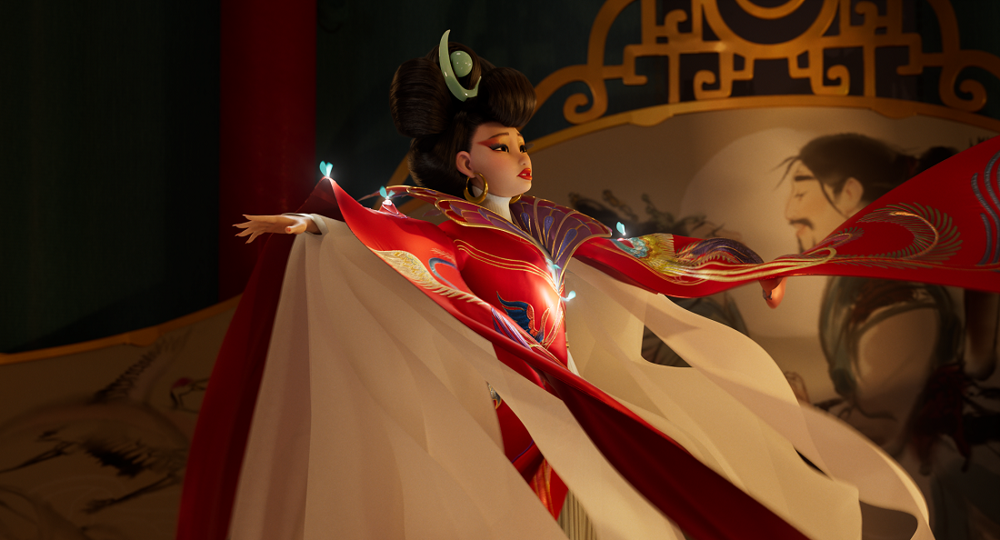

So far we've used real-world data. But we can account for one more bit of information from *Over the Moon*. That is, when Chang'e cries, she creates stardust and meteor showers. 

Although we don't know when this crying might happen, we *do* know that it happened at one moment in the film. We can create new data that takes this phenomenon into account!



## Determine the right data

We know that Fei Fei travels to Lunaria after the Moon Festival. Though we don't know exactly how long it takes her to prototype, test, and build a rocket to the Moon, we can make a guess. 

The 2020 Chinese Moon Festival was on October 1. Because the rest of the dates that we use in this module are from 2020, let's use that date. 

We need data for each of the data frames that we reference. So let's start with the meteor shower in the film. For Chang'e's meteor shower, let's choose the Draco constellation because it's where the Draconids meteor shower is likely to radiate from in early October. We'll use that meteor shower as inspiration for our fictional one:
```python
change_meteor_shower = {'name':'Chang\'e','radiant':'Draco','bestmonth':'october','startmonth':'october','startday':1,'endmonth':'october','endday':31,'hemisphere':'northern','preferredhemisphere':'northern'}
```

Next, create an entry for the Draco constellation:
```python
draco_constellation = {'constellation':'Draco','bestmonth':'july','latitudestart':90,'latitudeend':-15,'besttime':2100,'hemisphere':'northern'}
```

Now add these two entries to the data frames. Go to the top of your Python notebook file and add two cells after the second cell. Use the following code:
```python
change_meteor_shower = {'name':'Chang\'e','radiant':'Draco','bestmonth':'october','startmonth':'october','startday':1,'endmonth':'october','endday':31,'hemisphere':'northern','preferredhemisphere':'northern'}

meteor_showers.append(change_meteor_shower, ignore_index=True)
```

```python
draco_constellation = {'constellation':'Draco','bestmonth':'july','latitudestart':90,'latitudeend':-15,'besttime':2100,'hemisphere':'northern'}

constellations.append(draco_constellation, ignore_index=True)
```

Your code should look like this:


Now rerun all of the code in your notebook:

1. Select the **Clear all output** button. (It's a stack of rectangles and a letter *x*.)
1. Select the **Restart iPython kernel** button. (It's a circle arrow.) 
1. Select the **Run all cells** button. (It's a double right-arrow.)

At the bottom of your Python notebook file, change the city to Beijing:

```python
print(predict_best_meteor_shower_viewing('Beijing'))
```

Now you should see output that includes the Chang'e meteor shower!

```output
In Beijing you can see the following meteor showers:
Lyrids is best seen if you look towards the Lyra constellation on April 22, 2020.
Eta Aquarids is best seen if you look towards the Aquarius constellation on April 22, 2020.
Orionids is best seen if you look towards the Orion constellation on October 16, 2020.
Perseids is best seen if you look towards the Perseus constellation on July 20, 2020.
Chang'e is best seen if you look towards the Draco constellation on October 16, 2020.
```

Let's make one last change to our predictive algorithm to align with the film. Fei Fei travels to the Moon when it's big and bright, so we should make the viewing closer to 1. Change the predictive function after you get the moon_date_list and before the return statement:

```python
        if meteor_shower == 'Chang\'e':
            # For the film meteor shower, find the date where the Moon is the most visible
            best_moon_date = moon_phases_list.loc[moon_phases_list['percentage'].idxmax()]['date']

            # Add that date to the string to report back to the user
            meteor_shower_string += "Though the Moon will be bright, " + meteor_shower + "'s meteor shower is best seen if you look towards the " + constellation + " constellation on " +  best_moon_date.to_pydatetime().strftime("%B %d, %Y") + ".\n"
        else:
            # Find the first date where the Moon is the least visible
            best_moon_date = moon_phases_list.loc[moon_phases_list['percentage'].idxmin()]['date']

            # Add that date to the string to report back to the user
            meteor_shower_string += meteor_shower + " is best seen if you look towards the " + constellation + " constellation on " +  best_moon_date.to_pydatetime().strftime("%B %d, %Y") + ".\n"
```

```output
In Beijing you can see the following meteor showers:
Lyrids is best seen if you look towards the Lyra constellation on April 22, 2020.
Eta Aquarids is best seen if you look towards the Aquarius constellation on April 22, 2020.
Orionids is best seen if you look towards the Orion constellation on October 16, 2020.
Perseids is best seen if you look towards the Perseus constellation on July 20, 2020.
Though the Moon will be bright, Chang'e's meteor shower is best seen if you look towards the Draco constellation on October 01, 2020.
```

Now we know that when Fei Fei's family gathers for the Moon Festival, they might be able to look into the sky to see Chang'e showering them. We hope she showers them with tears of happiness and remembrance instead of sadness.

