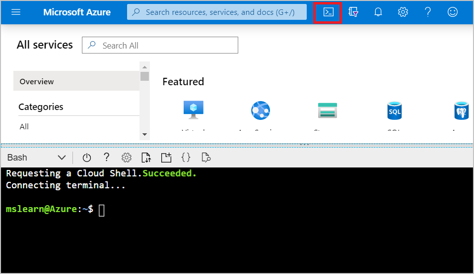

## Using the Azure Cloud Shell

To start Azure Cloud Shell, launch Cloud Shell from the top navigation of the Azure portal.



You need to install the Azure IoT extension for Azure CLI using the following command. This extension manages Azure resources such as IoT Hub.

First, check which extensions you already have installed.

```azurecli
az extension list
```

If the older version of the Azure IoT extension named `azure-cli-iot-ext` is installed, remove it. This version is incompatible with the current version.

```azurecli
az extension remove --name azure-cli-iot-ext
```

Install the current Azure IoT extension.

```azurecli
az extension add --name azure-iot
```

## Creating a resource group

Create a resource group in eastus2 using the following command. Give a name to your resource group.

```azurecli
az group create --name <resource-group> --location eastus2
```

## Creating a virtual machine to act as your IoT Edge device

Accept the terms of use and create the Microsoft-provided Azure IoT Edge on Ubuntu virtual machine. This virtual machine preinstalls everything you need to run IoT Edge on a device.

Create the virtual machine named EdgeVM using the following commands. Replace <resource-group> with your resource group name.

```azurecli
az vm image accept-terms --urn microsoft_iot_edge:iot_edge_vm_ubuntu:ubuntu_1604_edgeruntimeonly:latest
```

```azurecli
az vm create --resource-group <resource-group> --name EdgeVM --image microsoft_iot_edge:iot_edge_vm_ubuntu:ubuntu_1604_edgeruntimeonly:latest --admin-username azureuser --generate-ssh-keys
```

It may take a few minutes to create and start the new virtual machine.

**Note the public IP address (publicIpAddress)** which is provided as part of the create command output. You'll use this to connect to the virtual machine in later steps.

## Create an IoT Hub instance

The following code creates a free F1 hub in the resource group. Replace {hub_name} with a unique name for your IoT Hub and replace <resource-group> with your resource group name.

```azurecli
az iot hub create --resource-group <resource-group> --name {hub_name} --sku F1 --partition-count 2
```

## Registering an IoT Edge device to the IoT Hub

Create a device identity for your IoT Edge device.

In the Azure Cloud Shell, enter the following command to create a device named myEdgeDevice in your hub.

Since IoT Edge devices behave and can be managed differently than typical IoT devices, declare this identity to be for an IoT Edge device with the --edge-enabled flag.

If you get an error about iothubowner policy keys, make sure that your Cloud Shell is running the latest version of the azure-cli-iot-ext extension.

```azurecli
az iot hub device-identity create --hub-name {hub_name} --device-id myEdgeDevice --edge-enabled
```

## Retrieving the connection string for your device

To retrieve the connection string for your device, which links your physical device with its identity in IoT Hub use the command.

```azurecli
az iot hub device-identity show-connection-string --device-id myEdgeDevice --hub-name {hub_name} --output table
```

Make a note of the device connection string, which looks like:

HostName={YourIoTHubName}.azure-devices.net;DeviceId=MyNodeDevice;SharedAccessKey={YourSharedAccessKey}

This value is the device connection string. You'll use this connection string to configure the IoT Edge runtime in the next section.

## Configuring your IoT Edge device

You need to configure your device with the device connection string that you retrieved in the previous section. You can do this remotely without having to connect to the virtual machine. Run the following command, replacing {device_connection_string} with your own string. Replace <resource-group> with your resource group name.

```azurecli
az vm run-command invoke -g <resource-group> -n EdgeVM --command-id RunShellScript --script "/etc/iotedge/configedge.sh '{device_connection_string}'"
```

## Viewing the IoT Edge runtime status

Use the following command to connect to your virtual machine. Replace {azureuser} if you used a different username than the one suggested in the prerequisites. Replace {publicIpAddress} with your machine's address.

```bash
ssh azureuser@{publicIpAddress}
```

To find your IP address:

1. Go to the resource group you created
2. Click on virtual machine resource
3. In the Overview page, you'll find your public IP address

## Checking if the IoT Edge device is configured

You'll check to see that the IoT Edge security daemon is running as a system service by using iotedge commands. You need elevated privileges to run iotedge commands.

You run the following commands to test the status of the IoT Edge device.

```bash
sudo systemctl status iotedge
```

Your output will be:

 "Azure IoT Edge daemon is active (running)"

Run this command to list iot edge modules

```bash
sudo iotedge list
```

Your IoT Edge device is now configured. It's ready to run cloud-deployed modules.