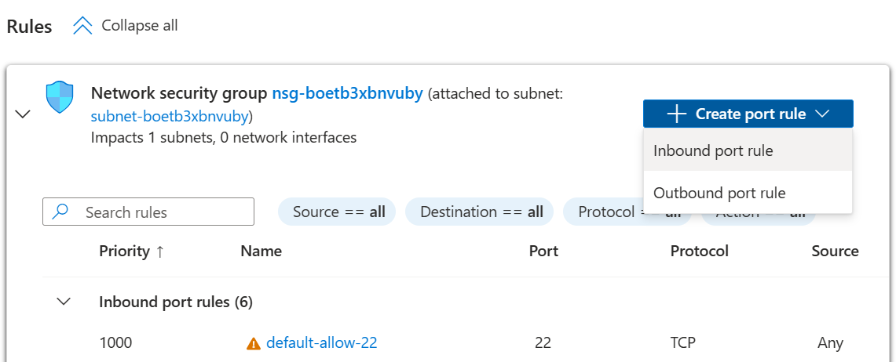
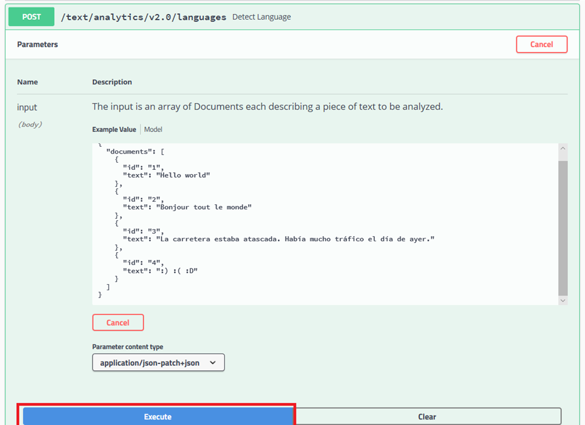

## Query the container's prediction endpoint

You'll make an HTTP call to the IoT Edge device that has the Cognitive Service container running. The container provides REST-based query prediction endpoint APIs. Use the host, `http://<<your-ipaddress>>:5000`, for container APIs.

First you'll open port 5000 of the edge device.

1. Go to edge device you created.
2. Go to VM details then **Settings > Networking**.
3. Navigate **Inbound port rule** to add an inbound security rule to open port 5000. 
4. Copy the publicIPaddress of your edge device.

Now you can query the Cognitive Service running on your IoT Edge device from any machine with a browser.

| Request URL                              | Purpose                                                      |
| :--------------------------------------- | :----------------------------------------------------------- |
| `http://<<your-ipaddress>>:5000/`        | The container provides a home page.                          |
| `http://<<your-ipaddress>>:5000/status`  | Requested with an HTTP GET, to validate that the container is running without causing an endpoint query. |
| `http://<<your-ipaddress>>:5000/swagger` | The container provides a full set of documentation for the endpoints and a **Try it out** feature. |

1. Open the browser and go to http://<<your-ipaddress>>:5000.
2. Select API Description or go to http://<<your-ipaddress>>:5000/swagger to get a detailed description of the API.
3. Select **Try it out** and then **Execute**, you can change the input value as you like. The result will show up further down on the page.

