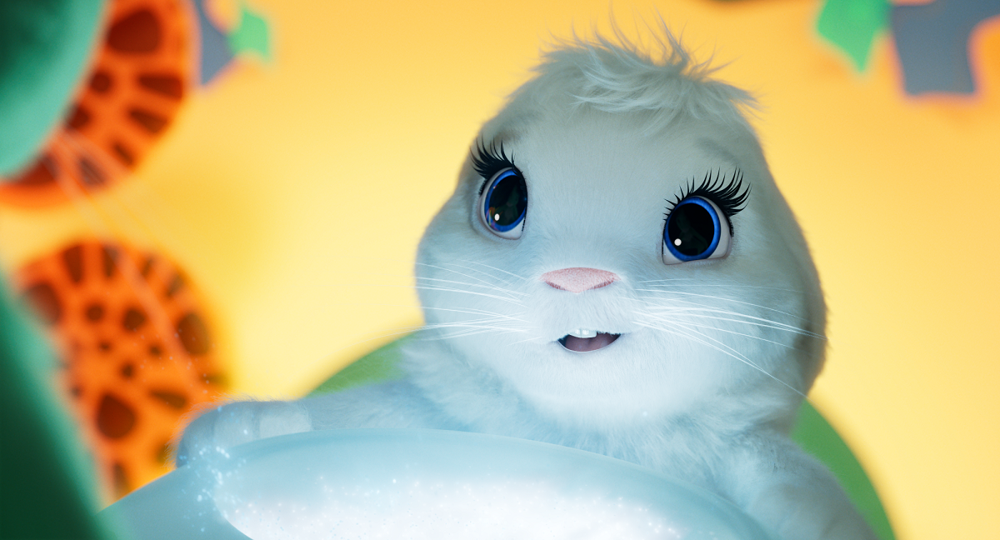
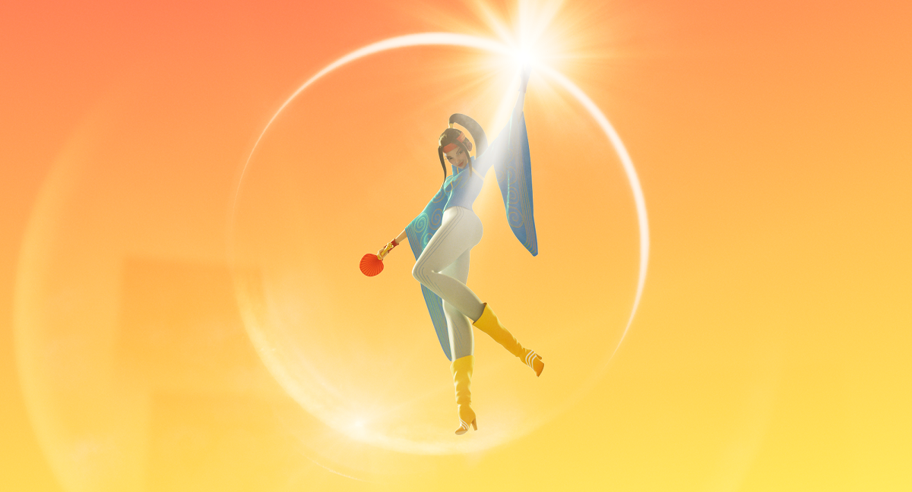
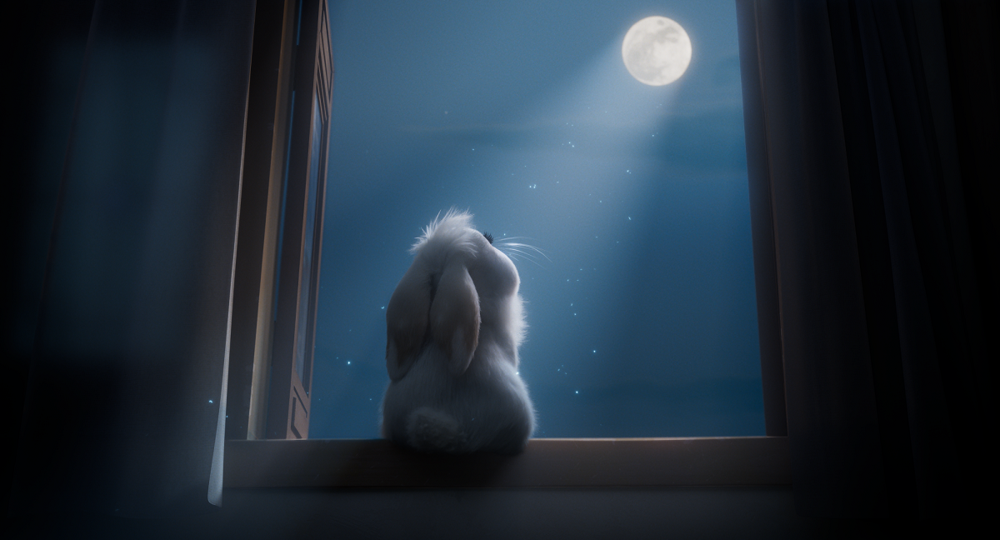
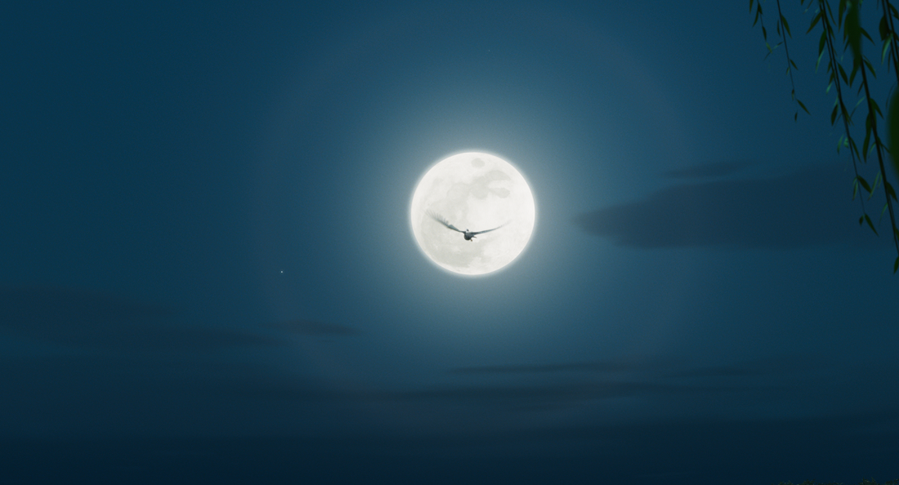
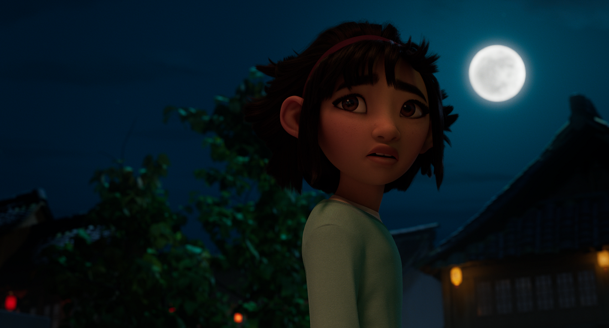
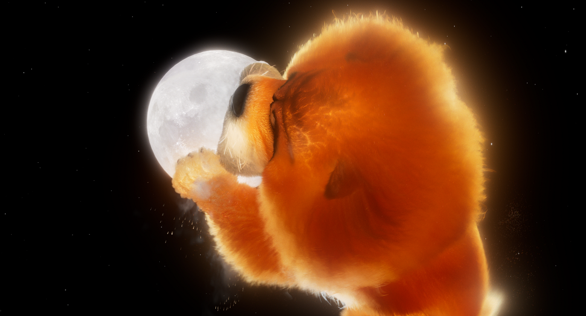

Now that you have your project ready, we should go through an overview of what we're about to do. Artificial intelligence (AI) is exactly that--artificial. AI is simulated intelligence that uses a *tremendous amount* of data to back it.

Specifically looking at the Object Detection of Custom Vision AI, we can break down the process into two steps:

1. You tell the AI where in an image an object is.
1. You give the AI a picture with the object in it, and it tells you where the object is.

Sounds simple enough, but how does the AI know how to do that?

## Image recognition: Color

While going into the depths of how AI is built is beyond the scope of this module, we can start to understand how it works. Computers rely on what can be converted to data--more specifically, numbers. You could imagine a computer that, when shown an image, can go through each pixel and tell you what color is in each location. This computer wouldn't be "intelligent," but it would be able to tell you the color of each pixel as it goes through them.

Now imagine that the computer is a little smarter and can identify the primary color that shows up in an image. We can already start *teaching* (called *training* in AI) the computer to identify images. For example, if I showed the computer this picture of Bungee:

The computer would probably understand that pictures that are mostly white and yellow are pictures of Bungee. But what if we showed the computer this picture of Chang'e?

That picture also has a lot of white and yellow, so the computer would probably think that is a picture of Bungee, too.

And what if we showed the computer this picture of Bungee next to the night sky?

There is white, but no yellow at all, so the computer would probably think this is *not* a picture of Bungee.

## Image recognition: Shape

To account for images of different objects with similar colors, or images of the same object with different colors, we've evolved AI algorithms to start to recognize lines and shapes. You can start to imagine how this was done in the beginning of AI development. A line or shape can be described as the shift in color.

Rather than only keeping track of aggregate colors in an image, the computer would start to also take into account the position of where those colors are. If the same colors are next to each other, they probably are creating a line or shape.

This kind of analysis can be useful, for example, if we start to identify pictures of the moon. Now we can say that the moon is in a picture if there is a white circle, typically against a blue or black background, like this:

And if we showed the computer this picture:

The computer would probably still recognize it because there is a distinct white circle against a blue or black background.

But the computer would probably not be able to recognize this as a picture of the moon:

Because it's not a complete white circle.

## Image recognition: Advanced AI

As you can see, the progression of AI, specifically around image recognition, started out simple and got more complex as more people started investing in ways to help computers figure out what they were seeing. In today's world, and the AI that drives Azure's Custom Vision resource, image recognition takes into account a lot more than just color or shape. AI has been trained on thousands and millions of images. AI can detect subtle differences between cats and dogs, which might seem obvious to a human. But if a computer looked at two same-sized, four-legged, brown shapes that had tails and ears, well, you can start to see how it's impressive that the features of a cat can be differentiated from the features of a dog.

## Training on specific images

While advanced AI is able to detect numerous common objects (dogs versus cats, cars versus bikes), work still needs to be done if you want to train AI to recognize a *specific* object, say a specific character from a specific movie like Bungee.

That's where the Custom Vision service comes into play. This service has AI in the background that already has some knowledge of the world, but it knows *nothing* about Bungee (or your pet). So what we're going to do is provide a lot of pictures of Bungee and tell the AI that they are Bungee. Each image that we give of Bungee gives the AI more data of characteristics that represent Bungee specifically. The more pictures of Bungee, from different angles, lighting, and sizes, the better the AI will become at recognizing her from within a larger image.

This is called *training* the AI.

Next, we will test our AI to see if it was trained well. We do this by giving it images that contain Bungee that it has *never* seen before. It's *critical* that you test with pictures that the AI *hasn't* used to train. Otherwise, you aren't actually testing its ability to recognize Bungee. You're just recognizing its ability to remember it saw that exact picture.

This is the *predicting* step of our project and is called *testing* the AI.

After you have validated that the predicting of the AI is accurate enough, you can deploy your AI so that others could use it to identify objects using phones or computers. That activity is beyond this module, but something you should definitely try out!

> [!NOTE]
> Remember when we created the Custom Vision project in the Custom Vision portal and it asked us what region we wanted for training and for predicting separately? That's because you might be training your AI from your house in Seattle, Washington, for example. In this case, you would want to use cloud resources that are close to you so that the process is fast. But you might be deploying this AI to your mother who lives in London, and you want her to get the predictions *fast*. In that case, you would want to use cloud resources closer to her for predictions.