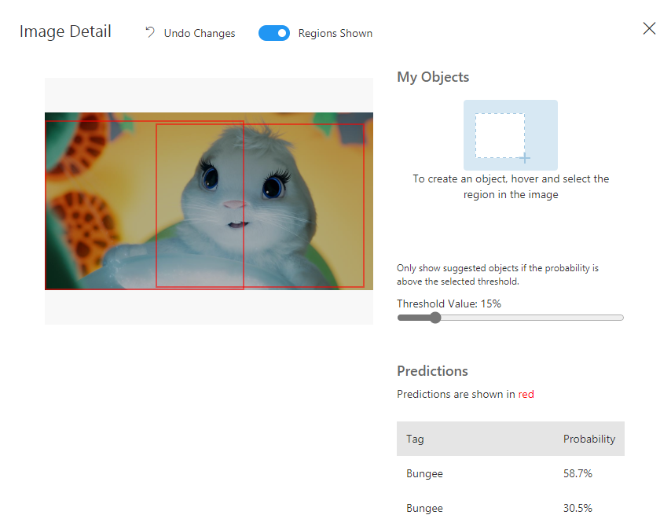
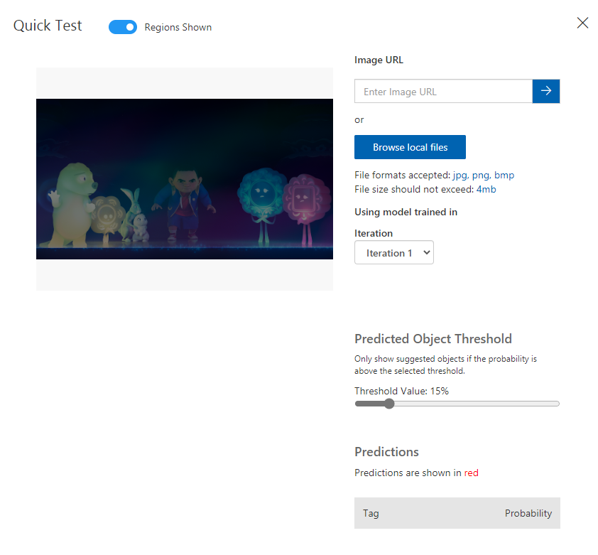
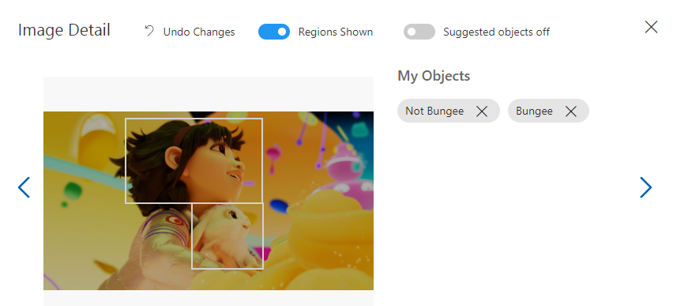
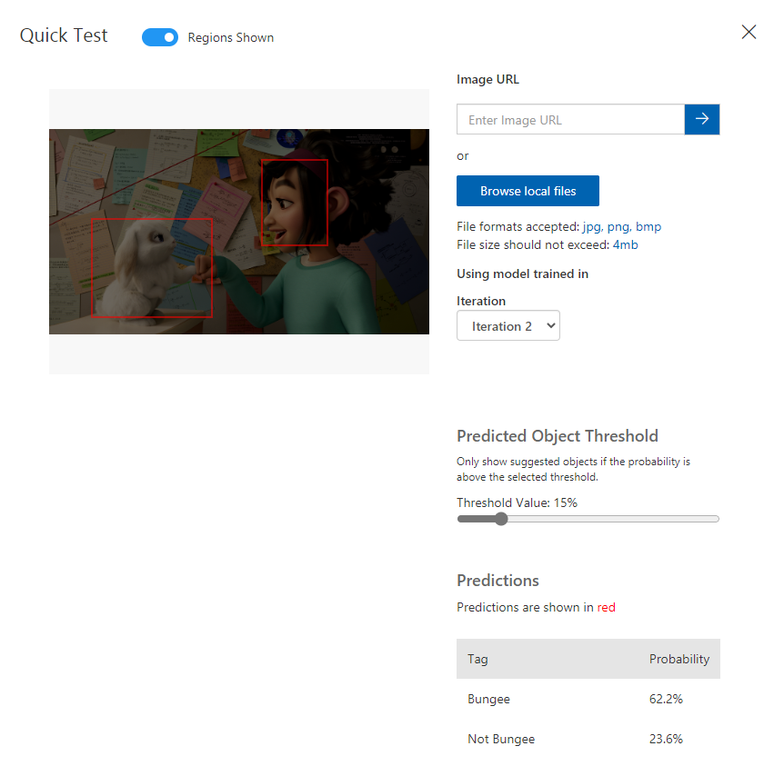

Now that you have trained your AI, you can do a quick test to see how accurate it is so far! Click on the Quick Test button in the top right corner of the Custom Vision Portal:

Choose an image that you *didn't* use to train the AI, and remember that it has to be 4MB or smaller. 

The test will perform immediately. When it does, you should see something like this:

Notice that the AI decided that Bungee might have been in two places in the image, but the bounding box that had his full face had more of a probability of her being there. 

## Challenge the AI

Now, this was a pretty "easy" test. The images we used to train the AI were only of Bungee, his entire body, with no other objects in the images. So when it's an image of mostly Bungee's face, it is likely that the AI will find Bungee. But what happens if we add a more complciated image from the film?

We can see that the AI did not find Bungee *at all* in this image. Admitedly, it's a little difficult for even me to see her hiding next to Jack Rabbit. No worries though! We can iterate!

## Train with More Images

Now is the time to train with *more* images. Add in more images that not only include the object you're looking for, but also some images that don't have the object at all. Better yet, find images where there is an object that looks similar to your object, but isn't it. For example, I'm going to train with more images of Bungee from the film, and also creat a "Not Bungee" tag and tag other characters that are not Bungee.

Remember - you have to have at least 15 images per tag to train the AI! 

Click on the Training button at the top right of the Custom Vision Portal and choose Quick Training again. 

## Retest Your AI

Now you can test the AI again using images that you haven't used yet in your training set. 

With this second iteration we can see that we have a more confident prediction that one of the objects in the image is Bungee at 62.2%. The AI is not very confident at objects that are not Bungee, since we grouped all other characters in the "Not Bungee" category isntead of creating one for each of the other characters. 

## Continue Iterating

Now that you'be got the basics down, you can continue iterating on your AI model. Make sure you are keep track of which images you are using to train your AI versus test your AI so that you don't accidentally get too excited when the model predicts with 95% accuracy! 