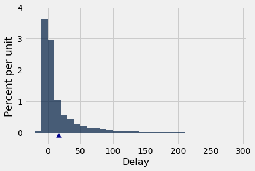
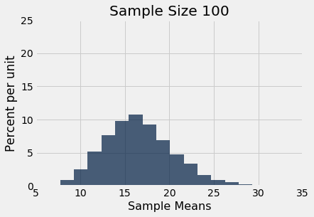
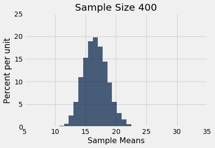
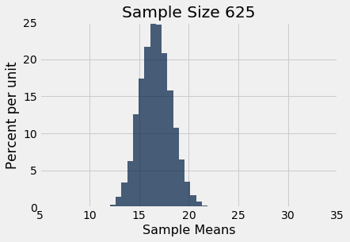
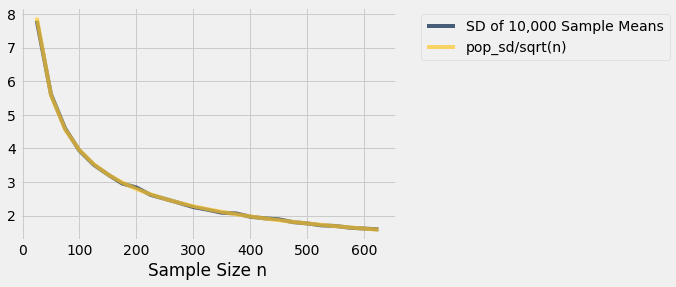

### Note: You can find an interactive version of this unit named **variability-of-the-sample-mean.ipynb** in your virtual environment

### If you haven't set up your online Virtual Studio Code environment for the Learning Path "Foundations of Data Science", please refer to the first unit **Setup**

### Open <a href = "https://online.visualstudio.com/environments/new?azure-portal=true&name=MicrosoftDocs&repo=MicrosoftDocs/inferentialthinking" target="_blank" rel="noopener">Visual Studio Online</a>


``` {.python}
from datascience import *
import numpy as np
path_data = '../../../../data/'
%matplotlib inline
import matplotlib.pyplot as plots
plots.style.use('fivethirtyeight')
```

### The Variability of the Sample Mean

By the Central Limit Theorem, the probability distribution of the mean
of a large random sample is roughly normal. The bell curve is centered
at the population mean. Some of the sample means are higher, and some
lower, but the deviations from the population mean are roughly symmetric
on either side, as we have seen repeatedly. Formally, probability theory
shows that the sample mean is an *unbiased* estimate of the population
mean.

In our simulations, we also noticed that the means of larger samples
tend to be more tightly clustered around the population mean than means
of smaller samples. In this section, we will quantify the variability of
the sample mean and develop a relation between the variability and the
sample size.

Let's start with our table of flight delays. The mean delay is about
16.7 minutes, and the distribution of delays is skewed to the right.

``` {.python}
united = Table.read_table(path_data + 'united_summer2015.csv')
delay = united.select('Delay')
```

``` {.python}
pop_mean = np.mean(delay.column('Delay'))
pop_mean
```

    16.658155515370705

``` {.python}
delay.hist(bins=np.arange(-20, 300, 10))
plots.scatter(pop_mean, -0.0008, marker='^', color='darkblue', s=60)
plots.ylim(-0.004, 0.04);
```

    /mnt/c/Users/chold/github/forks/python/viz/matplotlib/lib/matplotlib/axes/_axes.py:6250: MatplotlibDeprecationWarning: 
    The 'normed' kwarg was deprecated in Matplotlib 2.1 and will be removed in 3.1. Use 'density' instead.
      alternative="'density'", removal="3.1")



Now let's take random samples and look at the probability distribution
of the sample mean. As usual, we will use simulation to get an empirical
approximation to this distribution.

We will define a function `simulate_sample_mean` to do this, because we
are going to vary the sample size later. The arguments are the name of
the table, the label of the column containing the variable, the sample
size, and the number of simulations.

``` {.python}
"""Empirical distribution of random sample means"""

def simulate_sample_mean(table, label, sample_size, repetitions):
    
    means = make_array()

    for i in range(repetitions):
        new_sample = table.sample(sample_size)
        new_sample_mean = np.mean(new_sample.column(label))
        means = np.append(means, new_sample_mean)

    sample_means = Table().with_column('Sample Means', means)
    
    # Display empirical histogram and print all relevant quantities
    sample_means.hist(bins=20)
    plots.xlabel('Sample Means')
    plots.title('Sample Size ' + str(sample_size))
    print("Sample size: ", sample_size)
    print("Population mean:", np.mean(table.column(label)))
    print("Average of sample means: ", np.mean(means))
    print("Population SD:", np.std(table.column(label)))
    print("SD of sample means:", np.std(means))
```

Let us simulate the mean of a random sample of 100 delays, then of 400
delays, and finally of 625 delays. We will perform 10,000 repetitions of
each of these process. The `xlim` and `ylim` lines set the axes
consistently in all the plots for ease of comparison. You can just
ignore those two lines of code in each cell.

``` {.python}
simulate_sample_mean(delay, 'Delay', 100, 10000)
plots.xlim(5, 35)
plots.ylim(0, 0.25);
```

    /mnt/c/Users/chold/github/forks/python/viz/matplotlib/lib/matplotlib/axes/_axes.py:6250: MatplotlibDeprecationWarning: 
    The 'normed' kwarg was deprecated in Matplotlib 2.1 and will be removed in 3.1. Use 'density' instead.
      alternative="'density'", removal="3.1")


    Sample size:  100
    Population mean: 16.658155515370705
    Average of sample means:  16.612564
    Population SD: 39.480199851609314
    SD of sample means: 3.8997187931829136



``` {.python}
simulate_sample_mean(delay, 'Delay', 400, 10000)
plots.xlim(5, 35)
plots.ylim(0, 0.25);
```

    /mnt/c/Users/chold/github/forks/python/viz/matplotlib/lib/matplotlib/axes/_axes.py:6250: MatplotlibDeprecationWarning: 
    The 'normed' kwarg was deprecated in Matplotlib 2.1 and will be removed in 3.1. Use 'density' instead.
      alternative="'density'", removal="3.1")


    Sample size:  400
    Population mean: 16.658155515370705
    Average of sample means:  16.650027499999997
    Population SD: 39.480199851609314
    SD of sample means: 1.9777759739145762



``` {.python}
simulate_sample_mean(delay, 'Delay', 625, 10000)
plots.xlim(5, 35)
plots.ylim(0, 0.25);
```

    /mnt/c/Users/chold/github/forks/python/viz/matplotlib/lib/matplotlib/axes/_axes.py:6250: MatplotlibDeprecationWarning: 
    The 'normed' kwarg was deprecated in Matplotlib 2.1 and will be removed in 3.1. Use 'density' instead.
      alternative="'density'", removal="3.1")


    Sample size:  625
    Population mean: 16.658155515370705
    Average of sample means:  16.68069616
    Population SD: 39.480199851609314
    SD of sample means: 1.5794443889422805



You can see the Central Limit Theorem in action -- the histograms of the
sample means are roughly normal, even though the histogram of the delays
themselves is far from normal.

You can also see that each of the three histograms of the sample means
is centered very close to the population mean. In each case, the
"average of sample means" is very close to 16.66 minutes, the population
mean. Both values are provided in the printout above each histogram. As
expected, the sample mean is an unbiased estimate of the population
mean.

### The SD of All the Sample Means

You can also see that the histograms get narrower, and hence taller, as
the sample size increases. We have seen that before, but now we will pay
closer attention to the measure of spread.

The SD of the population of all delays is about 40 minutes.

``` {.python}
pop_sd = np.std(delay.column('Delay'))
pop_sd
```

    39.480199851609314

Take a look at the SDs in the sample mean histograms above. In all three
of them, the SD of the population of delays is about 40 minutes, because
all the samples were taken from the same population.

Now look at the SD of all 10,000 sample means, when the sample size is
100. That SD is about one-tenth of the population SD. When the sample
size is 400, the SD of all the sample means is about one-twentieth of
the population SD. When the sample size is 625, the SD of the sample
means is about one-twentyfifth of the population SD.

It seems like a good idea to compare the SD of the empirical
distribution of the sample means to the quantity "population SD divided
by the square root of the sample size."

Here are the numerical values. For each sample size in the first column,
10,000 random samples of that size were drawn, and the 10,000 sample
means were calculated. The second column contains the SD of those 10,000
sample means. The third column contains the result of the calculation
"population SD divided by the square root of the sample size."

The cell takes a while to run, as it's a large simulation. But you'll
soon see that it's worth the wait.

``` {.python}
repetitions = 10000
sample_sizes = np.arange(25, 626, 25)

sd_means = make_array()

for n in sample_sizes:
    means = make_array()
    for i in np.arange(repetitions):
        means = np.append(means, np.mean(delay.sample(n).column('Delay')))
    sd_means = np.append(sd_means, np.std(means))

sd_comparison = Table().with_columns(
    'Sample Size n', sample_sizes,
    'SD of 10,000 Sample Means', sd_means,
    'pop_sd/sqrt(n)', pop_sd/np.sqrt(sample_sizes)
)
```

``` {.python}
sd_comparison
```

<table border="1" class="dataframe">
<thead>
<tr>
<th>
Sample Size n
</th>
<th>
SD of 10,000 Sample Means
</th>
<th>
pop\_sd/sqrt(n)
</th>
</tr>
</thead>
<tbody>
<tr>
<td>
25
</td>
<td>
7.80558
</td>
<td>
7.89604
</td>
</tr>
<tr>
<td>
50
</td>
<td>
5.60588
</td>
<td>
5.58334
</td>
</tr>
<tr>
<td>
75
</td>
<td>
4.58432
</td>
<td>
4.55878
</td>
</tr>
<tr>
<td>
100
</td>
<td>
3.93334
</td>
<td>
3.94802
</td>
</tr>
<tr>
<td>
125
</td>
<td>
3.51501
</td>
<td>
3.53122
</td>
</tr>
<tr>
<td>
150
</td>
<td>
3.22156
</td>
<td>
3.22354
</td>
</tr>
<tr>
<td>
175
</td>
<td>
2.95652
</td>
<td>
2.98442
</td>
</tr>
<tr>
<td>
200
</td>
<td>
2.83387
</td>
<td>
2.79167
</td>
</tr>
<tr>
<td>
225
</td>
<td>
2.61634
</td>
<td>
2.63201
</td>
</tr>
<tr>
<td>
250
</td>
<td>
2.49718
</td>
<td>
2.49695
</td>
</tr>
</tbody>
</table>
<p>
... (15 rows omitted)
</p>
The values in the second and third columns are very close. If we plot
each of those columns with the sample size on the horizontal axis, the
two graphs are essentially indistinguishable.

``` {.python}
sd_comparison.plot('Sample Size n')
```



There really are two curves there. But they are so close to each other
that it looks as though there is just one.

What we are seeing is an instance of a general result. Remember that the
graph above is based on 10,000 replications for each sample size. But
there are many more than 10,000 samples of each size. The probability
distribution of the sample mean is based on the means of *all possible
samples* of a fixed size.

**Fix a sample size.** If the samples are drawn at random with
replacement from the population, then

$$
{\mbox{SD of all possible sample means}} ~=~
\frac{\mbox{Population SD}}{\sqrt{\mbox{sample size}}}
$$

This is the standard deviation of the averages of all the possible
samples that could be drawn. **It measures roughly how far off the
sample means are from the population mean.**

### The Central Limit Theorem for the Sample Mean

If you draw a large random sample with replacement from a population,
then, regardless of the distribution of the population, the probability
distribution of the sample mean is roughly normal, centered at the
population mean, with an SD equal to the population SD divided by the
square root of the sample size.

### The Accuracy of the Sample Mean

The SD of all possible sample means measures how variable the sample
mean can be. As such, it is taken as a measure of the accuracy of the
sample mean as an estimate of the population mean. The smaller the SD,
the more accurate the estimate.

The formula shows that: - The population size doesn't affect the
accuracy of the sample mean. The population size doesn't appear anywhere
in the formula. - The population SD is a constant; it's the same for
every sample drawn from the population. The sample size can be varied.
Because the sample size appears in the denominator, the variability of
the sample mean *decreases* as the sample size increases, and hence the
accuracy increases.

### The Square Root Law

From the table of SD comparisons, you can see that the SD of the means
of random samples of 25 flight delays is about 8 minutes. If you
multiply the sample size by 4, you'll get samples of size 100. The SD of
the means of all of those samples is about 4 minutes. That's smaller
than 8 minutes, but it's not 4 times as small; it's only 2 times as
small. That's because the sample size in the denominator has a square
root over it. The sample size increased by a factor of 4, but the SD
went down by a factor of $2 = \sqrt{4}$. In other words, the accuracy
went up by a factor of $2 = \sqrt{4}$.

In general, when you multiply the sample size by a factor, the accuracy
of the sample mean goes up by the square root of that factor.

So to increase accuracy by a factor of 10, you have to multiply sample
size by a factor of 100. Accuracy doesn't come cheap!
 square root of that factor.

So to increase accuracy by a factor of 10, you have to multiply sample
size by a factor of 100. Accuracy doesn't come cheap!
