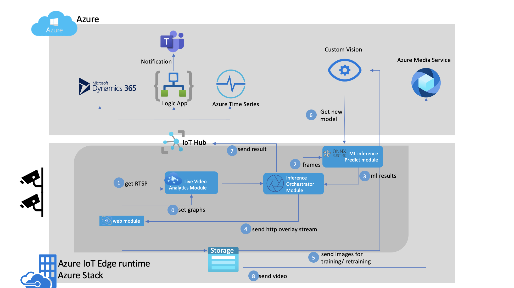

In this module, you'll learn how to use Azure Live Video Analytics on IoT Edge to deploy a model on the edge for detecting voids on the shelf. You'll also learn about the capabilities of Live Video Analytics easily to deploy a custom model as a container on the edge and analyze a simulated live video feed. You'll use Custom Vision to build and train a computer vision model by capturing and labeling a few images from the video feed.

You'll see how to:

- Set up the Azure resources
- Set up edge workloads to the edge device
- Use a Custom Vision to build a model in the cloud to detect void spaces  and deploy it on the edge
- Deploy your solution
- Examine and interpret the results

You use an Azure virtual machine (VM) as an IoT Edge device and the video analytics solution is based on sample in the [GitHub repository](https://github.com/Azure-Samples/azure-intelligent-edge-patterns/tree/master/factory-ai-vision). 

## Sample video

This module uses a [bottle shelf video](https://github.com/Azure-Samples/azure-intelligent-edge-patterns/blob/master/factory-ai-vision/EdgeSolution/modules/CVCaptureModule/videos/scenario4-empty-shelf-alert.mkv) file to simulate a live stream. To play back the video, you can use an application such as [VLC media player](https://www.videolan.org/vlc/). Copy the video link and paste it. Your custom vision model will be trained to detect gaps in shelves from the video, representing the out-of-stock items.

## Solution workflow

Firstly, you need to set up an edge device with the IoT Edge runtime installed. You'll create an IoT Hub that will send the deployment manifest to your edge device after you configure your device to IoT Hub.

After the deployment manifest is sent, the IoT Edge agent running on your edge device gets new containers from the container registry and starts them on your edge device.

- **Web Module**: This module is the web application that the user interacts with, for example when you add your camera this Web Module will set the graph with all your camera settings to the live video analytics module. Web Module is based on user setting can capture images automatically and send them to retrain using customvision.ai application protocol interface(API).
- **Live Video Analytics (LVA)**: This module will parse frames from all the cameras and send them to the Inference Module.
- **Inference Orchestrator:** This module sends frames to Predict Module and gets results. It also overlays results on the camera feed and sends an HTTP video stream out to Web Module and sends ML results to the Azure IoT hub.
- **ML Predict Module:** This module runs custom vision trained models using onnxruntime, it takes frames over HTTP or gRPC and sends JSON results.
- With **Live Video Analytics**, users can also allow Web Module to store videos based on inference results and push them to their provided media service account on Azure.

## Architecture

Here is the end-to-end Video Analytics solution architecture.

## Define Azure products 

You'll use the following components in the design of the solution:

- **Azure IoT Hub:** Azure IoT Hub provides a cloud-hosted solution back end to connect virtually any device.
- **Azure IoT Edge virtual machine:** It's a virtual machine to install the runtime. In this module, you'll open network port 8181 to enable communications between your virtual machine and the web application.
- **Live Video Analytics on IoT Edge:** is an [IoT Edge module](https://azuremarketplace.microsoft.com/marketplace/apps/azure-media-services.live-video-analytics-edge) that has functionality to be combined with other Azure edge modules. Examples of such modules include: Stream Analytics on IoT Edge, Cognitive Services on IoT Edge, and Azure services in the cloud such as Media Services, Event Hub, Cognitive Services.
- **Custom Vision Service:** Custom Vision lets you build, deploy, and improve your image classifiers. An image classifier is an AI service that applies labels (representing classes) to images based on their visual characteristics.
- **Media Services:** Azure Media Services is a collection of cloud and edge media workflow services that enable you to build solutions that require live and batch video analytics, transcoding, multi-device delivery services, content protection, and live event broadcasting at scale.

## Steps to follow

The overall module steps are for this solution:

1. Create an IoT Hub
2. Create a virtual machine as an edge device
3. Register an edge device to the IoT Hub
4. Install and run Azure Shell Installer
   1. Set up Azure resources
   3. Set workloads to the IoT Edge device
5. Upload sample video to the edge device
6. Connect the web application
7. Add camera to feed the sample video 
8. Capture images from video stream and tag labels as gap
9. Deploy the solution
10. Examine the results

## Conclusion

After completing the module, the vision solution will be deployed to your edge device to detect voids on a shelf using Custom Vision service and Live Video Analytics.

Watch the following video to see brief introduction and understand Vision on Edge solution.

>[!VIDEO https://channel9.msdn.com/Shows/Internet-of-Things-Show/Rapidly-move-your-Vision-AI-project-to-production-with-VisionOnEdge/player]