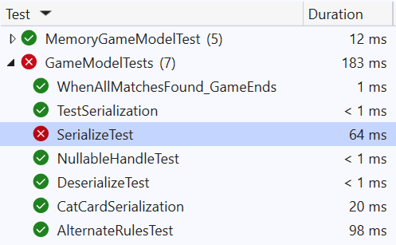

<!-- 1. Topic sentence(s) ---------------------------------------------------------------

    Goal: briefly state that this unit will define the product.

    Heading: none

    Example: "Let's start with a few definitions and a quick tour of the core features of Logic Apps. This overview should help you see whether Logic Apps might be a good fit for your work."
-->

<!-- 2. Background-concept definitions (optional) ----------------------------------------

    Goal:
        Define any needed underlying concepts or terms the learner must know to understand the product.
        Repeat this pattern multiple times if multiple concepts are needed.

    Heading:
        "## What is (concept)?"

    Pattern:
        1. H2 heading.
        2. Lead sentence that gives a definition "(concept) is..." (ensure this is a definition, do not give use cases like "(concept) lets you...").
        3. Additional text as needed (typically 1-3 paragraphs total, integrate the lead sentence into the first paragraph).
        4. Visual like an image, table, list, code sample, or blockquote (image preferred).

    Example:
        (Note: the product "Logic Apps" implements business processes in the cloud; therefore, "business process" is a background concept.)
        Heading: "What is a business process?
        Lead sentence: "A business process or _workflow_ is a sequence of tasks that produce a specific outcome. The result might be a decision, some data, or a notification...."
-->
## What is testing?
Testing involves a series of test methods that run against your product code and return a pass or fail result based on certain criteria that is asserted. Test results appear in a list of red "x" and green "✔" that make it easy to assess what functionality is working or not at a glance.

<!-- 3. Define the product -------------------------------------------------------------

    Goal:
        Give a formal and precise definition of the product.

    Heading:
        "## (product) definition"

    Pattern:
        1. H2 heading.
        2. Lead sentence that gives a definition "(product) is..." (ensure this is a definition, do not give use cases like "(product) lets you...").
        3. Additional text as needed (typically 1-3 paragraphs total, integrate the lead sentence into the first paragraph).
        4. Visual like an image, table, list, code sample, or blockquote (image preferred).

    Example:
        Heading: "Azure Logic Apps definition"
        Lead sentence: "Azure Logic Apps is a cloud service that automates the execution of your business processes."
-->
## Test Method definition
Tests are very much like regular methods. They are organized within Test Classes, have method signatures, and accept parameters. They reference and call your product code (another way of saying your non-test code) and compares how it behaves to an expected outcome.

One difference between tests and product code is they don't run as part of your app's normal function. So instead of using F5 (or the big green run button at the top of your development environment) to run as you would your app, you choose which tests to run either via a Test Explorer or a number of other helpful editor tools.

<!-- 4. Solve the scenario -------------------------------------------------------------

    Goal:
        At a high level, describe how the (product) solves one of the customer tasks in your (scenario).
        Avoid teaching how to actually do the work (you're not teaching how-to-use in this module).

    Heading:
        "## How to (solve scenario)"

    Pattern:
        1. H2 heading.
        2. Lead sentence that summarizes how the (product) solved the (scenario).
        3. Additional text as needed (typically 1-2 paragraphs total, integrate the lead sentence into the first paragraph).
        4. Visual like an image, table, list, code sample, or blockquote (image preferred).

    Example:
        Heading: "How to implement a Twitter monitor"
        Lead sentence: "To implement a Twitter monitor, you map each task to a Logic Apps component and connect them with conditional logic."
-->
## How to can tests help prevent regressions in functionality?
Remember the phone number bug from the intro scenario?
TODO: Add your additional text
TODO: Add your visual element

<!-- 5. Additional content (optional, as needed) ------------------------------------------------

    Goal:
        The section is a catch-all for any information not covered in the sections above.
        Repeat the pattern here as many times as needed.

    Possible topics:
        - Key feature(s).
        - Example use case in addition to the scenario.
        - High-level of how practitioners use the product (e.g. there's an API and a web UI to support multiple use cases).
        - Business value (e.g. it lets you do something that would be difficult to achieve without (product)).

    Pattern:
        Break the content into 'chunks' where each chunk has three things:
            1. An H2 or H3 heading describing the goal of the chunk.
            2. 1-3 paragraphs of text, with a strong lead sentence in the first paragraph.
            3. Visual like an image, table, list, code sample, or blockquote (image preferred).

    [Learning-unit structural guidance](https://review.docs.microsoft.com/learn-docs/docs/id-guidance-structure-learning-content?branch=master)
-->

<!-- Pattern for simple chunks (repeat as needed) -->
## H2 heading
Strong lead sentence; remainder of paragraph.
Paragraph (optional)
Visual (image, table, list, code sample, blockquote)
Paragraph (optional)
Paragraph (optional)

<!-- Pattern for complex chunks (repeat as needed) -->
## H2 heading
Strong lead sentence; remainder of paragraph.
Visual (image, table, list, code sample, blockquote)
### H3 heading
Strong lead sentence; remainder of paragraph.
Paragraph (optional)
Visual (image, table, list, code sample, blockquote)
Paragraph (optional)
### H3 heading
Strong lead sentence; remainder of paragraph.
Paragraph (optional)
Visual (image, table, list, code sample, blockquote)
Paragraph (optional)

<!-- - - - - - - - - - - - - - - - - - - - - - - - - - - - - - - - - - - - - - - - -->

<!-- Do not add a unit summary or references/links -->