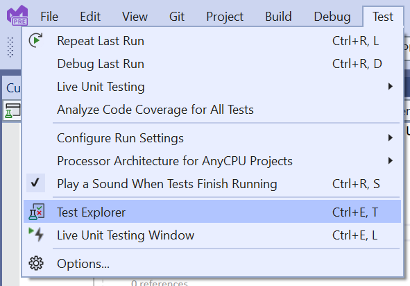
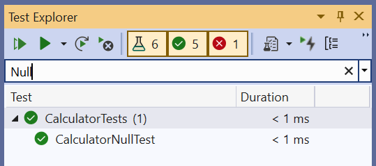
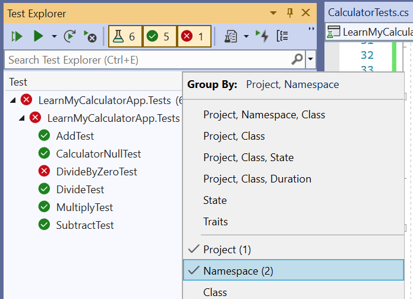

# View, Run, and Debug tests

There are many tools to help you get the most out of your tests. Let's go over a few built-in to Visual Studio.

## View your tests in the Test Explorer

* You can view your list of tests in the Test Explorer in Visual Studio. To open this window use the top-level "Test" menu and select "Test Explorer."

  
  

* The name of each of your tests appear in an easily navigable list. Note you can use the search box to search for a specific test or substring.

  

* The view of tests is highly customizable to better handle navigating huge code bases with hundreds of thousands of tests. You can use buttons to filter the view to by state. Try filtering to show only failed tests.
* The "Group by" button lets you customize how the test groupings appear in the hierarchy. Try a new grouping by de-selecting the presets and only grouping by Project and Namespace. You can control what levels appear in the hierarchy and how many.

  

  * View of the Project and Namespace group by setting.

  

## Run your tests

* Click the green run button in the Test Explorer to Run All Tests.
* Note that small icons now show the test result in the code editor at every test method. This helpful feature is one part of CodeLens. You can use these icons to run, debug, and view test output without leaving the code editor.

## Debug a test

* Set a breakpoint in one of the tests you have created by clicking in the margin of the code editor.
* Right-click inside of the test in the code editor and select 'Debug Test.' Debugging tests let you pause the application to explore variables and what is happening during the execution of your test. Debugging tests is especially helpful because you can precisely isolate which function you'd like the debugger to step through programmatically rather than manually using your app until you trigger the method you would like to test.

<!-- - - - - - - - - - - - - - - - - - - - - - - - - - - - - - - - - - - - - - - - -->

<!-- Do not add a unit summary or references/links -->