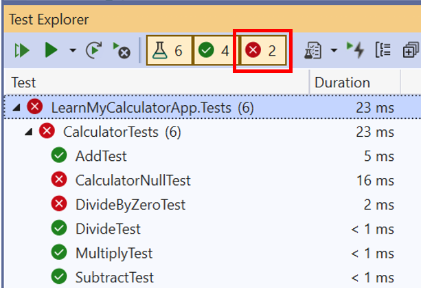
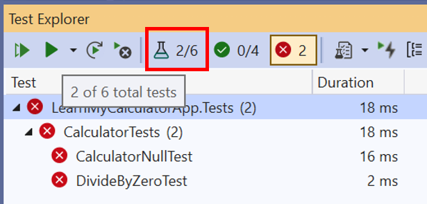
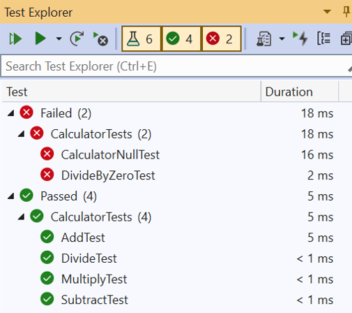
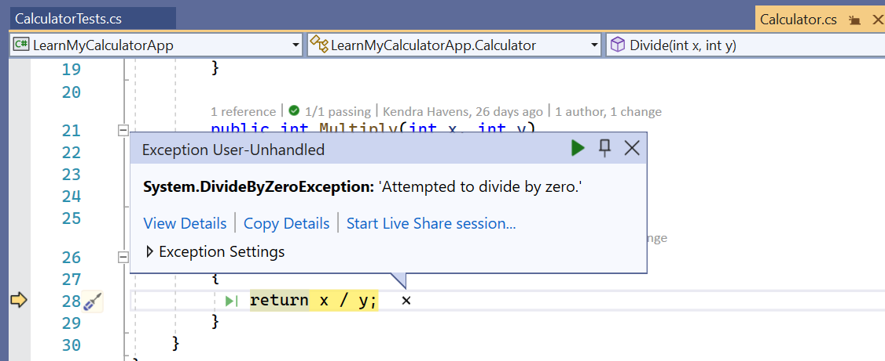
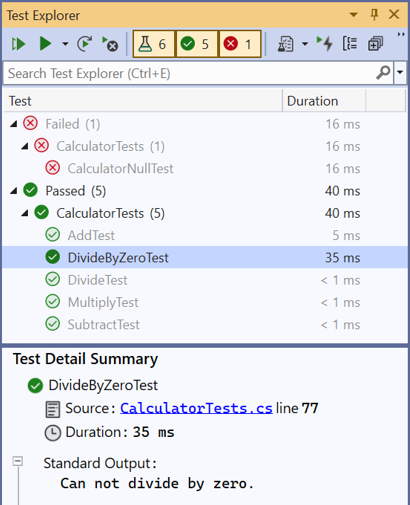

In this exercise, we'll build out a test suite a little further and exercise the Test Explorer.

* Add more tests
* Filter to failing test in Test Explorer
* Use the groupby to customize the test view
* Debug a test

## Add more tests

1. The code below demonstrates a simple test for inputting two numbers into the `Add` method and asserting a result. Can you create similar tests for the `Subtract`, `Multiply`, and `Divide` methods?

    ```csharp
    [TestMethod]
    public void AddTest()
    {
        // Arrange
        var calculator = new Calculator();
    
        // Act
        var actual = calculator.Add(1, 1);
    
        // Assert
        Assert.AreEqual(2, actual);
    }
    ```

   * Now you should have tests for the `Subtract`, `Multiply`, and `Divide` methods. If you want to check your code, see the [expected examples](#Expected-examples-for-`Subtract`,-`Multiply`,-and-`Divide`-tests) section at the end of this page.

1. Add an additional test for the `Divide` method that fails. The `Divide` method in our calculator can not yet handle dividing by zero. Create a test method that inputs zero as the divisor. Run the new test to confirm it fails.
   * Note that it doesn't matter what is in your assert statement since this is an instance of an uncaught exception failing a test. For now, let's say the `Divide` method should return null when dividing by zero. What assert should you use?
   * If you want to check your code, see the [expected divide by zero test](#Expected-divide-by-zero-test) at the end of this page.

Now that you are accumulating a test suite, let's learn more about managing multiple tests with the Visual Studio Test Explorer.

## Filter to failing tests

1. Try filtering to show only failed tests with the failed test button in the Test Explorer toolbar. Note this button also summarizes how many tests are failing in the current view.

    

   * The test view will filter down to only the failing tests.

    

1. Click the test flask button to go back to viewing tests with all outcomes. Note, this button also lists the total number of tests as well as how many tests are visible in the current view as a fraction. There are only 2 tests visible out of a total of 6 tests with the current filtering.

    

## Use the groupby

1. Let's explore some of the groupby settings. Try a new grouping by de-selecting the presets and only grouping by State and then Class.

    

   * Once you click outside the menu, the new groupby selection is applied to the test view.

    

## Debug a test

1. Set a breakpoint the `DivideByZeroTest` at the `Assert` line by clicking in the margin of the code editor.
1. Right-click inside of the test in the code editor and select 'Debug Test.'

   

1. You'll notice the debugger doesn't reach your breakpoint because it fails on the `System.DivideByZeroException` as expected.

   

1. This test will fail until you update the `Divide` method in the `Calculator.cs` to gracefully handle when the divisor is zero. Write some code to catch the exception if the divisor is zero, and notify the user with a console message such as, "Can not divide by zero." After catching the exception, the Divide method can then return null. Edit the `Divide` method signature to allow a nullable int return type.
   * If you want to check your code, see the [expected divide by zero update](#Expected-divide-by-zero-update) at the end of this page.

1. Now rerun your `DivideByZero` test which should pass! The `Divide` method now returns null when the divisor is zero. Note the output warning the user they can not divide by zero appears in the test detail summary in the Test Explorer.

    

1. Now that your test is passing don't forget to clean up your product and test code with a bit of refactoring. Consider scenarios that might need to be updated due to your recent changes. Feel free to add comments to describe new functionality.

This was a basic example of the Red, Green, Refactor pattern. We started with the red failing `DivideByZeroTest` and modified the product code until it got to green. The last step before moving on was refactoring.

## Check the sample code

### Expected examples for `Subtract`, `Multiply`, and `Divide` tests

```csharp
[TestMethod]
public void SubtractTest()
{
    // Arrange
    var calculator = new Calculator();

    // Act
    var actual = calculator.Subtract(1, 1);

    // Assert
    Assert.AreEqual(0, actual);
}

[TestMethod]
public void MultiplyTest()
{
    // Arrange
    var calculator = new Calculator();

    // Act
    var actual = calculator.Multiply(1, 1);

    // Assert
    Assert.AreEqual(1, actual);
}

[TestMethod]
public void DivideTest()
{
    // Arrange
    var calculator = new Calculator();

    // Act
    var actual = calculator.Divide(1, 1);

    // Assert
    Assert.AreEqual(1, actual);
}
```

### Expected divide by zero test

```csharp
[TestMethod]
public void DivideByZeroTest()
{
    // Arrange
    var calculator = new Calculator();

    // Act
    var actual = calculator.Divide(1, 0);

    // Assert
    Assert.IsNull(actual);
}
```

### Expected divide by zero update

```csharp
public int? Divide(int x, int y)
{
    try
    {
        return x / y;
    }
    catch (DivideByZeroException)
    {
        Console.WriteLine("Can not divide by zero.");
        return null;
    }
}
```
