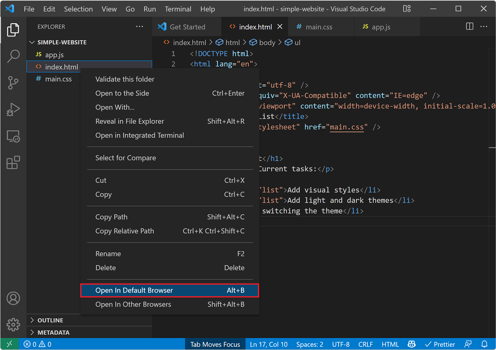

At the moment you have an empty HTML file. Let's add some code! The goal is to use hypertext markup language (HTML) to describe the web page the browser should display. Wouldn't it be nice to have a starting template? Editors can conveniently fill in some of the typical boilerplate or HTML structure for you.

## Add some HTML code

Visual Studio Code provides basic support for HTML programming out of the box. There is syntax highlighting, smart completions with IntelliSense, and customizable formatting.

In **Visual Studio Code**, open `index.html` by selecting the `index.html` file. Select the `index.html` page and type `html:5`, then hit Enter (Return).

Edit your code so that it resembles the following, then save the file with Control+S (Windows) or Command+S (macOS).

```html
<!DOCTYPE html>
<html lang="en">
<head>
    <meta charset="UTF-8">
    <title>Document</title>
</head>
<body>

</body>
</html>
```

There have been different versions of HTML. The document type `<!DOCTYPE html>` indicates this is HTML5 code.

While we aren't going to delve deeply into the meaning of all the HTML elements, we will point out a few important items. The `meta` tag indicates *metadata* information that won't typically be visible to the viewer unless they view source code in their browser. Meta elements or tags provide descriptive information about the webpage. For example, they help search engines display results to people.

The *character set* (charset) UTF-8 may seem insignificant but is crucial for establishing how computers interpret characters. If missing, charset can lead to compromised security. There's quite a bit of history and technical information behind charset. The bigger picture here is that boilerplate provides some sensible defaults.

## Edit the head

The *title* of a webpage appears at the top of a browser window and is significant in a few ways. For example, the title is utilized by and displayed in search engines. Let's add a title.

> [!IMPORTANT]
> From this point forward, the ellipsis (...) indicates that previously declared code precedes or follows. There should be enough code provided as context to make necessary changes or update to your work.

```html
...
<head>
  <meta charset="utf-8">
  <title>Simple website</title>
...
```

To style the HTML elements on the page, you could write the CSS code directly in the head of the website, which is called *internal CSS*. However, it's a best practice to separate HTML structure and CSS styling. Having a separate CSS page is called *external CSS*. Code tends to be easier to read when it's concise and compartmentalized. You can use one or more external style sheets to service multiple webpages. Rather than updating each HTML page with duplicated CSS, you can make changes once and have those updates broadcast to all dependent pages. Let's link to an external stylesheet.

In **Visual Studio Code**, add a blank line after the `<title>` element, type `link` and hit the Enter (Return) key. Update the `href` to `main.css` and save the file with Control+S (Windows) or Command+S (macOS).

```html
...
<head>
  <meta charset="utf-8">
  <title>Task List</title>
  <link rel="stylesheet" href="main.css">
</head>
...
```

## Edit the body

Let's start filling in the *body* element now. Add a *heading* `<h1>`, *paragraph* `<p>`, and create a *list item* `<li>`. Update your code, or copy and paste, so it looks like the following.

```html
<!DOCTYPE html>
<html lang="en" dir="ltr">
  <head>
    <meta charset="utf-8">
    <title>Simple website</title>
    <link rel="stylesheet" href="main.css">
  </head>
  <body>
    <h1>Task List</h1>
    <p id="msg">Current tasks:</p>
    <ul>
      <li class="list">Add visual styles</li>
      <li class="list">Add light and dark themes</li>
      <li>Enable switching the theme</li>
    </ul>
  </body>
</html>
```

An ID attribute (used in the `<p>`) can be used for styling one element, while the class attribute (used in the `<li>`) is for styling all elements of the same class.

Each list item `<li>` element is grouped into an unordered list `<ul>`.

## Open in browser

You can preview your webpage locally by opening the HTML file in a browser. Instead of a website address that begins with `https://`, your browser points to the local file path. For example, the path might look similar to the following: *file:///Users/username/Desktop/public/index.html*.

To preview using **Visual Studio Code**, select `index.html` and select **Open In Default Browser** or use the keyboard shortcut Alt+B.



> [!IMPORTANT]
> If you're having trouble, make sure you're directly selecting on the filename icon or text.

The webpage opens in your default browser.

## View the page using developer tools

You can inspect a webpage by using the developer tools in your browser. Let's give this a try.

In **Edge**, the keyboard shortcut for **Developer Tools** is F12 (FN+F12). Alternately, view **Settings and more** with Alt+X and select **Developer Tools**.

In **Chrome**, the keyboard shortcut for **Developer Tools** is Option+Command+I. (F12 also works.)


1. Select the **Elements** tab.
2. Roll over and select the HTML elements.
3. Open the disclosure triangles.

The Elements tab in developer tools shows you the document object model (DOM) as rendered in the browser. When debugging, it is often important to see how the browser interprets your source code.

> [!NOTE]
> If you're using **Safari**, see the [Web Developer Tools](https://developer.apple.com/safari/tools/). When installed, choose **Safari > Preferences**, and choose **Advanced**. At the bottom of the pane, select the **Show Develop menu in menu bar** checkbox. Choose **Develop > Show Web Inspector**. For more information, check the Safari Web Inspector documentation.

Inspecting the page in a browser provides all sorts of useful information and can help you troubleshoot problems. You can also view CSS details with the inspector, as you'll see in the next section.
