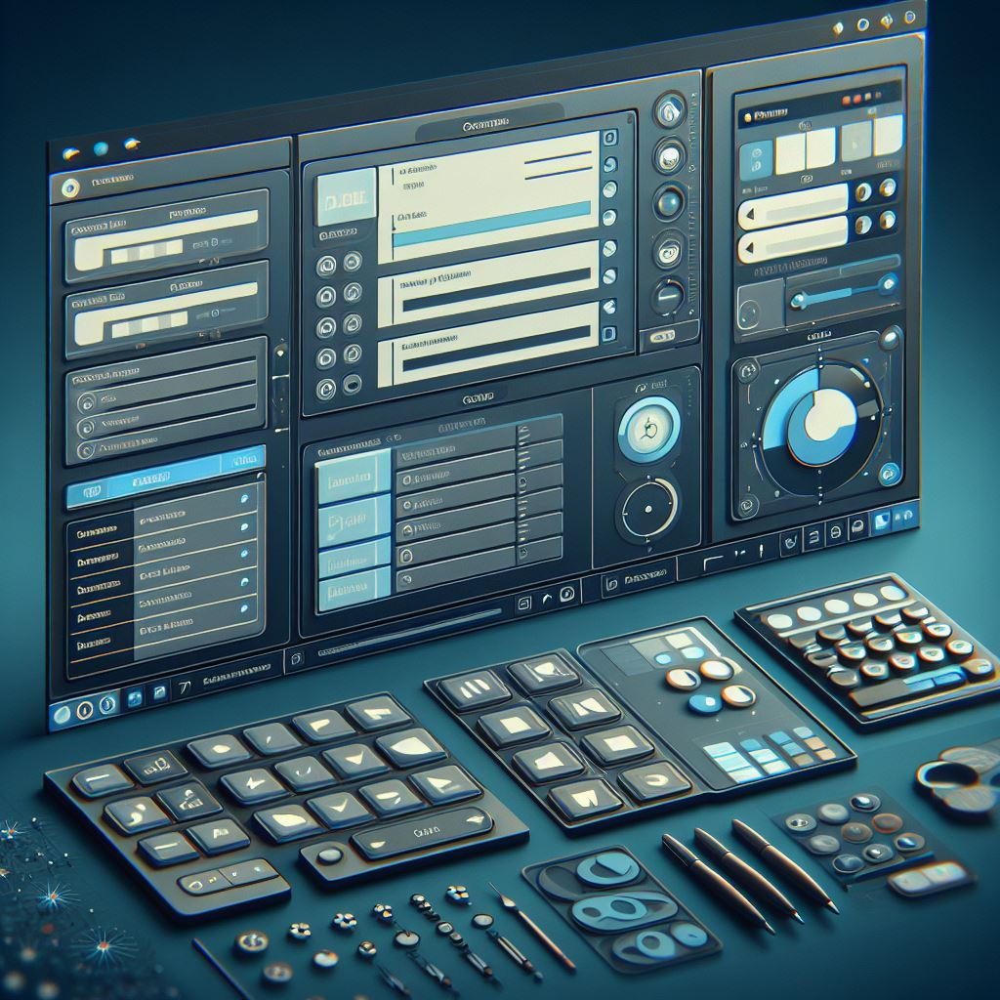

In the software consulting firm scenario, you must choose the best application framework for each upcoming project. You have multiple options for building Windows applications. Each option has its own strengths and benefits. This unit describes the options for building Windows applications and discusses how to choose the best option for your application.

Windows offers exciting and diverse choices for creating native applications. Each UI framework that Microsoft provides has its own advantages and features. You may be familiar with WPF and Windows Forms, which are popular .NET frameworks for building powerful desktop applications. However, you may not be aware of the latest innovations in Windows development: WinUI and Windows App SDK, which enable you to create beautiful, native Windows apps with high performance and rich functionality.

## WPF applications

WPF is a XAML-based UI framework that is built to take advantage of modern graphics hardware. WPF provides a comprehensive set of features: controls, data binding, layout, graphics & animation, styles, templates, documents, media, and typography. WPF is part of .NET, so you can build applications that incorporate other elements of the .NET API. While .NET is cross-platform, WPF is only available on Windows.

WPF is a time-tested framework for building enterprise applications. It's a mature framework with an extensive ecosystem of third-party libraries and controls. WPF is a great choice for building desktop applications that require a high degree of customization, rich functionality, and the high performance of a native Windows application.

Users interact with WPF applications through windows, and its windowing system is advanced. WPF windows can be modal or modeless, and can be hosted in other applications. WPF also supports multiple windows. While WPF doesn't currently support Fluent design out of the box, there are third-party libraries that enable you to incorporate various design options into your WPF applications. WPF apps can be distributed through the Microsoft Store, installed via stand-alone packages, or deployed with enterprise software management systems.

## Windows Forms applications

Windows Forms is a UI framework that creates rich desktop client apps for Windows. The Windows Forms development platform supports a broad set of app development features: controls, graphics, data binding, and user input. Windows Forms features a drag-and-drop visual designer in Visual Studio to quickly and easily create Windows Forms apps.

Windows Forms is part of .NET, so you can build applications that incorporate other elements of the .NET API. While .NET is cross-platform, the Windows Forms framework (like WPF) is only available on Windows. Windows Forms is a good choice for building desktop applications that require a high degree of customization, rich functionality, and the high performance of a native Windows application built on the modern .NET stack.

Windows Forms is popular choice for system utility apps or line-of-business applications. Windows Forms is a mature framework that has a large ecosystem of third-party libraries and controls. Unlike XAML-based UI frameworks, Windows Forms is not well-suited for apps that require animations or rich graphics. Like WPF apps, Windows Forms applications can be distributed through the Microsoft Store, installed via stand-alone packages, or deployed with enterprise software management systems.

## WinUI applications with Windows App SDK

WinUI 3 is the native UI platform component that ships with the Windows App SDK. Unlike its predecessor UWP, Windows App SDK APIs are decoupled from the Windows SDKs. The Windows App SDK provides a set of APIs and tools that are used to create desktop apps for Windows. The Windows App SDK can be used to create applications on Windows 11 and downlevel to Windows 10, version 1809.

WinUI apps incorporate Fluent design, providing the look-and-feel in-box Windows apps. WinUI 3 apps can be written in C# or C++. The XAML UI framework feels familiar to Windows developers who are experienced in WPF development. It's a great choice if the current feature set meets your requirements, and the ongoing development efforts in the framework regularly provide new features and functionality.

The Fluent design principles aren't just a set of styles and themes. They also include accessibility and the overall user experience when interacting with the application. WinUI embodies all that. WPF might be able to match the style but may not go all the way if the best of the best in user experience is a requirement.

WinUI applications can be distributed through the Microsoft Store, installed via stand-alone packages, or deployed with enterprise software management systems.

