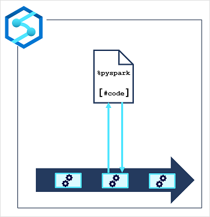

Azure Synapse Pipelines enable you to create, run, and manage data integration and data flow activities. While many of these activities are built-into the Azure Synapse Pipeline platform and run natively in the integration runtime for your pipeline, you can also use external processing resources to perform specific tasks. One such external resource is an Apache Spark pool in your Azure Synapse Analytics workspace on which you can run code in a notebook.

It's common in big data analytics solutions for data engineers to use Spark notebooks for initial data exploration and interactive experimentation when designing data transformation processes. When the appropriate transformation logic has been developed in a notebook, you can perform some final code optimization and refactoring for maintainability, and then include the notebook in a pipeline that can be run on a schedule or in response to an event (such as new data files being loaded into the data lake).

The notebook is run on a Spark pool, which you can configure with the appropriate compute resources and Spark runtime for your specific workload. The pipeline itself is run in an integration runtime that orchestrates the activities in the pipeline, coordinating the external services needed to run them.

> [!TIP]
> There are several best practices that can help make working with Spark notebooks more efficient and effective. Some of these include:
>
> - Keep your code organized: Use clear and descriptive variable and function names, and organize your code into small, reusable chunks.
> - Cache intermediate results: Spark allows you to cache intermediate results, which can significantly speed up the performance of your notebook.
> - Avoid unnecessary computations: Be mindful of the computations you are performing and try to avoid unnecessary steps. For example, if you only need a subset of your data, filter it out before running any further computations.
> - Avoid using collect() unless necessary: When working with large datasets, it is often better to perform operations on the entire dataset rather than bringing the data into the driver node using the collect() method.
> - Use Spark UI for monitoring and debugging: Spark's web-based user interface (UI) provides detailed information about the performance of your Spark jobs, including task execution times, input and output data sizes, and more.
> - Keep your dependencies version-consistent and updated: when working with Spark, it is important to keep dependencies version-consistent across your cluster and to use the latest version of Spark and other dependencies if possible.
