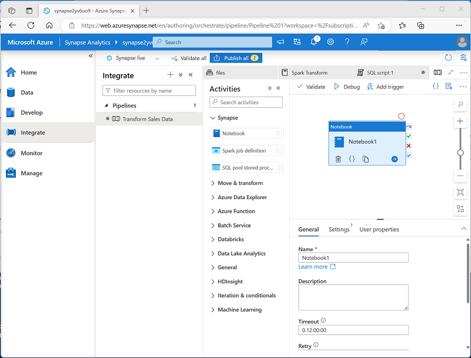

To run a Spark notebook in a pipeline, you must add a notebook activity and configure it appropriately. You'll find the **Notebook** activity in the **Synapse** section of the activities pane in the Azure Synapse Analytics pipeline designer.

> [!TIP]
> You can also add a notebook to a pipeline from within the notebook editor.

To configure the notebook activity, edit the settings in the properties pane beneath the pipeline designer canvas. Notebook activity specific settings include:

- **Notebook**: The notebook you want to run. You can select an existing notebook in your Azure Synapse Analytics workspace, or create a new one.
- **Spark pool**: The Apache Spark pool on which the notebook should be run.
- **Executor size**: The node size for the worker nodes in the pool, which determines the number of processor cores and the amount of memory allocated to worker nodes.
- **Dynamically allocate executors**: Configures Spark dynamic allocation, enabling the pool to automatically scale up and down to support the workload.
- **Min executors**: The minimum number of executors to be allocated.
- **Max executors**: The maximum number of executors to be allocated.
- **Driver size**: The node size for the driver node.
