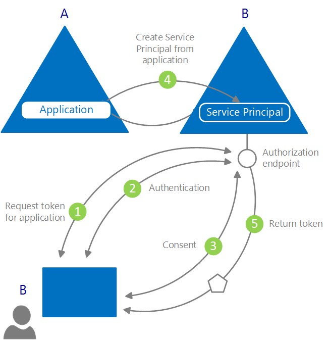

Any application that outsources authentication to Azure AD needs to be registered in a directory. This step involves telling Azure AD about your application:, including:

### Azure AD application scenarios

| **Frontend** | **Authentication** | **Backend** |
| --- | --- | ---|
| Single page application are frontends that run in a browser | Azure AD Authorization Endpoint​ | Web API​ |
| Web apps are applications that authenticate a user in a web browser to a web application| Azure AD WS-Federation or SAML Endpoint​ | Web application​ |
| Native apps are applications that call a web API on behalf of a user​ | Azure AD Authorization Endpoint and Azure AD Token Endpoint​ | Web API |
| Web API apps are web applications that need to get resources from a web API | Azure AD Authorization Endpoint and Azure AD Token Endpoint| Web application and Web API​ |
| Service-to-service applications are daemon or server application that needs to get resources from a web API | Azure AD Authorization Endpoint and Azure AD Token Endpoint | Web API |

Azure AD represents applications following a specific model that's designed to fulfill two main functions:

- Identify the app according to the authentication protocols it supports. This involves enumerating all the identifiers, URLs, secrets, and related information that Azure AD needs at authentication time. Here, Azure AD:
  - Holds all the data needed to support authentication at run time.
  - Holds all the data for deciding which resources an app might need to access, whether it should fulfill a particular request, and under what circumstances it should fulfill the request.
  - Supplies the infrastructure for implementing app provisioning both within the app developer's tenant and to any other Azure AD tenant.
- Handle user consent during token request time and facilitate the dynamic provisioning of apps across tenants. Here, Azure AD:
  - Enables users and administrators to dynamically grant or deny consent for the app to access resources on their behalf.
  - Enables administrators to ultimately decide what apps are allowed to do, which users can use specific apps, and how directory resources are accessed.

In Azure AD, an application object describes an application as an abstract entity. Developers work with applications. At deployment time, Azure AD uses a specific application object as a blueprint to create a service principal, which represents a concrete instance of an application within a directory or tenant. It's the service principal that defines what the app can do in a specific target directory, who can use it, what resources it has access to, and so on. Azure AD creates a service principal from an application object through consent.

The following diagram depicts a simplified Azure AD provisioning flow driven by consent.

In this provisioning flow:

1. A user from B tries to sign in with the app.
2. Azure AD gets and verifies the user credentials.
3. Azure AD prompts the user to consent for the app to gain access to tenant B.
4. Azure AD uses the application object in A as a blueprint for creating a service principal in B.
5. The user receives the requested token.

You can repeat this process as many times as you want for other tenants (C, D, and so on). Directory A keeps the blueprint for the app (application object). Users and admins of all the other tenants where the app is given consent to retain control over what the application can do through the corresponding service principal object in each tenant. 

When an application is given permission to access resources in a tenant (upon registration or consent), a service principal object is created. The Microsoft Graph **ServicePrincipal entity** defines the schema for a service principal object's properties.
