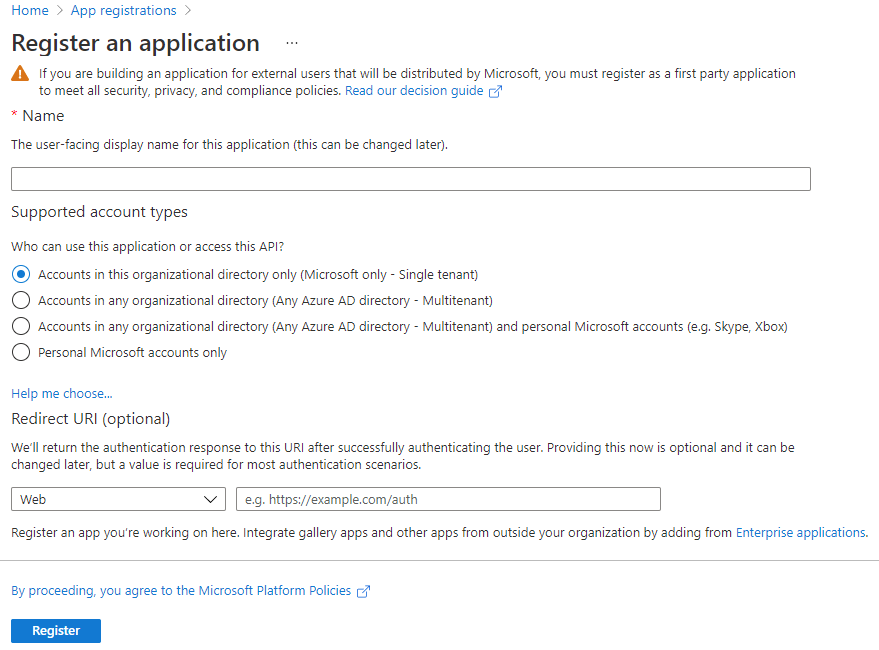

For the most secure operation, register your app with the Microsoft identity platform.

Before your app can get a token from the Microsoft identity platform, it must be registered in the Azure portal. Registration integrates your app with the Microsoft identity platform and establishes the information that it uses to get tokens, including:
* **Application ID**: A unique identifier assigned by the Microsoft identity platform.
* **Redirect URI/URL**: One or more endpoints at which your app will receive responses from the Microsoft identity platform. (For native and mobile apps, this is a URI assigned by the Microsoft identity platform.)
* **Application Secret**: A password or a public/private key pair that your app uses to authenticate with the Microsoft identity platform. (Not needed for native or mobile apps.)

### Getting an access token

Like most developers, you will probably use authentication libraries to manage your token interactions with the Microsoft identity platform. Authentication libraries abstract many protocol details, like validation, cookie handling, token caching, and maintaining secure connections, away from the developer and let you focus your development on your app. Microsoft publishes open source client libraries and server middleware.

For the Microsoft identity platform endpoint:
* Microsoft Authentication Library (MSAL) client libraries are available for .NET, JavaScript, Android, and Objective-c. All platforms are in production-supported preview, and, in the event breaking changes are introduced, Microsoft guarantees a path to upgrade.
* Server middleware from Microsoft is available for .NET core and ASP.NET (OWIN OpenID Connect and OAuth) and for Node.js (Microsoft the Microsoft identity platform Passport.js).
* The Microsoft identity platform is compatible with many third-party authentication libraries.

