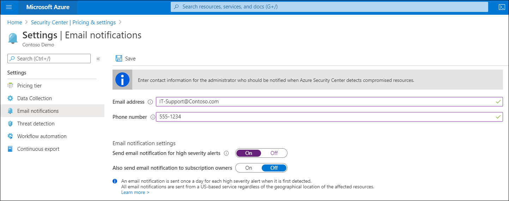

To address the unique security challenges that a hybrid environment presents, such as rapidly changing services, sophisticated attacks, and increased workload, Contoso IT staff need tools to help assess their security posture and identify risks. Ideally, they want to deploy those tools with minimal effort. Azure's Security Center can help them meet all these requirements.

## What is Azure Security Center

*Security Center* is a cloud-based tool for managing the security of your cloud and on-premises infrastructure. With Security Center capabilities, you can:

- Improve your security position. Use Security Center to implement security best practices across your IaaS, platform as a service (PaaS), data, and on-premises resources. In addition to security best practices, you can also track compliance against regulatory standards.
- Protect your environment. Monitor for security threats to your cloud and on-premises servers, including identifying misconfigurations and providing server Endpoint Detection and Response (EDR) with Microsoft Defender Advanced Threat Protection (ATP).
- Protect your data. Identify suspicious activity such as potential data breaches within your servers, files, databases, data warehouses, and storage accounts. Security Center can also perform automatic data classification in your Azure SQL databases.

## How Security Center works in hybrid environments

In addition to Security Center capabilities for monitoring and protecting Azure IaaS, PaaS, and data resources, Security Center also helps protect servers outside of Azure. From the Azure portal, you can install the Log Analytics agent on your on-premises Windows Server and Linux server VMs and non&ndash;Azure cloud VMs. The agent then collects the data that Security Center needs for monitoring and managing those resources.

Security Center collects event log events and Event Tracing for Windows events from the agents. It then scans security-related configurations, and native events in Azure. The Log Analytics agent also collects crash dumps when applications fail, and it enables command-line auditing. It analyzes these data sources and generates a custom list of hardening tasks that it recommends you perform, and it generates security alerts that can be sent to your SIEM solution.

> [!NOTE]
> In addition to the Log Analytics agent, the Microsoft Defender ATP sensor is automatically enabled on Windows Server computers that are onboarded to Security Center.

### Notifications

One of the first things to do when onboarding to Security Center is to provide contact information so Security Center can notify you when it detects compromised resources. In Security Center, select **Email notifications** on the **Pricing & settings** page and then provide an email address and phone number. Choose whether to get alerts for high-severity events and if all users with an Owner role in the subscription should receive notifications.

### Security Center feature coverage for VMs

Security Center provides a wide variety of features, some of which are available for Azure VMs and PaaS services as part of the Free service tier, and some are available only as part of the Standard tier.

> [!NOTE]
> Only some features apply to on-premises servers and VMs, and those that do apply require the Standard tier.

The following list are some of the common Security Center features:

- Microsoft Intune Endpoint Protection assessment
- Missing operating system patches assessment
- Security misconfigurations assessment
- Disk encryption assessment
- Network security assessment
- Third-party vulnerability assessment
- VM behavioral analytics and security alerts
- Adaptive application controls
- File integrity monitoring
- Fileless security alerts
- Defender ATP
- Regulatory compliance dashboard and reports
- Adaptive network controls
- Adaptive network hardening
- Just-in-time (JIT) VM access
- Native vulnerability assessment
- Network map
- Network-based security alerts

You can find out which Security Center features are included with which pricing tier, and learn more about what they do by reviewing [Feature coverage for machines](https://aka.ms/feature-coverage-for-machines?azure-portal=true).
