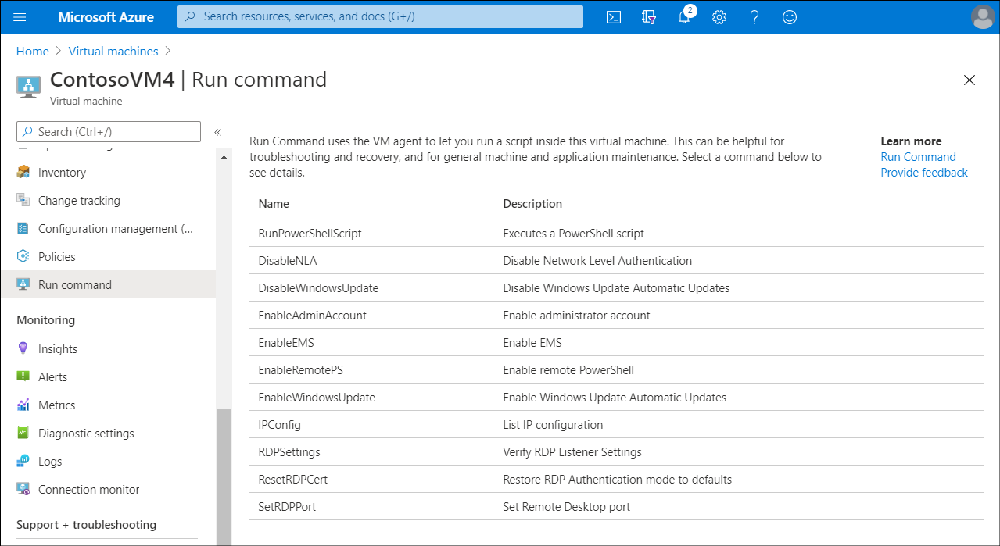

When you onboard servers with Azure Automation State Configuration, you set the configuration mode to one of the following modes:

- **ApplyOnly**
- **ApplyandMonitor**
- **ApplyAndAutoCorrect**

If you don't choose **ApplyAndAutoCorrect**, servers that drift from a compliant state for any reason remain noncompliant until you manually correct them. To force an Azure Automation State Configuration node to download the latest configuration and apply it, you must use the **Update-DscConfiguration** cmdlet, as in the following code example:

```powershell
Update-DscConfiguration -Wait -Verbose
```

However, to run this cmdlet against your noncompliant server, you must use an Azure compute feature *Run Command*.

## What is the Run Command?

The **Run Command** feature enables you to run scripts inside VMs. You can use this feature when manually correcting configuration drift. **Run Command** uses the VM agent to run PowerShell scripts within an Azure Windows VM. You can use these scripts for a general machine or application management. They can help you to quickly diagnose and remediate VM access and network issues, and get the VM back to a good state.

> [!TIP]
> **Run Command** enables VM and application management, and troubleshooting by using scripts. It's available even when the machine is not reachable—for example, if the guest firewall doesn't have the Remote Desktop Protocol (RDP) or the Secure Shell (SSH) port open.

### Restrictions

There are some restrictions to using **Run Command**. Because it's designed to quickly remedy issues affecting VMs, its software features have been kept to a minimum. The following restrictions apply when using **Run Command**:

- Output is limited to the last 4,096 bytes.
- The minimum time to run a script is about 20 seconds.
- Scripts run as the System account on Windows.
- Only one script can run at a time.
- Scripts that prompt for information (interactive mode) are not supported.
- You can't cancel a running script.
- The maximum time a script can run is 90 minutes. After that, it will time out.
- Outbound connectivity from the VM is required to return the results of the script.

> [!NOTE]
> To function correctly, **Run Command** requires connectivity (port 443) to Azure public IP addresses. If the extension doesn't have access to these endpoints, the scripts might run successfully but not return the results. If you're blocking traffic on the VM, you can use service tags to allow traffic to Azure public IP addresses by using the AzureCloud tag.

### Available PowerShell commands

You can launch a number of PowerShell commands against your Windows VMs.

[](../media/m2-run-script.png#lightbox)

The following table describes the list of commands available for Windows VMs.

|Name|Description|
|---|---|
|**RunPowerShellScript**|Runs a PowerShell script. You can use the **RunPowerShellScript** command to run any custom script that you want.|
|**DisableNLA**|Disables Network Level Authentication (NLA).|
|**DisableWindowsUpdate**|Disables Automatic Updates through Windows Update.|
|**EnableAdminAccount**|Checks if the local administrator account is disabled, and if so enables it.|
|**EnableEMS**|Enables Emergency Management Services (EMS) to allow for serial console connection in troubleshooting scenarios.|
|**EnableRemotePS**|Configures the machine to enable PowerShell remoting.|
|**EnableWindowsUpdate**|Enables Automatic Updates through Windows Update.|
|**IPConfig**|Provides detailed information for the IP address, subnet mask, and default gateway for each adapter bound to Transmission Control Protocol (TCP)/IP.|
|**RDPSettings**|Checks registry settings and domain policy settings. Suggests policy actions if the machine is part of a domain, or modifies the settings to default values.|
|**ResetRDPCert**|Removes the Transport Layer Security (TLS)/SSL certificate tied to the RDP listener and restores the RDP listener security to default. Use this script if you find any issues with the certificate.|
|**SetRDPPort**|Sets the default or user-specified port number for Microsoft Remote Desktop connections. Enables firewall rules for inbound access to the port.|

### Limiting access to the Run Command feature

Because **Run Command** can overrule some firewall port restrictions, it's important to ensure only authorized personnel can use it. Listing the run commands or displaying the details of a command requires the **Microsoft.Compute/locations/runCommand/read** permission.

> [!NOTE]
> The built-in Reader role and higher levels have this permission.

Running a command requires the **Microsoft.Compute/virtualMachines/runCommand/action** permission.

> [!NOTE]
> The Virtual Machine Contributor role and higher levels have this permission.

You can use one of the built-in roles or create a custom role to use **Run Command**.

## Additional reading

You can learn more by reviewing the following documents:

- [Run PowerShell scripts in your Windows VM by using Run Command](https://aka.ms/VM-windows-run-command?azure-portal=true).
- [Update-DscConfiguration](https://aka.ms/update-dscconfiguration?azure-portal=true).
