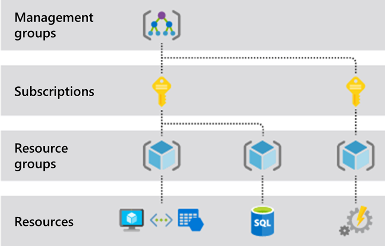

In this unit, you’ll learn about the native Azure tools for using Azure Resource Manager and Azure Resource Manager Templates (ARM templates) to start deploying SAP on Azure infrastructure. ARM templates are an important step on the journey towards understanding how to gain the advantages of infrastructure as code (IaC). These advantages include:

- Consistent configurations
- Improved scalability
- Faster deployments
- Better traceability
 
## Azure Resource Manager

Central to the ability to automate in Azure is the Azure Resource Manager, providing a management layer that enables you to create, update, and delete resources in your Azure account using tools such as the Azure portal, Azure CLI, and Azure PowerShell.
 
### CLI

The Azure CLI cross-platform command-line tool is used to connect to Azure and execute administrative commands on Azure resources. It allows the execution of commands through a terminal using interactive command-line prompts or a script. For interactive use, launch your shell of preference, such as cmd.exe on Windows, or Bash on Linux or macOS, and then issue a command at the shell prompt. Azure Cloud Shell is configured to run CLI commands.
 
### PowerShell

The [Azure AZ PowerShell module](/powershell/azure/new-azureps-module-az) is a set of cmdlets for managing Azure resources directly from PowerShell and is included in Azure Cloud Shell PowerShell.
 
> [!NOTE]
> This module focuses on using Bash for CLI commands and uses Bash for running ARM Templates, and in later units for working with Terraform and Ansible templates.
 
When a user sends a request from any of the Azure tools, APIs, or SDKs, Resource Manager receives the request. It authenticates and authorizes the request. Resource Manager sends the request to the Azure service, which takes the requested action. Because all requests are handled through the same API, you see consistent results and capabilities in all the different tools.

The following image shows the role Azure Resource Manager plays in handling Azure requests.
 

All capabilities that are available in the portal are also available through PowerShell, Azure CLI, REST APIs, and client SDKs. Functionality initially released through APIs will be represented in the portal within 180 days of initial release.
  
Azure provides four levels of scope: management groups, subscriptions, resource groups, and resources. The following image shows an example of these layers.
 

You can apply management settings at any of these levels of scope. The level you select determines how widely the setting is applied. Lower levels inherit settings from higher levels. For example, when you apply a policy to the subscription, the policy is applied to all resource groups and resources in your subscription. When you apply a policy on the resource group, that policy is applied to the resource group and all its resources. However, that policy assignment doesn’t apply to other resource groups.
 
### Azure Resource Manager Templates (ARM templates)

ARM templates use a declarative code syntax that you treat like application code. Treating your infrastructure as code enables you to track changes to your infrastructure requirements, making deployments more consistent and repeatable.

ARM templates allow you to declare what you intend to deploy without having to write the sequence of programming commands to create it. In an ARM template, you specify the resources and the properties for those resources. Then Azure Resource Manager uses that information to deploy the resources in an organized and consistent manner.
 
ARM templates are *idempotent*, which means you can deploy the same template many times and get the same resource types in the same state.

Resource Manager orchestrates the deployment of the resources so that they're created in the correct order. When possible, resources will also be created in parallel, so ARM template deployments finish faster than scripted deployments.