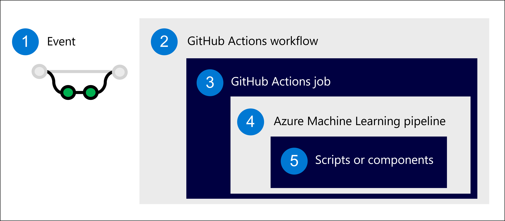
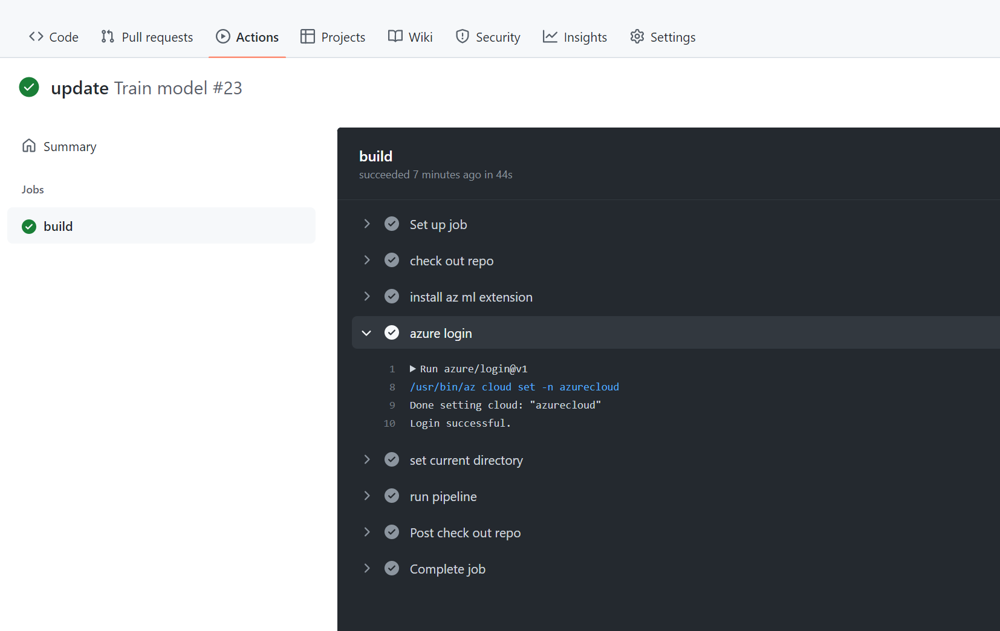

When you want to automate workflows with GitHub, you use **GitHub Actions**. 

GitHub is primarily used to host code projects. When you host your machine learning code in a GitHub repository (repo), you can create GitHub Actions to automatically build, test, and deploy your code.

> [!Note]
> To use GitHub Actions with Azure Machine Learning pipelines, you need to [allow your GitHub repo to access your Azure Machine Learning workspace through a **secure connection**](/training/modules/introduction-development-operations-principles-for-machine-learn/4-integrate-azure-development-operations-tools).

You'll learn how to use GitHub Actions to run an Azure Machine Learning pipeline.

## Create a GitHub Action



1. Define an **event** that will trigger the workflow.
2. Run the **workflow**, which consists of jobs.
3. A **job** contains one or more steps.
4. As a step, run an **Azure Machine Learning pipeline**.
5. The Azure Machine Learning pipeline is made up of **scripts** or Azure Machine Learning **components**.

To create the workflow for GitHub Actions, you define the steps you want to run in a YAML file. In the YAML file, you'll include:

- **Event**: How you want to trigger the workflow.
- **Job**: A group of steps you want to execute on a **runner**. For machine learning workloads, you'll likely use an **Ubuntu Linux** virtual machine.
- **Step**: A script or action you want to run. For example, a CLI command to initiate the Azure Machine Learning pipeline (`az ml job create`).

> [!Tip]
> Learn more about [core concepts used in GitHub Actions](https://docs.github.com/actions/learn-github-actions/understanding-github-actions).

To run an Azure Machine Learning pipeline whenever changes are pushed to the repo, you can use a YAML file like this:

```yml
name: Train model

on:
  push:
    branches: [ main ]

jobs:
  build:
    runs-on: ubuntu-latest 
    steps:
    - name: check out repo
      uses: actions/checkout@v2
    - name: install az ml extension
      run: az extension add -n ml -y
    - name: azure login
      uses: azure/login@v1
      with:
        creds: ${{secrets.AZURE_CREDENTIALS}}
    - name: set current directory
      run: cd src
    - name: run pipeline
      run: az ml job create --file src/aml_service/pipeline-job.yml --resource-group dev-ml-rg --workspace-name dev-ml-ws
```

The example workflow will:

1. Check out the repo to make it available on the runner.
2. Install the Azure Machine Learning extension for the CLI.
3. Sign in to Azure using the predefined `AZURE_CREDENTIALS`.
4. Navigate to the `src` folder, which contains all your production code.
5. Run the Azure Machine Learning pipeline.

## Run a workflow with GitHub Actions

Suppose you created the YAML file to define the workflow. You store the YAML file in the `.github/workflows/` directory in your repository. 

To view the workflow, navigate to the GitHub **Actions** tab of your repo.


GitHub will automatically pick up any workflows that are stored in the `.github/workflows/` directory. 

> [!Tip]
> If you add `  workflow_dispatch:` to your workflow YAML file, you can manually trigger the workflow to run from the **Actions** tab. 

You can trigger the workflow with the events specified in your workflow YAML file. In the example, a push to the repo will trigger the workflow to run. Anytime you make a change and push your commits to the repo (locally in Visual Studio Code or directly in GitHub), the workflow will run.

Select the latest run to further inspect whether all steps have successfully executed or what error messages you received.



When a workflow triggers an Azure Machine Learning pipeline, you should also review the pipeline run in the Azure Machine Learning workspace as errors may still occur within the Azure Machine Learning pipeline. Any error messages will be viewable in the outputs folder of the Azure Machine Learning pipeline experiment run. 
