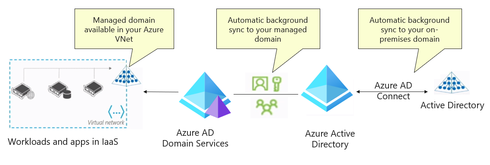

Azure Active Directory Domain Services (Azure AD DS) provides managed domain services such as domain join, group policy, lightweight directory access protocol (LDAP), and Kerberos / NTLM authentication that is fully compatible with Windows Server Active Directory. You use these domain services without the need to deploy, manage, and patch domain controllers in the cloud. Azure AD DS integrates with your existing Azure AD tenant, which makes it possible for users to sign in using their existing credentials. You can also use existing groups and user accounts to secure access to resources, which provides a smoother lift-and-shift of on-premises resources to Azure.

Azure AD DS replicates identity information from Azure AD, so it works with Azure AD tenants that are cloud-only, or synchronized with an on-premises Active Directory Domain Services (AD DS) environment. The same set of Azure AD DS features exist for both environments.

* If you have an existing on-premises AD DS environment, you can synchronize user account information to provide a consistent identity for users.
* For cloud-only environments, you don't need a traditional on-premises AD DS environment to use the centralized identity services of Azure AD DS.

> [!div class="mx-imgBorder"]
> 

## Azure AD DS features and benefits

To provide identity services to applications and VMs in the cloud, Azure AD DS is fully compatible with a traditional AD DS environment for operations such as domain-join, secure LDAP (LDAPS), Group Policy and DNS management, and LDAP bind and read support. LDAP write support is available for objects created in the Azure AD DS managed domain, but not resources synchronized from Azure AD. The following features of Azure AD DS simplify deployment and management operations:

* **Simplified deployment experience**: Azure AD DS is enabled for your Azure AD tenant using a single wizard in the Azure portal.

* **Integrated with Azure AD**: User accounts, group memberships, and credentials are automatically available from your Azure AD tenant. New users, groups, or changes to attributes from your Azure AD tenant or your on-premises AD DS environment are automatically synchronized to Azure AD DS.
    
* **Use your corporate credentials/passwords**: Passwords for users in Azure AD DS are the same as in your Azure AD tenant. Users can use their corporate credentials to domain-join machines, sign in interactively or over remote desktop, and authenticate against the Azure AD DS managed domain.

* **NTLM and Kerberos authentication**: With support for NTLM and Kerberos authentication, you can deploy applications that rely on Windows-integrated authentication.

* **High availability**: Azure AD DS includes multiple domain controllers, which provide high availability for your managed domain. This high availability guarantees service uptime and resilience to failures.

In regions that support Azure Availability Zones, these domain controllers are also distributed across zones for additional resiliency.

> [!IMPORTANT]
> Azure AD DS integrates with Azure AD, which itself can synchronize with an on-premises AD DS environment. This ability extends central identity use cases to traditional web applications that run in Azure as part of a lift-and-shift strategy.
