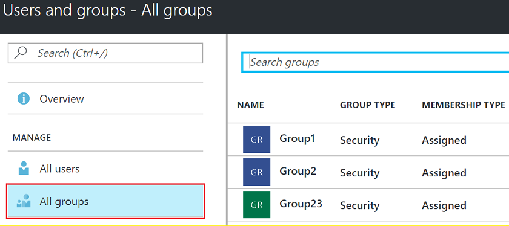

Azure AD allows you to define two different types of groups.

* **Security groups**. These are the most common and are used to manage member and computer access to shared resources for a group of users. For example, you can create a security group for a specific security policy. By doing it this way, you can give a set of permissions to all the members at once, instead of having to add permissions to each member individually. This option requires an Azure AD administrator.

* **Microsoft 365 groups**. These groups provide collaboration opportunities by giving members access to a shared mailbox, calendar, files, SharePoint site, and more. This option also lets you give people outside of your organization access to the group. This option is available to users as well as admins.

> [!div class="mx-imgBorder"]
> 

There are different ways you can assign group access rights:

* **Assigned**. Lets you add specific users to be members of this group and to have unique permissions.

* **Dynamic User**. Lets you use dynamic membership rules to automatically add and remove members. If a member's attributes change, the system reviews your dynamic group rules for the directory to determine if the member meets the rule requirements (is added) or no longer meets the rules requirements (is removed). 

* **Dynamic Device (Security groups only)**. Lets you use dynamic group rules to automatically add and remove devices. If a device's attributes change, the system reviews your dynamic group rules for the directory to determine if the device meets the rule requirements (is added) or no longer meets the rules requirements (is removed).

>[!IMPORTANT]
>Have you given any thought to which groups you need to create? Would you directly assign or dynamically assign membership?
