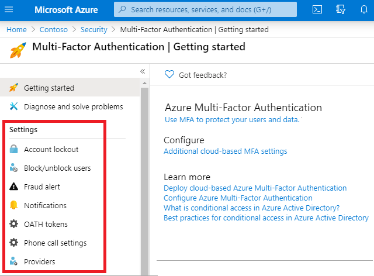

> [!div class="mx-imgBorder"]
> 

## Account lockout

To prevent repeated MFA attempts as part of an attack, the account lockout settings let you specify how many failed attempts to allow before the account becomes locked out for a period of time. The account lockout settings are only applied when a pin code is entered for the MFA prompt. The following settings are available:

- Number of MFA denials to trigger account lockout
- Minutes until account lockout counter is reset
- Minutes until account is automatically unblocked

## Block and unblock users

If a user's device has been lost or stolen, you can block authentication attempts for the associated account.

## Fraud Alerts

* **Block user when fraud is reported** - Configure the fraud alert feature so that your users can report fraudulent attempts to access their resources. Users can report fraud attempts by using the mobile app or through their phone. Block user when fraud is reported: If a user reports fraud, their account is blocked for 90 days or until an administrator unblocks their account. An administrator can review sign-ins by using the sign-in report and take appropriate action to prevent future fraud. An administrator can then unblock the user's account.

* **Code to report fraud during initial greeting** - Code to report fraud during initial greeting: When users receive a phone call to perform two-step verification, they normally press # to confirm their sign-in. To report fraud, the user enters a code before pressing #. This code is 0 by default, but you can customize it.

## Notifications

Email notifications can be configured when users report fraud alerts. These notifications are typically sent to identity administrators, as the user's account credentials are likely compromised. 

## OATH tokens

Azure AD supports the use of OATH-TOTP SHA-1 tokens that refresh codes every 30 or 60 seconds. Customers can purchase these tokens from the vendor of their choice.

## Trusted IPs

Trusted IPs is a feature to allow federated users or IP address ranges to bypass two-step authentication. Notice there are two selections in this screenshot. 

Which selections you can make depends on whether you have managed or federated tenants.

* **Managed tenants**. For managed tenants, you can specify IP ranges that can skip MFA.

* **Federated tenants**. For federated tenants, you can specify IP ranges and you can also exempt AD FS claims users.

>[!IMPORTANT]
>The Trusted IPs bypass works only from inside of the company intranet. If you select the All Federated Users option and a user signs in from outside the company intranet, the user must authenticate by using two-step verification. The process is the same even if the user presents an AD FS claim.

