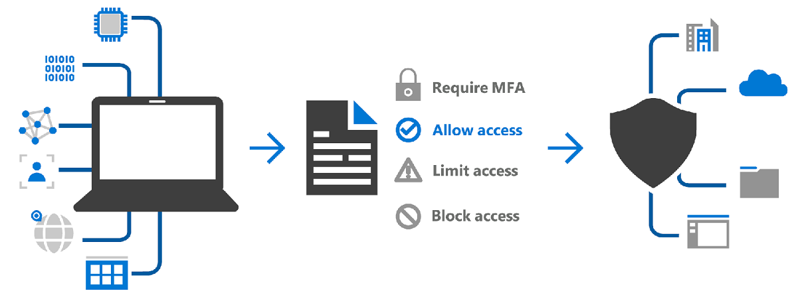

Gone are the days when security focused on a strong perimeter defense to keep malicious hackers out. 

Anything outside the perimeter was treated as hostile, whereas inside the wall, an organization’s systems were trusted. Today's security posture is to assume breach and use the Zero Trust model. Security professionals no longer focus on perimeter defense. Modern organizations have to support access to data and services evenly from both inside and outside the corporate firewall.

This course will serve as your roadmap as you create and move applications and data to Microsoft Azure. Understanding the security services offered by Azure is key in implementing security-enhanced services. 

## What does Zero Trust Mean

The analyst Zero Trust model, states that you should never assume trust but instead continually validate trust. When users, devices, and data all resided inside the organization’s firewall, they were assumed to be trusted. This assumed trust allowed for easy lateral movement after a malicious hacker compromised an endpoint device. 

Instead of assuming everything behind the corporate firewall is safe, the **Zero Trust model assumes breach and verifies each request as though it originates from an open network**. Regardless of where the request originates or what resource it accesses, Zero Trust teaches us to **never trust, always verify**. Every access request is fully authenticated, authorized, and encrypted before granting access. Microsegmentation and least privileged access principles are applied to minimize lateral movement. Rich intelligence and analytics are utilized to detect and respond to anomalies in real time. With most users now accessing applications and data from the internet, most of the components of the transactions—that is, the users, network, and devices—are no longer under organizational control. 

The Zero Trust model relies on verifiable user and device trust claims to grant access to organizational resources. No longer is trust assumed based on the location inside an organization's perimeter.

The following figure depicts the basic components of the Zero Trust model.

> [!div class="mx-imgBorder"]
> 

Notice the trust determination components:

* **Identity provider**. Establishes a user’s identity and related information.

* **Device directory**. Validates a device and the device integrity.

* **Policy evaluation service**. Determines whether the user and device conform to security policies.

* **Access proxy**. Determines which organizational resources can be accessed.

## Implementing a Zero Trust Security model

Migrating to a Zero Trust security model provides for a simultaneously improvement of security over conventional network-based approaches, and to better enable users where they need access. A Zero Trust model requires **signals** to inform decisions, **policies** to make access decisions, and **enforcement capabilities** to implement those decisions effectively.

> [!div class="mx-imgBorder"]
> 

 **Signal** - to make an informed decision. | **Decision** - based on organizational policy. | **Enforcement** - of the policy across resources. 
 --- | --- | ---
 Zero Trust consider many signal sources - from identity systems to device management and device security tools - to create context-rich insights that help make informed decisions. | The access request and signal are analyzed to deliver a decision based on finely-tuned access policies, delivering granular, organization-centric access control. | Decisions are then enforced across the entire digital estate - such as read-only access to SaaS app or remediating compromised passwords with a self-service password reset.

The user is the common denominator of these components. As previously discussed, that is why a user’s identity and how that identity is managed is now called the **control plane**. If you can’t determine who the user is, you can’t establish a trust relationship for other transactions.

## Guiding principles of Zero Trust

1. **Verify explicitly**. Always authenticate and authorize based on all available data points, including user identity, location, device health, service or workload, data classification, and anomalies.
2. **Use least privileged access**. Limit user access with **Just In Time** and **Just Enough Access (JIT/JEA)**, risk based adaptive polices, and data protection to protect both data and productivity.
3. **Assume breach**. Minimize blast radius for breaches and prevent lateral movement by segmenting access by network, user, devices, and application awareness. Verify all sessions are encrypted end to end. Use analytics to get visibility, drive threat detection, and improve defenses.

## Microsoft's Zero Trust architecture

Below is a simplified reference architecture for our approach to implementing Zero Trust. The primary components of this process are Intune for device management and device security policy configuration, Azure AD conditional access for device health validation, and Azure AD for user and device inventory.

The system works with Intune, pushing device configuration requirements to the managed devices. The device then generates a statement of health, which is stored in Azure AD. When the device user requests access to a resource, the device health state is verified as part of the authentication exchange with Azure AD.

> [!div class="mx-imgBorder"]
> 

>[!IMPORTANT]
>The National Institute of Standards and Technology has a Zero Trust Architecture, NIST 800-207, publication.