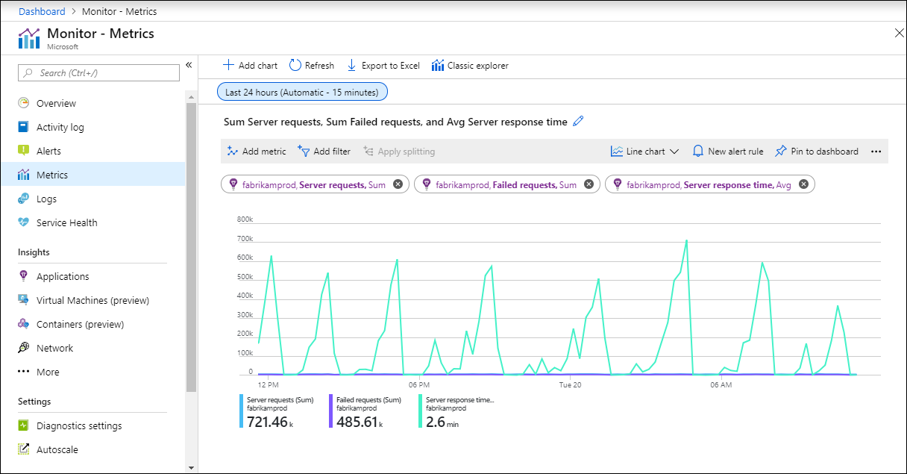
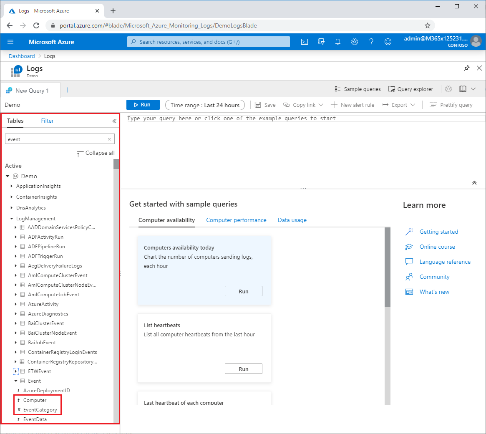

All data that Azure Monitor collects fits into one of two fundamental types: **metrics or logs**. 
## What are metrics?
Metrics are numerical values that describe some aspect of a system at a particular time. Metrics are collected at regular intervals and are useful for alerting because they can be sampled frequently, and an alert can be fired quickly with relatively simple logic.

The following is a list of the different ways that you can use metric data in Azure Monitor.

* **Analyze** -	Use metrics explorer to analyze collected metrics on a chart and compare metrics from different resources.
* **Visualize** -	Pin a chart from metrics explorer to an Azure dashboard. Create a workbook to combine with multiple sets of data in an interactive report. Export the results of a query to Grafana to leverage its dashboarding and combine with other data sources.
* **Alert** -	Configure a metric alert rule that sends a notification or takes automated action when the metric value crosses a threshold.
* **Automate** - Use Autoscale to increase or decrease resources based on a metric value crossing a threshold.
* **Export** -	Route Metrics to Logs to analyze data in Azure Monitor Metrics together with data in Azure Monitor Logs and to store metric values for longer than 93 days.
Stream Metrics to an Event Hub to route them to external systems.
* **Retrieve** -	Access metric values from a command line using PowerShell cmdlets
Access metric values from custom application using REST API.
Access metric values from a command line using CLI.
* **Archive** -	Archive the performance or health history of your resource for compliance, auditing, or offline reporting purposes.

### Interacting with Azure Monitor Metrics

Use Metrics Explorer to interactively analyze the data in your metric database and chart the values of multiple metrics over time. You can pin the charts to a dashboard to view them with other visualizations. You can also retrieve metrics by using the Azure monitoring REST API.

> [!div class="mx-imgBorder"]
> 

Behind the scene, log-based metrics translate into log queries. Their retention matches the retention of events in underlying logs. For Application Insights resources, logs are stored for 90 days.

## What are Azure Monitor Logs?
Logs in Azure Monitor contain different kinds of data organized into records with different sets of properties for each type. Logs can contain numeric values like Azure Monitor Metrics but typically contain text data with detailed descriptions. They further differ from metric data in that they vary in their structure and are often not collected at regular intervals. Telemetry such as events and traces are stored Azure Monitor Logs in addition to performance data so that it can all be combined for analysis.

A common type of log entry is an event, which is collected sporadically. Events are created by an application or service and typically include enough information to provide complete context on their own. For example, an event can indicate that a particular resource was created or modified, a new host started in response to increased traffic, or an error was detected in an application.

Because the format of the data can vary, applications can create custom logs by using the structure that they need. Metric data can  even be stored in Logs to combine them with other monitoring data for trending and other data analysis.

The following is a lists of the different ways that you can use Logs in Azure Monitor.
* **Analyze** -	Use Log Analytics in the Azure portal to write log queries and interactively analyze log data using the powerful Data Explorer analysis engine.
Use the Application Insights analytics console in the Azure portal to write log queries and interactively analyze log data from Application Insights.
* **Visualize** -	Pin query results rendered as tables or charts to an Azure dashboard.
Create a workbook to combine with multiple sets of data in an interactive report.
Export the results of a query to Power BI to use different visualizations and share with users outside of Azure.
Export the results of a query to Grafana to leverage its dashboarding and combine with other data sources.
* **Alert** -	Configure a log alert rule that sends a notification or takes automated action when the results of the query match a particular result.
Configure a metric alert rule on certain log data logs extracted as metrics.
* **Retrieve** -	Access log query results from a command line using Azure CLI.
Access log query results from a command line using PowerShell cmdlets.
Access log query results from a custom application using REST API.
* **Export** -	Build a workflow to retrieve log data and copy it to an external location using Logic Apps.

### Log queries
Data in Azure Monitor Logs is retrieved using a log query written with the Kusto query language, which allows you to quickly retrieve, consolidate, and analyze collected data. Use Log Analytics to write and test log queries in the Azure portal. It allows you to work with results interactively or pin them to a dashboard to view them with other visualizations.

> [!div class="mx-imgBorder"]
> 

### Security tools use of Monitor logs
* **Azure Security Center** stores data that it collects in a Log Analytics workspace where it can be analyzed with other log data. 
* **Azure Sentinel** stores data from data sources into a Log Analytics workspace.
